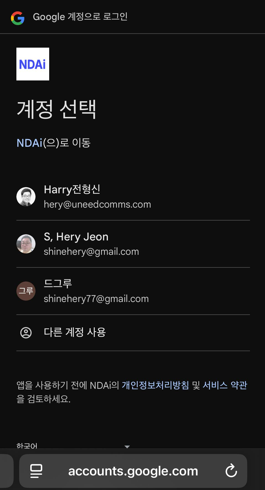

# Google One Tap: Detailed Customer Experience Flow

NudgeAI provides customers with a seamless Google One Tap information provision and authentication experience at various points within your Shopify store. Here's a breakdown of the typical user screen sequence, key content on each screen, and important considerations for customers from the moment they click a NudgeAI UI element (like an AI Plus Pop-up, AI Lite Pop-up, or a 'Continue with Google' button on a Legacy account login page) until they complete the information provision.

## General Screen Flow When Using Google One Tap

When a customer clicks NudgeAI's 'Continue with Google' or 'Subscribe' button, the information provision and authentication process proceeds through the following steps.

*   **Example - Clicking AI Plus Pop-up:**
    *   
    *   *Description: Tapping the AI Plus Pop-up in a mobile environment immediately brings up the Google account selection screen, allowing for easy information submission.*

*   **Example - Clicking AI Lite Pop-up:**
    *   
    *   *Description: Clicking the 'Subscribe' button on the AI Lite Pop-up (PC or mobile) allows for quick completion of the subscription process via Google account selection.*

*   **Example - Clicking Button on Legacy Account Login Page:**
    *   
    *   *Description: On the login page of a store using Shopify 'classic (Legacy)' customer accounts, clicking the 'Continue with Google' button enables easy login or sign-up with a Google account, bypassing password entry.*

### Step 1: Google Account Chooser Screen

*   **When it Appears:** This is the first screen that appears when a NudgeAI UI element is clicked. (May appear as a pop-up window or an overlay, depending on the browser.)
*   **Screen Content:**
    *   A list of Google accounts currently logged into the customer's web browser is displayed.
    *   If multiple Google accounts are logged in, the customer can select the one they wish to use to provide information to NudgeAI or log in.
    *   If no Google account is logged into the browser, the customer may be redirected to the Google login page to sign in first.
*   **Customer's Role:** Select the desired Google account from the list.

### Step 2: (If Necessary) Consent and Information Verification Screen

*   **When it Appears (Generally Minimized):** Google One Tap often streamlines or skips this step to optimize user experience. This screen might not appear if the customer has previously provided information to this store or similar services via their Google account, or if the information NudgeAI requests (basic profile info like name, email address) falls within Google's default information sharing scope.
*   **If Displayed:**
    *   In rare cases where NudgeAI (or Shopify) requires explicit consent to access specific information from the customer's Google account (e.g., name, email address), this screen may appear.
    *   The screen will display a message similar to "[App Name] wants to access your Google Account," along with details of what information is being requested (e.g., "View your basic profile info," "View your email address").
    *   Buttons like "Allow" or "Deny" may be present at the bottom.
*   **Customer's Role:** (If this screen appears) Review the scope of information to be provided to NudgeAI (the Shopify store) and click "Allow."

### Step 3: Authentication Complete & Automatic Return to Store (or Pop-up Closes)

*   Once all the above steps (Google account selection, and consent if required) are successfully completed, the customer's information is securely transmitted to the Shopify store via NudgeAI.
*   Typically, the Google One Tap interface will automatically close, return the customer to the store page they were viewing, or briefly display a message indicating that login/sign-up is complete before disappearing.
*   Customers can complete the entire process very quickly and smoothly without additional data entry or page navigation.

## Customer Choices and Points to Note

The Google One Tap information provision and authentication process offered by NudgeAI is designed to be very simple and intuitive. However, here are a few points to be aware of for an even smoother experience:

1.  **Selecting the Correct Google Account (When Multiple Accounts are Logged In):**
    *   **Scenario:** If multiple Google accounts are simultaneously logged into the customer's web browser, the initial Google One Tap screen will list all of them.
    *   **Action/Note:** The customer must **select the exact Google account** they wish to use to provide information to the Shopify store via NudgeAI. For instance, if both personal and work email addresses are logged in as Google accounts, it's advisable to select the account they prefer for receiving notifications or marketing information from the store.
    *   

2.  **(Very Rare Cases) Confirming Google Account Access Permissions:**
    *   **Scenario:** While Google One Tap usually handles this automatically or skips it, a screen might occasionally appear requesting explicit consent for NudgeAI (or Shopify) to access basic profile information like name and email address from the customer's Google account.
    *   **Action/Note:** The screen will briefly indicate what information access is being requested (e.g., "View your basic profile info," "View your email address"). If the customer agrees to provide this information, they must click the "Allow" button for the process to continue. Selecting "Deny" will prevent information provision.
    *   (Note: The actual Google consent screen will be displayed according to Google's UI guidelines.)
    *   

3.  **(General Note) Pop-up Blockers or Browser Extensions:**
    *   **Scenario:** If the customer's web browser has a strong pop-up blocker enabled, or if certain security-related extensions are installed, the Google One Tap authentication window might not appear correctly, or the process might be interrupted.
    *   **Action/Note:** If there's no response after clicking a NudgeAI button or an error occurs, it's recommended to temporarily disable the browser's pop-up blocker or relevant extensions and try again. Alternatively, trying the process in the browser's incognito/private browsing mode might also help.

Most customers will complete NudgeAI's Google One Tap process very quickly and smoothly through a few clicks, without encountering these special circumstances. NudgeAI prioritizes customer convenience and is designed to deliver maximum value with minimal choices and attention required from the user. 