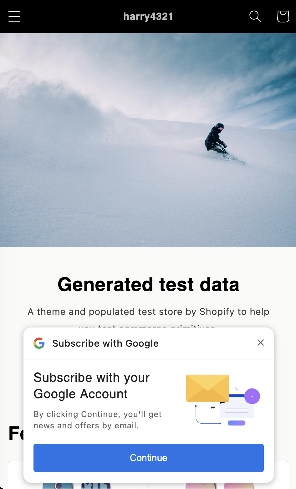

# AI Plus Pop-up

NudgeAI's AI Plus Pop-up is an assertive pop-up designed to maximize customer email subscription rates. It is optimized for the mobile environment and leverages the user experience of Google One Tap.

## Key Features

*   **Optimized Mobile Experience:** Perfectly optimized for mobile environments, designed to allow customers to conveniently subscribe and get information even on the go.
*   **Visible Bottom Notification:** Appears at the bottom of the screen, similar in size to Google One Tap, ensuring important notifications are not missed without disrupting the shopping flow.
*   **Familiar and Trustworthy Design:** Reflecting the design style of Google One Tap, it offers customers a familiar and trustworthy user experience.
*   **Information Delivered at the Optimal Timing:**
    *   Appears naturally at the most opportune moment when customers visit the store and browse content, guiding them to valuable information or offers.
    *   Helps already logged-in customers experience more value through subscription by delivering new updates or personalized benefits.
*   **Respect for User Choice:** Provides a clear option to easily close the pop-up at any time if users do not wish to see it, respecting user preferences.

## How AI Plus Pop-up Appears Based on Your Shopify Customer Account Settings

The AI Plus Pop-up may be displayed differently to **logged-in customers** depending on your Shopify store's 'Customer accounts' configuration. You can check which customer account type your store is using in your Shopify admin settings.

### 1. Are you using "Legacy" customer accounts?

*   **For logged-in customers, the AI Plus Pop-up will not appear.**
*   **Why is this?**
    *   When using 'Legacy' customer accounts, a logged-in customer is already a registered member of your store.
    *   NudgeAI **directly integrates a Google One Tap button onto your store's sign-up and login pages**. This allows customers to easily sign up or log in with their Google account in just one second directly on those pages, without a separate pop-up, and provide their email address, real name, and marketing consent all at once.
    *   **The primary role of the AI Plus Pop-up** is to encourage **high-value email acquisition** by offering the **convenient information submission experience (name, email, marketing consent)** via Google One Tap to **new visitors or non-logged-in users** who have not yet provided their information through these sign-up/login pages.
    *   Therefore, if a customer is already logged in, it means either (1) they have already provided their information via the Google One Tap on the sign-up/login page, or (2) they are an existing member from before NudgeAI was implemented. In both cases, there is no need to show them the AI Plus Pop-up again, which is an assertive pop-up for acquiring high-value emails.
    *   This approach respects the customer experience and avoids unnecessary repetitive prompts. (If an existing member is missing name or marketing consent information, this can be updated more gently through other means, such as the upcoming AI Lite Pop-up.)

### 2. Are you using "New" customer accounts?
(The method where customers log in with an email address and a 6-digit code)

*   **For logged-in customers, the AI Plus Pop-up will still appear.**
*   **Why is this?**
    *   Shopify's 'New' customer account system allows customers to log in conveniently by entering their email address and a 6-digit code sent to their email. While this passwordless method is convenient, the login process itself does not automatically mean the customer has consented to receive marketing emails.
    *   In other words, even if a customer logs in for purchasing or general site access, they might not have yet agreed to receive marketing communications.
    *   Therefore, for stores using the 'New' customer account system, the AI Plus Pop-up is displayed even to logged-in customers **to capture their name and obtain explicit marketing consent.** Through Google One Tap, this allows the store to easily acquire these two crucial pieces of information (real name, marketing opt-in), enabling more accurate personalized marketing and strengthening customer relationships.

---

*For information on AI Lite Pop-up, please see [here](../ai-lite-popup/index.md).* 