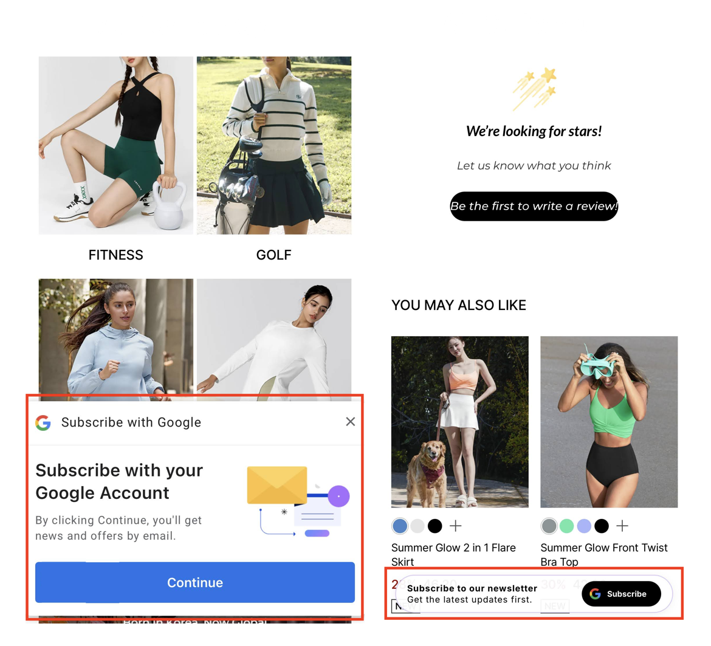

# AI Lite Pop-up: Introduction & Comparison

NudgeAI offers two types of pop-ups, **AI Plus Pop-up** and **AI Lite Pop-up**, to cater to various store situations and marketing goals. The AI Lite Pop-up focuses on gently approaching customers without significantly disrupting their shopping experience, aiming to naturally obtain valuable customer information (full name, verified email, newsletter subscription consent).

## Key Features of AI Lite Pop-up

1.  **Works on All Devices (PC and Mobile)**:
    *   Unlike the mobile-only AI Plus Pop-up, the AI Lite Pop-up can be displayed to customers on **both desktop PCs and mobile devices**. This allows you to reach a broader range of visitors.

2.  **Less Intrusive, Gentle Display Method**:
    *   The AI Lite Pop-up generally appears less aggressively than the AI Plus Pop-up. For example, it might gently appear at the bottom of the page when a customer has scrolled about **50% of the main page or a product details page**, encouraging subscription naturally without significantly interrupting the shopping experience.

3.  **Clear Value Proposition and Simple Click-Through Design**:
    *   The left side of the pop-up includes a clear message conveying the value to the customer, such as **"Subscribe to our newsletter. Get the latest updates first."**
    *   The right side features a **button with the Google logo and the text "Subscribe,"** guiding the customer to easily proceed to the next step with a single click.

4.  **Executes Google One Tap on Click for Information/Consent**:
    *   When a customer clicks the "Subscribe" button, the **Google One Tap feature is immediately executed**, similar to the AI Plus Pop-up.
    *   This allows customers to easily provide their name and email information and consent to newsletter subscription (i.e., marketing communication) as indicated in the pop-up text. No separate marketing consent checkbox is displayed within the Google One Tap interface (consent is implied by the pop-up text and click action).

## Key Differences from AI Plus Pop-up

| Feature                             | AI Plus Pop-up                                                    | AI Lite Pop-up                                                                 |
| :---------------------------------- | :---------------------------------------------------------------- | :----------------------------------------------------------------------------- |
| **Operating Environment**           | **Mobile Only**                                                   | **PC and Mobile**                                                              |
| **Display Method**                  | More aggressive (immediately occupies full width at bottom on page load) | Less aggressive (**fixed bar at bottom upon 50% page scroll**)                  |
| **Design/Wording**                  | Broader consent-inducing text (e.g., "Continue to receive news/offers") | Clearer, offer-specific text (e.g., "Subscribe to our newsletter") with "Subscribe" button |
| **Primary Purpose/Nuance**          | Maximize initial info acquisition & subscription rates, **immediate mobile action** | Gentle newsletter subscription, info update opportunity, **prioritizes user experience** |
| **Behavior by Shopify Acct/Login**  | More focused on immediate first interaction on mobile visit      | Flexibly used for info supplement/acquisition in various customer states, esp. PC users & scrolled-interest customers |

## When to Use AI Lite Pop-up?

*   When you want to provide an information collection opportunity to PC users via a pop-up.
*   When you want to naturally encourage subscriptions from customers who have shown a certain level of interest in page content, without significantly disrupting their shopping flow.
*   When you want to gently offer existing customers an opportunity to provide marketing consent or update missing information.

NudgeAI supports you in choosing and combining these two pop-up types to best suit your store's diverse situations and strategies for optimal customer information collection. 