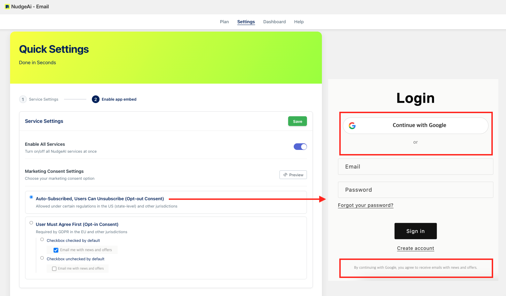

# Login Page: Marketing Consent Configuration (Legacy)

NudgeAI improves the customer information collection process by applying a 'Continue with Google' button to the login and sign-up pages of stores set to Shopify's **'Classic (Legacy) Customer Accounts'**. During this process, customer consent for marketing communications is handled in direct coordination with the options you select in the **"Marketing Consent Settings"** under **"Quick Settings"** in the NudgeAI app admin panel.

!!! success "Important: Legacy Account Specific Feature"
    This method of handling marketing consent on the login/sign-up page applies **only if you are using Shopify's 'Classic (Legacy) Customer Accounts'** setting.

The "Marketing Consent Settings" in the NudgeAI app have three main options, each directly impacting the marketing consent user interface (UI) displayed at the bottom of the login/sign-up page:

## Marketing Consent Setting Options

1.  **Option A: "Auto-Subscribed, Users Can Unsubscribe (Opt-out Consent)"**
    *   **Reflection on Login/Sign-up Page**: If you choose this "opt-out" method, when a customer provides information by clicking the 'Continue with Google' button, **no separate marketing consent checkbox will be displayed** at the bottom of the page.
    *   
    *   **Processing Method**: The customer may be considered to have automatically consented to receive email marketing upon providing their information. Customers can express their refusal later by using the unsubscribe option in received emails.
        !!! warning "Caution"
            The usability of this method may vary depending on the privacy regulations of specific countries/regions, so caution is advised.

2.  **Option B: "User Must Agree First (Opt-in Consent)" & Sub-option "Checkbox checked by default"**
    *   **Reflection on Login/Sign-up Page**: If you choose this "opt-in" method and activate the "Checkbox checked by default" sub-option, when a customer clicks the 'Continue with Google' button, a consent statement like **"Email me with news and offers" along with a pre-checked checkbox will be displayed** at the bottom of the page.
    *   
    *   **Processing Method**: The customer is set to consent by default but can choose not to consent by manually unchecking the checkbox. If they complete the information provision with the checkbox selected, they are recorded as having consented to marketing communications.

3.  **Option C: "User Must Agree First (Opt-in Consent)" & Sub-option "Checkbox unchecked by default"**
    *   **Reflection on Login/Sign-up Page**: If you choose this "opt-in" method and activate the "Checkbox unchecked by default" sub-option, the **same consent statement along with an unchecked (blank) checkbox will be displayed** at the bottom of the page.
    *   
    *   **Processing Method**: If the customer wishes to receive marketing information, they must manually check the checkbox. Only if they complete the information provision with the checkbox selected will they be recorded as having consented to marketing communications.

NudgeAI provides these flexible options so you can choose and apply the most appropriate marketing consent method considering your store's policies and the privacy regulations applicable to your primary customer base. Your selection in "Marketing Consent Settings" is immediately reflected on the login/sign-up pages of stores using 'Classic (Legacy) Customer Accounts,' helping you obtain clear and transparent marketing consent from your customers.

For more details on the NudgeAI initial setup process, please refer to the [First Steps After Installation](../setup-guide/initial-setup.md) document. 