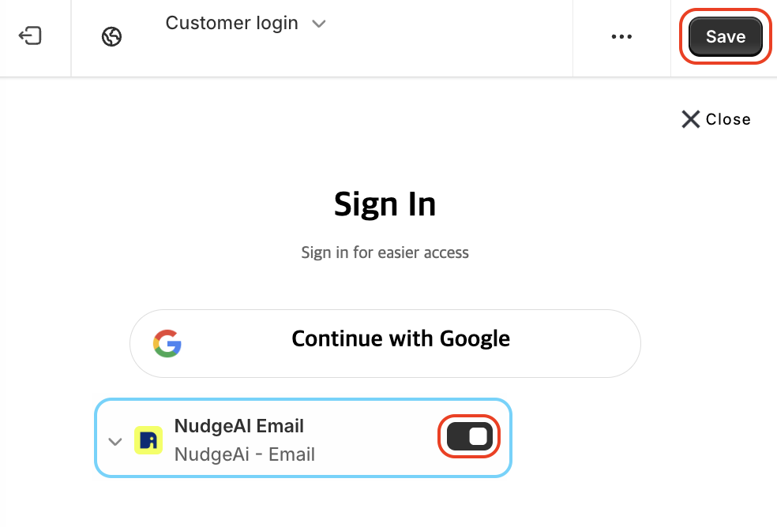

# App Embed Activation

App Embed activation is the process of integrating Nudge AI's UI/UX elements into your Shopify store's theme. This setting is **essential** for Nudge AI to function properly.

## Setup Method

1. From your Shopify admin panel, go to **Online Store** > **Themes**.
2. Click the **Customize** button for your currently active theme.
3. In the theme editor, click the **App embeds** icon (usually a puzzle piece) in the bottom left menu.
4. Find the **NudgeAI Email** item (or a similar name) in the list of app embeds and click the toggle switch to the right to enable it.
5. Click the **Save** button in the upper right corner of the screen.
{ width="60%" }

## Important Notes

- If this setting is not activated, Nudge AI's Google One Tap interface will not display in your store.
- App Embed is a key setting that allows Nudge AI to integrate naturally into your store's UI.
- Some themes may require cache clearing or theme saving after App Embed activation.

## Next Steps

After activating App Embed, refer to the [Verify Installation](../installation-check/index.md) page to ensure everything is set up correctly.
