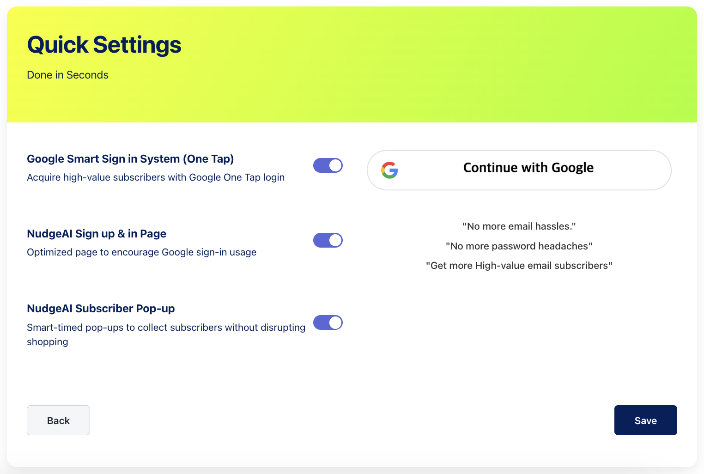
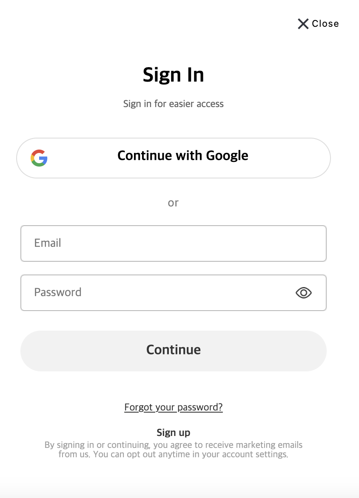

# Verify Installation

This guide explains how to verify that Nudge AI has been properly installed and configured.

## Verification Methods

### 1. Dashboard Status Check

1. Open the Nudge AI app via the **Apps** menu in your Shopify admin panel.
2. Navigate to the **Quick Settings** section of the Nudge AI app dashboard.
3. Verify that the toggle switches for the following three features are all activated (blue and ON):
   - **Google Smart Sign in System (One Tap)**
   - **NudgeAI Sign up & in Page**
   - **NudgeAI Subscriber Pop-up**
4. All features must be enabled for proper operation. If you made changes, click the **Save** button.

   { width="60%" }

### 2. Sign-up/Login Page Test

1. Navigate to your store's sign-up or login page.
2. Verify that the 'Continue with Google' interface is displayed instead of the traditional form.
   - Testing in private/incognito browsing mode will provide more accurate results.
3. Try a test login with a Google account.

{ width="60%" }

## Troubleshooting

If you encounter issues during verification, check the following:

1. Verify that [Legacy Customer Accounts](../legacy-accounts/index.md) has been properly activated.
2. Verify that [App Embed](../app-embed/index.md) has been properly activated.
3. Try clearing your theme cache:
   - Shopify admin > Online Store > Themes > Actions > Clear cache

If problems persist, refer to the [Support & Troubleshooting](../../support-troubleshooting/faq/general/index.md) section or contact the Nudge AI support team.
