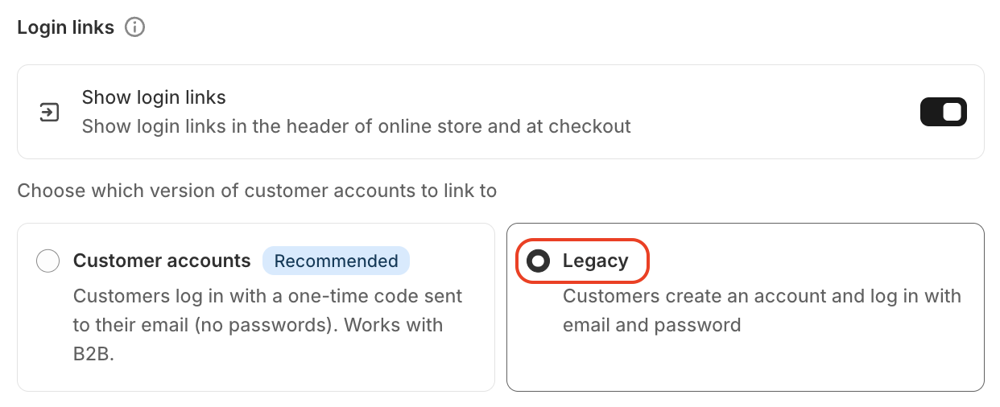

# Legacy Customer Accounts

Legacy account activation is one of the customer account systems provided by Shopify, and it is **essential** for Nudge AI to seamlessly process sign-up and login procedures through the Google One Tap feature.

## Setup Method

1. Log in to your Shopify admin panel.
2. Click on [Settings] at the bottom left.
3. Select [Customer accounts] from the left menu.
4. In the Customer accounts section, click 'Edit' in the 'Login experience' section, and under 'Choose which version of customer accounts to link to', select the **Legacy** option.
5. Save the changes.

{ width="60%" }

## Important Notes

- If this setting is not activated, Nudge AI's Google One Tap authentication feature will not work properly.
- Activating legacy accounts will not affect existing customer accounts.
- This setting is necessary for Nudge AI to properly process Google account information during new sign-ups.

## Next Steps

After activating legacy accounts, you need to proceed with [App Embed Activation](../app-embed/index.md).
