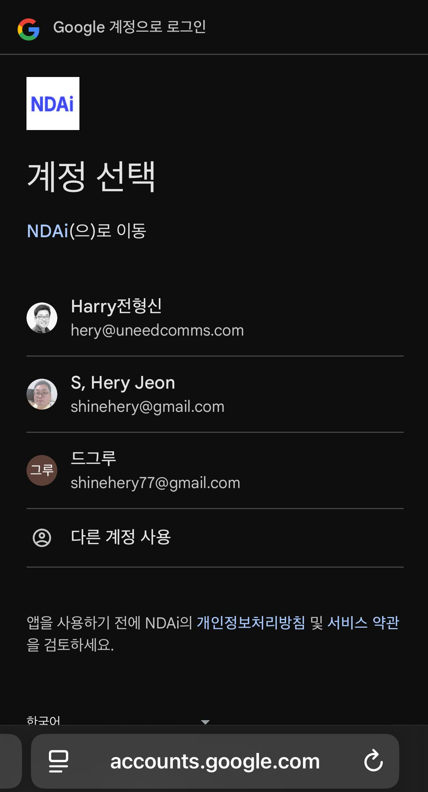
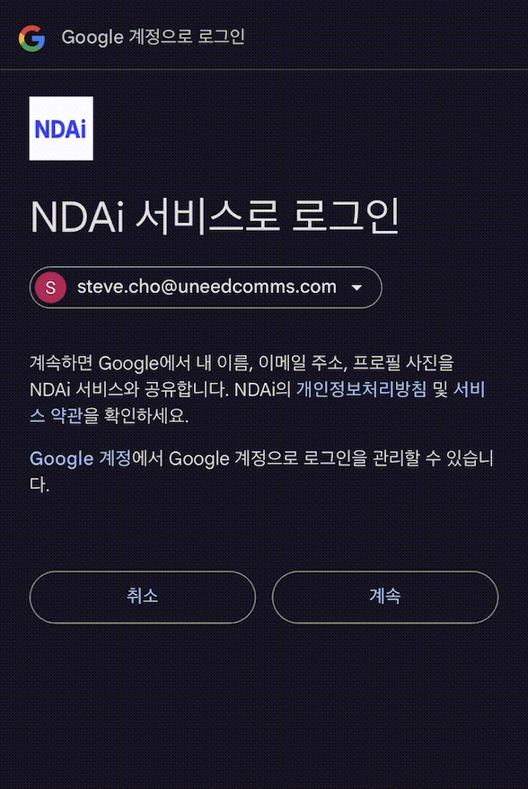

# Google One Tap: 고객 경험 흐름 상세 안내

NudgeAI는 Shopify 스토어의 다양한 지점에서 고객에게 Google One Tap을 통한 정보 제공 및 인증 경험을 제공합니다. 고객이 NudgeAI의 UI 요소(AI Plus Pop-up, AI Lite Pop-up, 또는 '클래식(Legacy) 고객 계정'의 로그인 페이지에 적용된 'Continue with Google' 버튼)를 클릭한 직후부터 정보 제공을 완료하기까지의 일반적인 사용자 화면 순서와 각 화면의 주요 내용, 그리고 고객이 선택하거나 주의해야 할 사항은 다음과 같습니다.

## Google One Tap 이용 시 일반적인 화면 흐름

고객이 NudgeAI의 'Continue with Google' 또는 'Subscribe' 버튼을 클릭하면, 다음과 같은 단계로 정보 제공 및 인증 절차가 진행됩니다.

*   **AI Plus Pop-up 클릭 시 예시:**
    *   
    *   *설명: 모바일 환경에서 AI Plus Pop-up을 탭하면 즉시 Google 계정 선택 화면이 나타나 간편하게 정보를 제출할 수 있습니다.*

*   **AI Lite Pop-up 클릭 시 예시:**
    *   
    *   *설명: PC 또는 모바일에서 AI Lite Pop-up의 'Subscribe' 버튼을 클릭하면 Google 계정 선택을 통해 빠르게 구독 절차를 완료할 수 있습니다.*

*   **Legacy 계정 로그인 페이지 버튼 클릭 시 예시:**
    *   
    *   *설명: Shopify '클래식(Legacy)' 고객 계정을 사용하는 스토어의 로그인 페이지에서 'Continue with Google' 버튼을 클릭하면, 비밀번호 입력 없이 Google 계정으로 간편하게 로그인 또는 회원가입할 수 있습니다.*

### 1단계: Google 계정 선택 화면 (Google Account Chooser)

*   **표시 시점:** NudgeAI의 UI 요소를 클릭하면 가장 먼저 Google 계정 선택 화면이 나타납니다. (브라우저에 따라 팝업창 또는 화면 일부를 덮는 형태로 표시될 수 있습니다.)
*   **화면 내용:**
    *   고객이 현재 사용 중인 웹 브라우저에 이미 로그인되어 있는 Google 계정 목록이 표시됩니다.
    *   여러 개의 Google 계정에 로그인되어 있다면, NudgeAI에 정보를 제공하거나 로그인할 계정을 직접 선택할 수 있습니다.
    *   만약 브라우저에 로그인된 Google 계정이 없다면, Google 로그인 페이지로 이동하여 먼저 Google 계정으로 로그인하도록 안내될 수 있습니다.
*   **고객의 역할:** 목록에서 사용할 Google 계정을 선택합니다.

### 2단계: (필요시) 권한 동의 및 정보 확인 화면 (Consent Screen)

*   **표시 시점 (일반적으로 최소화됨):** Google One Tap은 사용자 경험을 최적화하기 위해 이 단계를 가능한 한 간소화하거나 건너뛰는 경우가 많습니다. 특히, 고객이 이전에 해당 스토어나 유사한 서비스에 Google 계정으로 정보를 제공한 경험이 있거나, NudgeAI가 요청하는 정보(기본 프로필 정보인 이름, 이메일 주소 등)가 Google의 기본 정보 공유 범위에 해당한다면, 이 화면은 표시되지 않고 바로 다음 단계로 넘어갈 수 있습니다.
*   **만약 표시된다면:**
    *   매우 드물지만, NudgeAI(또는 Shopify)가 고객의 Google 계정 정보 중 특정 정보(예: 이름, 이메일 주소)에 접근하려고 하며, 이에 대한 고객의 명시적인 동의가 필요한 경우 이 화면이 나타날 수 있습니다.
    *   화면에는 "[앱 이름]이 Google 계정에 액세스하려고 합니다"와 유사한 메시지와 함께, 어떤 정보에 접근하려고 하는지(예: "기본 프로필 정보 보기", "이메일 주소 보기")가 표시됩니다.
    *   하단에는 "허용(Allow)" 또는 "거부(Deny)"와 같은 버튼이 있을 수 있습니다.
*   **고객의 역할:** (만약 이 화면이 나타난다면) NudgeAI(Shopify 스토어)에 제공될 정보의 범위를 확인하고 "허용(Allow)"을 클릭합니다.

### 3단계: 인증 완료 및 스토어로 자동 복귀 (또는 팝업 닫힘)

*   위의 모든 과정(Google 계정 선택, 필요한 경우 권한 동의)이 성공적으로 완료되면, 고객의 정보가 NudgeAI를 통해 Shopify 스토어에 안전하게 전달됩니다.
*   일반적으로 Google One Tap 인터페이스는 자동으로 닫히거나, 고객을 원래 보고 있던 스토어 페이지로 돌려보내거나, 또는 로그인/가입이 완료되었음을 알리는 간단한 메시지를 잠시 보여준 후 사라집니다.
*   고객은 추가적인 정보 입력이나 페이지 이동 없이 매우 빠르고 매끄럽게 모든 과정을 완료할 수 있습니다.

## 고객 선택 및 주의사항

NudgeAI가 제공하는 Google One Tap 정보 제공 및 인증 과정은 매우 간편하고 직관적이지만, 더욱 원활한 이용을 위해 다음 사항을 알아두시면 좋습니다.

1.  **사용할 Google 계정 선택 (여러 계정 로그인 시):**
    *   **상황:** 웹 브라우저에 여러 개의 Google 계정이 동시에 로그인되어 있는 경우, Google One Tap 초기 화면에 해당 계정 목록이 모두 표시됩니다.
    *   **선택/주의:** NudgeAI를 통해 Shopify 스토어에 제공하고 싶으신 **정확한 Google 계정을 직접 선택**해야 합니다. 예를 들어, 개인용 이메일 주소와 업무용 이메일 주소가 모두 로그인되어 있다면, 스토어로부터 알림이나 마케팅 정보를 받고자 하는 계정을 선택하는 것이 좋습니다.
    *   

2.  **(매우 드문 경우) Google 계정 접근 권한 동의 확인:**
    *   **상황:** 대부분의 경우 Google One Tap은 이 단계를 자동으로 처리하거나 건너뛰지만, 간혹 NudgeAI(또는 Shopify)가 고객님의 Google 계정으로부터 이름, 이메일 주소 등 기본 프로필 정보에 접근하는 것에 대한 명시적인 동의를 요청하는 화면이 나타날 수 있습니다.
    *   **선택/주의:** 화면에 어떤 정보(예: "기본 프로필 정보 보기", "이메일 주소 보기")에 대한 접근 권한을 요청하는지 간략히 표시됩니다. 내용을 확인하고, 정보 제공에 동의하시면 "허용(Allow)" 버튼을 클릭해야 정상적으로 진행됩니다. "거부(Deny)"를 선택하면 정보 제공이 이루어지지 않습니다.
    *   (참고: Google의 실제 권한 동의 화면은 Google의 UI 가이드라인에 따라 표시됩니다.)
    *   

3.  **(일반적인 주의사항) 팝업 차단 기능 또는 브라우저 확장 프로그램:**
    *   **상황:** 일부 웹 브라우저에 강력한 팝업 차단 기능이 활성화되어 있거나, 특정 보안 관련 확장 프로그램이 설치되어 있는 경우, Google One Tap 인증 창이 정상적으로 뜨지 않거나 과정이 중단될 수 있습니다.
    *   **선택/주의:** 만약 NudgeAI 버튼 클릭 후 아무런 반응이 없거나 오류가 발생한다면, 일시적으로 브라우저의 팝업 차단 기능을 해제하거나 관련 확장 프로그램을 비활성화한 후 다시 시도하는 것이 좋습니다. 또는, 브라우저의 시크릿 모드/개인 정보 보호 창에서 시도해보는 것도 도움이 될 수 있습니다.

대부분의 고객은 위에 언급된 특별한 상황 없이, 몇 번의 클릭만으로 매우 빠르고 원활하게 NudgeAI의 Google One Tap 과정을 완료할 수 있습니다. NudgeAI는 고객 편의를 최우선으로 생각하며, 최소한의 선택과 주의만으로 최대한의 가치를 경험할 수 있도록 설계되었습니다. 