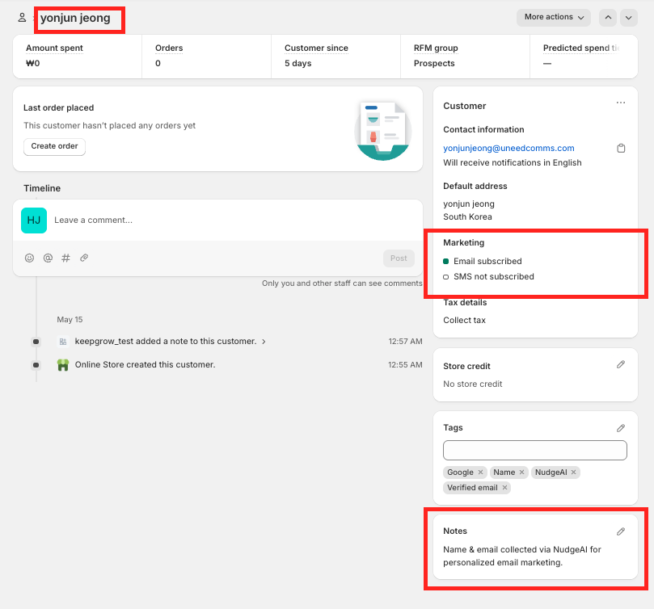
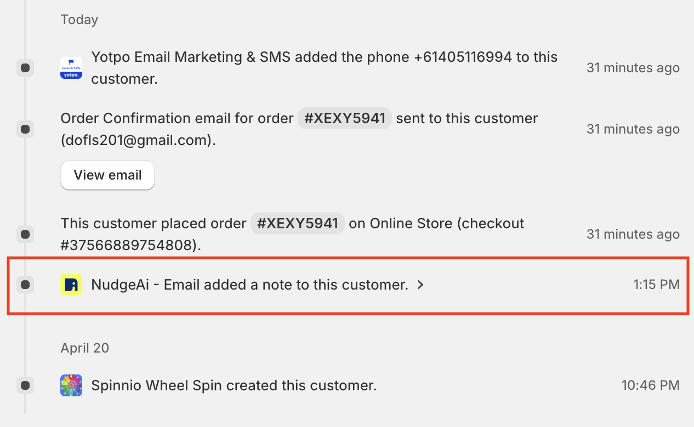

# 수집된 고객 정보 접근 및 관리

NudgeAI를 통해 성공적으로 수집된 소중한 고객 정보(이메일 주소, 고객 실명, 그리고 이메일 마케팅 수신 동의 상태)는 고객님께서 이미 익숙하게 사용하고 계시는 **Shopify 관리자 패널의 '고객(Customers)' 섹션에서 매우 쉽고 편리하게 확인하고 관리**하실 수 있습니다. NudgeAI는 수집된 모든 정보를 Shopify 고객 데이터베이스에 실시간으로 정확하게 기록하여, 고객님께서 중앙에서 모든 고객 정보를 통합적으로 관리하실 수 있도록 돕습니다.

별도의 NudgeAI 대시보드에서 고객 목록을 따로 확인하실 필요 없이, 다음과 같이 Shopify 내에서 바로 확인 가능합니다:

## 1. Shopify 고객 목록에서 NudgeAI로 수집된 고객 식별하기

Shopify 관리자 패널의 왼쪽 메뉴에서 **'고객(Customers)'**을 클릭하여 고객 목록 페이지로 이동합니다.

이 목록에서 NudgeAI를 통해 이름과 이메일, 그리고 마케팅 동의 정보가 성공적으로 수집된 고객의 이름 옆에는 **특별한 말풍선 모양의 아이콘(P)이 표시**되는 것을 확인하실 수 있습니다. 이 말풍선 아이콘에 마우스 커서를 올려보시면, **"Name & email collected via NudgeAI for personalized email marketing."** 이라는 안내 문구가 나타나, 해당 고객이 NudgeAI를 통해 확보된 소중한 'High-value' 리드임을 한눈에 알아보실 수 있습니다.

## 2. 개별 고객 상세 정보 페이지에서 구체적인 내용 확인하기

고객 목록에서 특정 고객을 클릭하여 해당 고객의 상세 정보 페이지로 이동하면, NudgeAI가 수집하고 Shopify 고객 정보에 기록한 다음과 같은 구체적인 내용들을 확인하실 수 있습니다:

*   **정확한 고객 이름 및 이메일 주소**:
    *   고객의 실명(이름과 성) 및 100% 검증된 이메일 주소는 Shopify 고객 정보의 기본 '연락처 정보(Contact information)' 섹션에 정확하게 입력되어 있습니다.
    *   
    *   고객 정보 수정 화면을 통해 NudgeAI가 수집한 고객의 이름이 'First Name'과 'Last Name' 필드에 각각 구분되어 저장되고, 이메일 주소 또한 해당 필드에 정확히 반영된 것을 확인하실 수 있습니다.

*   **명확한 이메일 마케팅 수신 동의 상태**:
    *   
    *   고객 상세 페이지 우측의 **'Marketing (마케팅)'** 섹션에서 해당 고객의 **"Email subscribed (이메일 구독함)"** 또는 "Not subscribed (구독 안 함)" 상태를 명확하게 확인하실 수 있습니다. NudgeAI는 고객의 동의 의사를 이곳에 정확히 반영합니다.

*   **유용한 자동 태그 (Tags)**:
    *   
    *   NudgeAI는 정보 수집 시 고객에게 자동으로 관련 태그(예: **"Google"**, **"Name"**, **"NudgeAI"**, **"Verified email"**)를 추가합니다. 이 태그들은 향후 Shopify 내에서 NudgeAI를 통해 유입된 고객을 쉽게 필터링하거나, 특정 특성을 가진 고객 그룹을 만들어 타겟 마케팅 캠페인을 진행하는 등 매우 유용하게 활용될 수 있습니다.

*   **NudgeAI 수집 기록 (Notes)**:
    *   고객 상세 페이지 우측 하단의 **'Notes (메모)'** 섹션에는 **"Name & email collected via NudgeAI for personalized email marketing."** 라는 메모가 자동으로 기록됩니다. 이는 해당 고객 정보가 NudgeAI를 통해 확보되었음을 다시 한번 명확히 하여, 정보 출처를 쉽게 파악하고 관리할 수 있도록 돕습니다. 이 내용은 고객 목록의 말풍선 아이콘에 표시되는 내용과 동일합니다.
    *   

*   **Shopify 고객 타임라인 기록 (NudgeAI 활동 이력)**:
    *   **기존 고객 정보 업데이트/동의 획득 시**:
        *   
        *   이미 스토어에 등록된 **기존 고객이 NudgeAI의 팝업(AI Plus/Lite) 또는 로그인 페이지의 'Continue with Google' 버튼을 통해 이름, 이메일 정보를 제공하거나 마케팅 수신에 새롭게 동의하는 경우**에도, 해당 고객의 타임라인에는 **"NudgeAi - Email added a note to this customer."** 와 같은 활동 기록이 남게 됩니다.
    *   **신규 고객 등록 시**:
        *   
        *   만약 NudgeAI를 통해 **새로운 고객이 스토어에 처음으로 등록되는 경우**, 해당 고객의 Shopify 타임라인에는 **"NudgeAi - Email created this customer."** 라는 활동 기록이 생성된 날짜 및 시간과 함께 명확하게 표시됩니다.

## 3. 정보 관리 및 활용

이렇게 Shopify 고객 정보에 완벽하게 통합된 NudgeAI 수집 데이터는 Shopify의 강력한 기본 고객 관리 기능을 통해 언제든지 손쉽게 검색, 필터링, 그룹핑, 그리고 CSV 파일 등으로 내보내기가 가능합니다. 또한, Shopify와 연동된 다른 마케팅 앱이나 분석 도구에서도 이 고객 데이터를 원활하게 활용하실 수 있습니다.

NudgeAI는 단순히 정보를 수집하는 것을 넘어, 고객님께서 수집된 정보를 Shopify라는 익숙한 환경 내에서 즉시 확인하고 효과적으로 관리하여 마케팅 성과를 높이실 수 있도록 최선을 다하고 있습니다. 