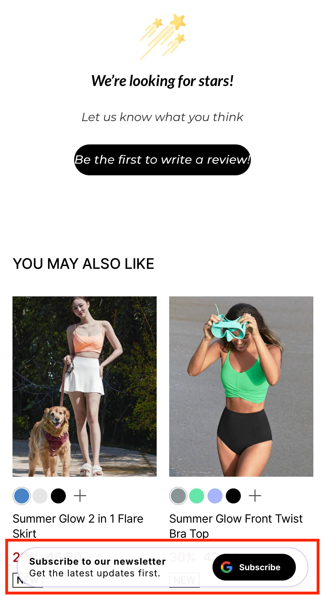

# AI Lite Pop-up: 상세 노출 및 닫기/재노출 규칙

NudgeAI의 **AI Lite Pop-up**은 고객의 쇼핑 경험을 최소한으로 방해하면서 자연스럽게 뉴스레터 구독 및 정보 제공을 유도하도록 설계되었습니다. 이를 위해 다음과 같은 상세한 노출, 닫기 및 재노출 규칙을 따릅니다.

## 1. 기본 노출 조건

*   **작동 환경**: AI Lite Pop-up은 **데스크톱 PC와 모바일 장치 모두**에서 작동합니다.
*   **노출 페이지**: 일반적으로 스토어의 **메인 페이지** 및 **상품 상세 페이지**에서 고객에게 표시됩니다.
*   **노출 방식 (스크롤 기반)**:
    *   고객이 해당 페이지에 방문하여 콘텐츠를 소비하며 페이지를 아래로 **50% 정도 스크롤했을 때**, AI Lite Pop-up이 화면 하단에 부드럽게 나타납니다.
    *   이는 고객이 페이지 콘텐츠에 어느 정도 관심을 보였을 때 팝업을 노출하여, 갑작스러운 방해를 최소화하고 자연스러운 상호작용을 유도하기 위함입니다.
    *   

## 2. 팝업 사라짐 조건 및 재노출 규칙

*   **팝업 사라짐**: AI Lite Pop-up에는 별도의 닫기 버튼('X' 버튼)이 제공되지 않으며, 팝업 영역 외부를 클릭해도 팝업이 닫히지 않습니다. 팝업은 다음의 경우 화면에서 사라집니다:
    *   고객이 팝업이 표시된 현재 페이지에서 **다른 페이지로 이동**하는 경우
    *   고객이 현재 페이지를 **새로고침**하는 경우
*   **재노출 규칙**:
    *   고객이 다른 페이지로 이동했거나 페이지를 새로고침하여 팝업이 사라진 후, 다시 해당 페이지의 노출 조건(예: 50% 스크롤)을 충족하면 AI Lite Pop-up은 다시 나타날 수 있습니다. (단, 아래 '미노출 조건'에 해당하지 않는 경우)

## 3. 고객 행동 및 상태에 따른 미노출 조건

NudgeAI는 고객에게 최적의 경험을 제공하기 위해 다음과 같은 경우에는 AI Lite Pop-up의 노출을 제한합니다:

*   **NudgeAI를 통해 이미 성공적으로 정보를 제공/로그인한 고객**:
    *   고객이 이전에 **AI Plus Pop-up, AI Lite Pop-up, 또는 (Shopify '클래식(Legacy) 고객 계정' 사용 시) 로그인 페이지의 'Continue with Google' 버튼**을 클릭하여 Google One Tap 과정을 **성공적으로 완료했다면** (즉, 이름, 이메일, 마케팅 동의 정보가 NudgeAI를 통해 처리되었거나, 이를 통해 로그인이 이루어졌다면), **그 고객에게는 더 이상 AI Lite Pop-up이 표시되지 않습니다.**
    *   이는 이미 NudgeAI와의 주요 상호작용(정보 제공, 구독, 로그인 등)을 마친 고객에게 중복된 팝업 노출을 피하기 위함입니다.

!!! note "Shopify 고객 계정 유형에 따른 추가 고려 사항"
    AI Lite Pop-up의 노출 여부는 고객의 Shopify **로그인 상태** 및 스토어의 **고객 계정 설정 방식('클래식 Legacy' 또는 '신규 New')**에 따라서도 일부 영향을 받을 수 있습니다. 자세한 내용은 "[AI Lite Pop-up: Shopify 고객 계정 유형 및 로그인 상태별 작동 방식](ai-lite-popup-account-type-behavior.md)" 문서를 참고해 주시기 바랍니다.

이러한 규칙들은 고객에게는 불필요한 반복 노출을 줄여 쾌적한 쇼핑 환경을 제공하고, 스토어에는 가장 적절한 순간에 고객의 자발적인 정보 제공을 유도할 기회를 드리기 위해 설계되었습니다. (세부적인 규칙은 서비스 업데이트에 따라 변경될 수 있습니다.) 