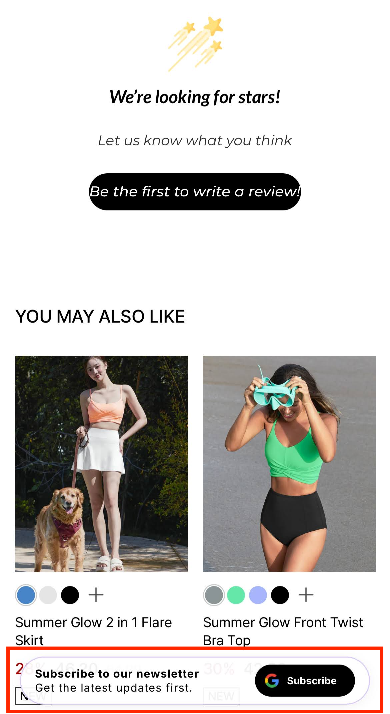

# AI Lite Pop-up: 노출 환경 및 디자인

NudgeAI의 **AI Lite Pop-up**은 고객의 쇼핑 경험을 최대한 존중하면서 다양한 환경에서 자연스럽게 다가갈 수 있도록 세심하게 디자인되었습니다.

## 1. 노출 환경: 어디서 볼 수 있나요?

*   **PC와 모바일 모든 환경 지원**: AI Lite Pop-up의 가장 큰 장점 중 하나는 **데스크톱 PC와 모바일 장치(스마트폰, 태블릿 등) 양쪽 환경 모두에서 작동**한다는 점입니다. 이를 통해 고객님께서는 더 폭넓은 방문객에게 NudgeAI의 편리한 정보 수집 기능을 제공하실 수 있습니다.

## 2. 노출 디자인: 어떻게 생겼나요?

*   **페이지 하단 고정 바(Fixed Bar) 형태**: AI Lite Pop-up은 일반적으로 **화면 하단에 고정된 바(bar) 형태**로 나타납니다. 이 디자인은 고객이 페이지를 스크롤하더라도 팝업이 화면의 특정 위치에 계속 머무르면서, 페이지의 주요 콘텐츠를 가리지 않고 부드럽게 메시지를 전달할 수 있도록 합니다.
*   **간결하고 명확한 구성**:
    *   **왼쪽 문구 영역**: "Subscribe to our newsletter. Get the latest updates first." (뉴스레터를 구독하고 최신 업데이트를 가장 먼저 받아보세요.)와 같이 고객에게 제공되는 가치나 행동을 유도하는 **명확하고 간결한 메시지**가 표시됩니다.
    *   **오른쪽 버튼 영역**: **Google 로고와 함께 "Subscribe (구독하기)"라는 텍스트가 포함된 클릭 유도 버튼**이 있어, 고객이 쉽게 다음 단계를 진행할 수 있도록 시각적으로 안내합니다. 버튼 디자인은 눈에 잘 띄면서도 페이지 전체 디자인과 조화를 이룰 수 있도록 고려됩니다.
    *   **사용자 경험 중심**: 전체적으로 AI Lite Pop-up은 고객의 화면을 과도하게 점유하거나 시각적으로 부담을 주지 않으면서, 필요한 정보와 기능을 효과적으로 전달하는 데 중점을 둔 깔끔하고 현대적인 디자인을 채택하고 있습니다.

## 3. 노출 방식 (참고)

*   AI Lite Pop-up은 일반적으로 고객이 페이지에 들어오자마자 바로 나타나기보다는, 특정 조건을 만족했을 때 (예: **메인 페이지 또는 상품 상세 페이지에서 화면을 50% 정도 스크롤했을 때**) 부드럽게 나타나 고객의 자연스러운 흐름 속에서 상호작용을 유도합니다. (자세한 노출 조건은 "[AI Lite Pop-up: 상세 노출 및 닫기/재노출 규칙](ai-lite-popup-detailed-rules.md)" 문서에서 안내됩니다.)

이처럼 AI Lite Pop-up은 다양한 접속 환경을 지원하고, 고객의 시야를 방해하지 않는 세련된 디자인을 통해 긍정적인 브랜드 경험을 유지하면서 효과적으로 고객 정보를 수집할 수 있도록 돕습니다. 