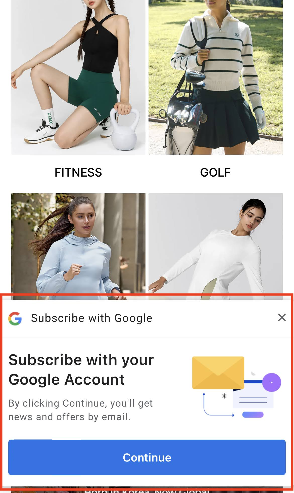

# AI Plus Pop-up: 노출 조건 및 규칙

NudgeAI의 **AI Plus Pop-up**은 고객님의 스토어 방문 경험을 최대한 존중하면서도, **모바일 환경에서** 중요한 순간에 나타나 가치 있는 고객 정보(실명, 검증된 이메일, 마케팅 동의) 획득 기회를 효과적으로 제공하도록 설계되었습니다.

## AI Plus Pop-up의 주요 노출 방식 및 조건

AI Plus Pop-up의 주요 노출 방식 및 조건은 다음과 같습니다:

1.  **모바일 전용 작동**:
    *   AI Plus Pop-up은 스마트폰이나 태블릿과 같은 **모바일 장치로 접속한 고객에게만 표시**됩니다. (PC 환경에서는 나타나지 않습니다.)

2.  **페이지별 즉시 노출 및 개별 닫기 규칙**:
    *   AI Plus Pop-up은 고객이 특정 주요 페이지에 **방문하는 즉시(랜딩 시) 화면 하단에 나타나** 정보 제공을 유도합니다. 각 페이지에서의 닫기 규칙은 서로 독립적으로 작동합니다.
        *   **메인 페이지**:
            *   **노출**: 고객이 스토어의 메인(홈) 페이지에 방문하면 즉시 AI Plus Pop-up이 표시됩니다.
            *   **닫기 효과**: 고객이 메인 페이지에서 팝업의 'X' 버튼을 클릭하여 닫으면, 해당 고객에게는 팝업을 **클릭한 시간으로부터 24시간 동안 메인 페이지에서 AI Plus Pop-up이 다시 나타나지 않습니다.**
        *   **장바구니 페이지**:
            *   **노출**: 고객이 장바구니 페이지에 방문하면 즉시 AI Plus Pop-up이 표시됩니다.
            *   **닫기 효과**: 고객이 장바구니 페이지에서 팝업을 닫으면, 해당 고객에게는 팝업을 **클릭한 시간으로부터 24시간 동안 장바구니 페이지에서 AI Plus Pop-up이 다시 나타나지 않습니다.**
        *   **결제 완료 페이지 (Thank You Page)**:
            *   **노출**: 고객이 상품 구매 및 결제를 성공적으로 완료한 후 이동하는 결제 완료 페이지에 방문하면 즉시 AI Plus Pop-up이 표시됩니다.
            *   **닫기 효과**: 고객이 결제 완료 페이지에서 팝업을 닫으면, 해당 고객에게는 팝업을 **클릭한 시간으로부터 7일 동안 결제 완료 페이지에서 AI Plus Pop-up이 다시 나타나지 않습니다.**
        *   **중요 (개별 작동)**: 한 페이지에서 팝업을 닫았다고 해서 다른 페이지의 팝업 노출에 영향을 주지는 않습니다. 예를 들어, 메인 페이지에서 팝업을 닫았더라도, 이후 장바구니 페이지나 결제 완료 페이지에서는 (각 페이지의 닫기 규칙에 해당하지 않는 한) AI Plus Pop-up이 정상적으로 노출될 수 있습니다.

3.  **고객의 이전 행동 및 상태에 따른 미노출 조건 (노출 빈도 조절)**:
    *   NudgeAI는 고객에게 과도한 피로감을 주지 않고 최적의 경험을 제공하기 위해, 다음과 같은 경우에는 AI Plus Pop-up의 노출을 제한합니다.
        *   **NudgeAI를 통해 이미 성공적으로 정보를 제공/로그인한 고객**:
            *   고객이 이전에 **AI Plus Pop-up, AI Lite Pop-up, 또는 (Shopify '클래식(Legacy) 고객 계정' 사용 시) 로그인 페이지의 'Continue with Google' 버튼**을 클릭하여 Google One Tap 과정을 **성공적으로 완료했다면** (즉, 이름, 이메일, 마케팅 동의 정보가 NudgeAI를 통해 처리되었거나, 이를 통해 로그인이 이루어졌다면), **그 고객에게는 더 이상 AI Plus Pop-up이 표시되지 않습니다.**
            *   이는 이미 NudgeAI와의 주요 상호작용(정보 제공, 구독, 로그인 등)을 마친 고객에게 중복된 팝업 노출을 피하기 위함입니다.

!!! note "Shopify 고객 계정 유형에 따른 추가 고려 사항"
    AI Plus Pop-up의 노출 여부는 고객의 Shopify **로그인 상태** 및 스토어의 **고객 계정 설정 방식('클래식 Legacy' 또는 '신규 New')**에 따라서도 영향을 받을 수 있습니다. 이와 관련된 더 자세한 내용은 "[AI Plus Pop-up: Shopify 고객 계정 유형 및 로그인 상태별 작동 방식](ai-plus-popup-account-type-behavior.md)" 문서를 참고해 주시기 바랍니다.

이러한 규칙들은 고객에게는 쾌적한 쇼핑 환경을 제공하고, 스토어에는 가장 효과적인 순간에 고품질 고객 정보를 얻을 기회를 드리기 위해 세심하게 조정됩니다. (세부적인 규칙은 서비스 업데이트에 따라 변경될 수 있습니다.) 