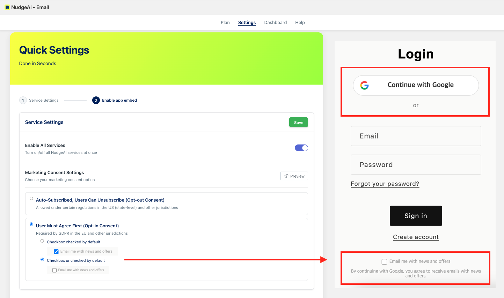

# 로그인 페이지: 마케팅 동의 설정 (Legacy 계정)

NudgeAI는 Shopify **'클래식(Legacy) 고객 계정'**으로 설정된 스토어의 로그인 및 회원가입 페이지에 'Continue with Google' (Google 계정으로 계속하기) 버튼을 적용하여 고객 정보 수집 과정을 개선합니다. 이 과정에서 고객의 마케팅 정보 수신 동의는 NudgeAI 앱 관리자 페이지의 **"Quick Settings (빠른 설정)"** 내 **"Marketing Consent Settings (마케팅 수신 동의 설정)"**에서 고객님께서 선택하신 옵션에 따라 정확하게 연동되어 처리됩니다.

!!! success "중요: Legacy 계정 전용 기능"
    이 로그인/회원가입 페이지에서의 마케팅 동의 처리 방식은 Shopify **'클래식(Legacy) 고객 계정'** 설정을 사용하시는 경우에만 해당합니다.

NudgeAI 앱의 "Marketing Consent Settings"에는 다음과 같은 세 가지 주요 옵션이 있으며, 각 옵션은 로그인/회원가입 페이지 하단에 표시되는 마케팅 동의 관련 사용자 인터페이스(UI)에 직접적인 영향을 미칩니다:

## 마케팅 동의 설정 옵션

1.  **옵션 A: "Auto-Subscribed, Users Can Unsubscribe (Opt-out Consent)"** (자동 구독, 추후 수신 거부 가능)
    *   **로그인/회원가입 페이지 반영**: 이 "옵트아웃(사후 거부)" 방식을 선택하시면, 고객이 'Continue with Google' 버튼을 클릭하여 정보를 제공할 때, 페이지 하단에 **별도의 마케팅 동의 체크박스가 표시되지 않습니다.**
    *   
    *   **처리 방식**: 고객은 정보 제공과 동시에 이메일 마케팅 수신에 자동으로 동의한 것으로 간주될 수 있습니다. 고객은 추후 수신되는 이메일 등에서 구독을 취소(Unsubscribe)할 수 있는 옵션을 통해 거부 의사를 밝힐 수 있습니다.
        !!! warning "주의"
            이 방식은 특정 국가/지역의 개인정보 보호 규정에 따라 사용 가능 여부가 다를 수 있으므로 주의가 필요합니다.

2.  **옵션 B: "User Must Agree First (Opt-in Consent)" & 세부 옵션 "Checkbox checked by default"** (사전 동의 필요 - 체크박스 기본 선택)
    *   **로그인/회원가입 페이지 반영**: 이 "옵트인(사전 동의)" 방식을 선택하고, "체크박스 기본 선택" 세부 옵션을 활성화하시면, 고객이 'Continue with Google' 버튼을 클릭할 때 페이지 하단에 **"Email me with news and offers" (뉴스 및 혜택 이메일 수신)와 같은 동의 문구와 함께 체크박스가 기본적으로 선택(체크)된 상태로 표시됩니다.**
    *   
    *   **처리 방식**: 고객은 기본적으로 동의하는 것으로 설정되지만, 원치 않을 경우 직접 체크박스를 해제하여 동의하지 않을 수 있습니다. 최종적으로 체크박스가 선택된 상태로 정보 제공을 완료하면 마케팅 수신에 동의한 것으로 기록됩니다.

3.  **옵션 C: "User Must Agree First (Opt-in Consent)" & 세부 옵션 "Checkbox unchecked by default"** (사전 동의 필요 - 체크박스 기본 선택 안 함)
    *   **로그인/회원가입 페이지 반영**: 이 "옵트인(사전 동의)" 방식을 선택하고, "체크박스 기본 선택 안 함" 세부 옵션을 활성화하시면, 페이지 하단에 **동일한 동의 문구와 함께 체크박스가 기본적으로 선택되지 않은(빈칸) 상태로 표시됩니다.**
    *   
    *   **처리 방식**: 고객이 마케팅 정보 수신을 원할 경우, 반드시 직접 체크박스를 선택해야 합니다. 체크박스를 선택하고 정보 제공을 완료해야 마케팅 수신에 동의한 것으로 기록됩니다.

이처럼 NudgeAI는 고객님께서 스토어의 정책과 주요 고객층의 개인정보 보호 규정을 고려하여 가장 적합한 마케팅 동의 방식을 선택하고 적용하실 수 있도록 유연한 옵션을 제공합니다. "Marketing Consent Settings"에서 선택하신 내용은 '클래식(Legacy) 고객 계정'을 사용하는 스토어의 로그인/회원가입 페이지에 즉시 반영되어, 고객으로부터 명확하고 투명한 방식으로 마케팅 수신 동의를 얻는 데 도움을 드립니다.

보다 자세한 NudgeAI 초기 설정 과정은 [설치 후 초기 설정 단계](../setup-guide/initial-setup.md) 문서를 참고해주세요. 