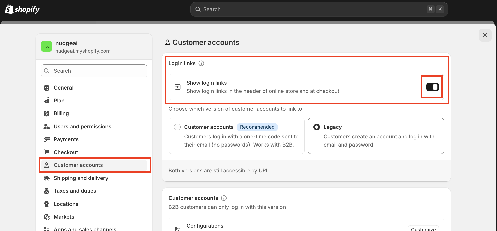

# NudgeAI 설치를 위한 필수 요구 사항

NudgeAI를 Shopify 스토어에 성공적으로 설치하고 모든 기능을 원활하게 사용하시려면, 스토어가 다음의 필수 조건을 충족하는지 먼저 확인해주시기 바랍니다.

1.  **활성화된 Shopify 스토어 보유:**
    *   NudgeAI는 Shopify 플랫폼 전용 앱으로 개발되었습니다. 따라서, 현재 운영 중인 **활성 Shopify 스토어**가 반드시 필요합니다.

2.  **스토어 관리자(Admin) 접근 권한:**
    *   Shopify 앱스토어에서 NudgeAI 앱을 설치하고 관련 설정을 변경하려면, 해당 Shopify 스토어에 대한 **관리자(Admin) 접근 권한**을 가지고 계셔야 합니다.

3.  **Shopify 고객 계정 기능 활성화:**
    *   NudgeAI는 고객의 가입 및 로그인 과정과 밀접하게 연동되어 작동합니다. 따라서 Shopify 스토어 설정에서 **고객 계정(Customer accounts) 기능이 활성화**되어 있어야 합니다.
    *   **확인 경로:** Shopify 관리자 > 설정(Settings) > 고객 계정(Customer accounts)
    *   해당 페이지에서 "고객 계정 방식" (예: 클래식 계정 또는 신규 계정)이 선택되어 있고, 로그인 링크 등이 활성화되어 있는지 확인해주세요.
        *   

이러한 필수 조건이 충족되면 NudgeAI를 원활하게 설치하고 사용하실 수 있습니다. 