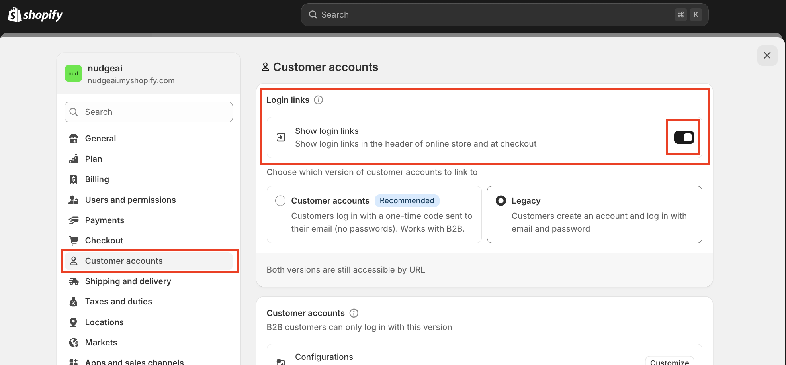

# Shopify 고객 계정: Legacy(클래식) vs. New(신규) 이해하기

Shopify는 스토어 운영자가 고객 계정을 관리하는 방식으로 크게 두 가지, 즉 **"클래식(Legacy) 고객 계정"**과 **"신규(New) 고객 계정"**을 제공합니다. 스토어가 어떤 고객 계정 유형을 사용하느냐에 따라 NudgeAI의 일부 기능(특히 로그인 페이지 개선 및 팝업 동작)이 다르게 적용될 수 있으므로, 현재 스토어의 설정을 파악하고 각 유형의 특징을 이해하는 것이 중요합니다.

## 내 스토어의 고객 계정 유형 확인 방법

현재 스토어가 어떤 고객 계정 유형을 사용하고 있는지 확인하는 방법은 다음과 같습니다:

1.  Shopify 관리자 패널에 로그인합니다.
2.  왼쪽 메뉴 하단의 **'설정(Settings)'**을 클릭합니다.
3.  설정 메뉴에서 **'고객 계정(Customer accounts)'**을 선택합니다.

    
    *Shopify 관리자 > 설정 > 고객 계정*

4.  '고객 계정' 페이지 상단 또는 중간 부분에 현재 선택된 계정 방식이 표시됩니다.
    *   **클래식(Legacy) 고객 계정의 경우:** 일반적으로 "계정이 있는 고객만 체크아웃 허용" 또는 "계정 비활성화"와 같은 옵션과 함께, 로그인 페이지(`/account/login`) 및 회원가입 페이지(`/account/register`)에 대한 언급이 있을 수 있습니다.
    *   **신규(New) 고객 계정의 경우:** "온라인 스토어 및 체크아웃에 신규 고객 계정 사용"과 같은 문구가 명확하게 표시되며, 고객이 이메일로 전송된 6자리 코드를 사용하여 로그인한다는 설명이 있을 수 있습니다.

## Legacy(클래식) 고객 계정과 New(신규) 고객 계정의 주요 차이점

| 구분                     | Legacy (클래식) 고객 계정                                  | New (신규) 고객 계정                                            |
| :----------------------- | :--------------------------------------------------------- | :-------------------------------------------------------------- |
| **로그인 방식**          | 이메일 + 비밀번호                                            | 이메일 + 6자리 인증 코드 (비밀번호 없음)                             |
| **NudgeAI 로그인 페이지 개선** | **로그인/회원가입 페이지에 'Continue with Google' 버튼 적용** | 로그인 페이지 직접 수정 없음 (Shopify 기본 로그인 방식 유지)          |
| **NudgeAI 팝업 동작 (로그인 고객 대상)** | AI Plus Pop-up: 로그인 고객에게 기본적 미노출 (중복 방지) AI Lite Pop-up: 기존 회원 정보 보완/동의 획득에 활용 가능 | AI Plus/Lite Pop-up: 로그인 고객에게도 표시 가능 (정보 보완/동의 목적) |
| **주요 특징**            | 전통적인 계정 관리 방식, 비밀번호 기반                       | 비밀번호 없는 간편 로그인, 이메일 인증 기반, 보안 강화                   |

## 고객 계정 유형별 NudgeAI 설정 및 영향

### 1. Legacy (클래식) 고객 계정을 사용하는 경우

*   **NudgeAI의 역할:** NudgeAI는 스토어의 `/account/login` (로그인) 및 `/account/register` (회원가입) 페이지에 **'Continue with Google' 버튼을 자동으로 추가**하여, 고객이 Google One Tap을 통해 매우 간편하게 로그인하거나 신규 가입하고, 동시에 이름, 이메일, 마케팅 동의 정보를 제공하도록 합니다.
*   **마케팅 동의 처리:** 이 'Continue with Google' 버튼을 통한 마케팅 동의는 NudgeAI 앱의 "Quick Settings" 내 ["Marketing Consent Settings 상세 안내"](../../features/login-page-consent-config-legacy.md)에 따라 처리됩니다.
*   **AI Pop-up 동작:**
    *   **AI Plus Pop-up:** 이미 로그인한 고객에게는 중복 안내를 피하기 위해 기본적으로 표시되지 않습니다.
    *   **AI Lite Pop-up:** 기존 회원의 정보(예: 실명)를 보완하거나 새로운 마케팅 동의를 얻는 데 부드러운 방식으로 활용될 수 있습니다.
*   **권장 사항:** NudgeAI의 로그인 페이지 개선 기능을 최대한 활용하기 위해, Shopify '고객 계정' 설정에서 **"온라인 스토어 및 체크아웃에 고객 계정 표시"** 옵션이 활성화되어 있는지 확인하십시오. (예: "계정이 있는 고객만 체크아웃 허용" 또는 유사한 옵션 선택)

### 2. New (신규) 고객 계정을 사용하는 경우

*   **NudgeAI의 역할:** NudgeAI는 Shopify의 신규 고객 계정 로그인 페이지(이메일과 6자리 코드 입력 방식)를 직접 변경하지 않습니다.
*   **정보 수집 방식:** 이 환경에서는 주로 [AI Plus Pop-up](../../features/ai-plus-popup-purpose-features.md) 및 [AI Lite Pop-up](../../features/ai-lite-popup-introduction.md)을 통해 고객의 실명, 검증된 이메일, 마케팅 수신 동의를 수집합니다. 이는 로그인한 고객에게도 해당될 수 있는데, Shopify 기본 로그인 과정에서 실명이나 마케팅 동의를 필수로 받지 않기 때문입니다.
*   **권장 사항:** NudgeAI의 팝업 기능들이 원활히 작동하여 고객 정보를 효과적으로 수집할 수 있도록, 앱 [초기 설정](./initial-setup.md) 시 서비스 활성화 및 App Embed 설정이 올바르게 완료되었는지 확인하십시오.

## 어떤 계정 유형을 선택해야 할까요?

Shopify는 점차적으로 신규 고객 계정 방식으로의 전환을 권장하고 있습니다. 신규 고객 계정은 비밀번호 없는 로그인으로 고객 편의성을 높이고 보안을 강화하는 장점이 있습니다.

NudgeAI는 두 가지 고객 계정 유형 모두에서 고객 정보 수집을 최적화하도록 설계되었습니다. 현재 스토어의 운영 정책, 고객 특성, 그리고 Shopify의 권장 사항을 종합적으로 고려하여 스토어에 가장 적합한 고객 계정 유형을 선택하고, NudgeAI 설정을 통해 데이터 수집 효과를 극대화하시기 바랍니다.

계정 유형 변경이나 설정에 관해 더 궁금한 점이 있으시면 Shopify의 공식 도움말 문서를 참고하시거나 [NudgeAI 고객 지원팀](../../support/contacting-support.md)에 문의해주시면 친절하게 안내해 드리겠습니다. 