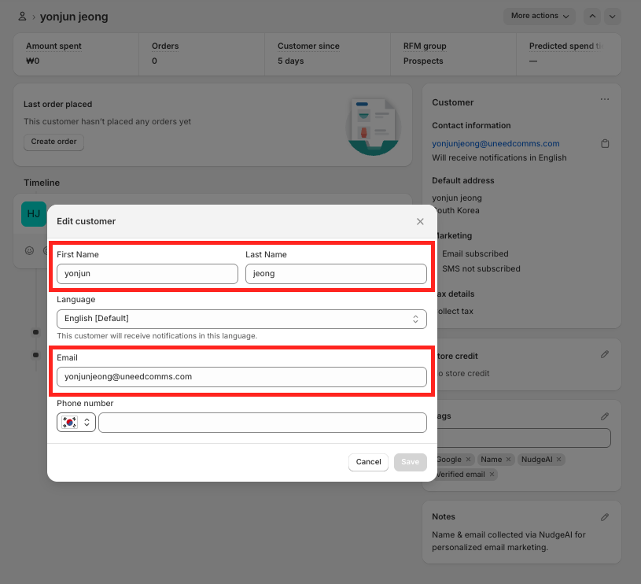

# NudgeAI 모든 설정 완료 확인 방법

NudgeAI 앱 설치, [초기 설정](./initial-setup.md), 그리고 [App Embed 활성화](./app-embed-guide.md)까지 모든 단계를 마치셨다면, 이제 NudgeAI가 스토어에서 정상적으로 작동하고 있는지, 그리고 소중한 고객 정보가 잘 수집되고 있는지 확인해볼 차례입니다. 다음 두 가지 주요 방법을 통해 NudgeAI 설정을 점검하고 실제 작동을 테스트해볼 수 있습니다.

## 1. NudgeAI 앱 대시보드에서 수집 현황 확인

NudgeAI가 올바르게 설정되고 작동하기 시작했다면, NudgeAI 앱 관리자 페이지의 **"Dashboard (대시보드)"** 탭에서 수집된 'High-value' 고객 정보 현황을 직접 확인하실 수 있습니다.

*   **접속 방법:** Shopify 관리자 패널 > 앱(Apps) > NudgeAI 앱 실행 > "Dashboard" 탭 선택

*   **확인 사항:**
    *   **핵심 성과 지표 (Core Performance Metrics):**
        *   
        *   대시보드 상단의 날짜 범위 선택 기능을 통해 특정 기간 동안 **"High-value Emails (고가치 이메일 수)"** 가 증가하고 있는지 확인합니다. 새로 수집된 정보가 있다면 이 숫자가 늘어납니다.
        *   **"Total High-value Emails (총 고가치 이메일 수)"** 는 NudgeAI 사용 시작부터 누적된 전체 수치입니다.
    *   **최근 수집된 고객 목록 (High-Value Email List):**
        *   대시보드 하단에는 최근 NudgeAI를 통해 확보된 고객 정보(이름, 검증된 이메일, 주문 수, 수집일 등)가 표 형태로 제공됩니다. 새로운 고객 정보가 이 목록에 나타나는지 확인합니다.

NudgeAI 앱 대시보드에 데이터가 정상적으로 표시되고 수치가 증가한다면, 기본적인 설정은 올바르게 완료된 것입니다. ([NudgeAI 대시보드 활용법](../../analytics/dashboard-navigation.md)에서 더 자세한 내용을 확인하세요.)

## 2. 실제 스토어에서 NudgeAI 기능 테스트 (가장 확실한 방법)

대시보드 확인과 더불어, 실제 고객이 경험하는 것처럼 스토어 프론트엔드에서 NudgeAI 기능(팝업 노출, 정보 제공 등)을 직접 테스트해보는 것이 가장 확실한 확인 방법입니다.

### 테스트 준비사항

*   **시크릿 모드(Incognito Mode) 사용:** 정확한 테스트를 위해, 이전에 스토어 방문 기록이나 NudgeAI 관련 쿠키/캐시가 남아있지 않은 **브라우저의 시크릿 모드(또는 Private Window)**를 사용하는 것이 매우 중요합니다.
*   **테스트용 Google 계정 준비 (선택 사항):** 실제 정보 제공 흐름까지 테스트하려면, 테스트에 사용할 수 있는 Google 계정으로 브라우저에 로그인해두는 것이 좋습니다.

### NudgeAI 작동 테스트 단계

1.  **AI Plus Pop-up 테스트 (모바일 환경):**
    *   스마트폰 또는 브라우저의 모바일 보기 모드를 사용하여 스토어의 **메인 페이지, 장바구니 페이지, 또는 상품 구매 후 주문 완료 페이지**에 접속합니다.
    *   페이지 로딩 시 화면 하단에 AI Plus Pop-up이 정상적으로 나타나는지 확인합니다.
    *   팝업을 클릭(탭)했을 때 Google One Tap 정보 제공 인터페이스가 올바르게 실행되는지 확인합니다.

2.  **AI Lite Pop-up 테스트 (PC/모바일 환경):**
    *   PC 또는 모바일 환경에서 스토어의 **메인 페이지 또는 상품 상세 페이지**에 접속합니다.
    *   페이지를 **약 50% 정도 아래로 스크롤**했을 때, 화면 하단 등에 AI Lite Pop-up (일반적으로 "뉴스레터 구독"을 유도하는 바 형태)이 부드럽게 나타나는지 확인합니다.
    *   "Subscribe" 버튼을 클릭했을 때 Google One Tap 인터페이스가 올바르게 실행되는지 확인합니다.

3.  **'Continue with Google' 버튼 테스트 (클래식 고객 계정 사용 시):**
    *   스토어가 ['클래식(Legacy) 고객 계정'](./shopify-customer-accounts.md)을 사용 중이라면, 스토어의 **로그인 페이지(`/account/login`) 또는 회원가입 페이지(`/account/register`)**에 접속합니다.
    *   'Continue with Google' 버튼이 정상적으로 표시되는지 확인합니다.
    *   버튼을 클릭했을 때 Google One Tap 인터페이스가 올바르게 실행되고, 마케팅 동의 관련 UI(NudgeAI 앱 설정에 따라 다름)가 의도한 대로 표시되는지 확인합니다.

4.  **(선택 사항) 실제 정보 제공 및 Shopify 고객 목록 확인:**
    *   테스트용 Google 계정을 사용하여 위 1~3번 과정 중 하나를 통해 실제 정보 제공(이름, 이메일, 마케팅 동의)을 완료합니다.
    *   잠시 후 Shopify 관리자 패널 > 고객(Customers) 메뉴로 이동하여, 해당 테스트 고객 정보가 Shopify에 올바르게 기록되었는지 확인합니다.
        *   고객의 이름과 이메일이 정확히 입력되었는지 확인합니다.
            *   
        *   마케팅 수신 동의 상태("Email subscribed")가 올바르게 반영되었는지 확인합니다.
            *   
        *   NudgeAI 관련 태그("NudgeAI", "Google", "Name", "Verified email" 등)가 자동으로 추가되었는지 확인합니다.
            *   
        *   고객 상세 정보의 'Notes (메모)' 섹션에 NudgeAI를 통한 수집 기록이 남았는지 확인합니다.
            *    (목록에서 말풍선 아이콘으로도 확인 가능)
        *   고객 타임라인에 NudgeAI 활동(예: "NudgeAi - Email created this customer." 또는 "NudgeAi - Email added a note to this customer.")이 기록되었는지 확인합니다.
            *   
            *   

## 문제 해결

위 테스트 과정에서 NudgeAI 기능이 예상대로 작동하지 않거나 정보가 올바르게 기록되지 않는다면, 다음 문서들을 먼저 참고하여 설정을 다시 한번 점검해보세요:

*   [NudgeAI 설치 후 초기 설정 단계](./initial-setup.md)
*   [App Embed 상세 가이드](./app-embed-guide.md)
*   [팝업이 표시되지 않을 때 문제 해결 방법](../../support/troubleshooting-popup-display.md)

지속적으로 문제가 해결되지 않는다면, 언제든지 [NudgeAI 고객 지원팀](../../support/contacting-support.md)으로 문의해주십시오. 문제 상황을 자세히 알려주시면 신속한 해결을 도와드리겠습니다. 