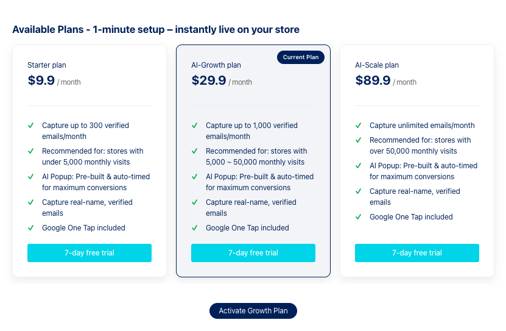

# NudgeAI Subscription Plans & Pricing

NudgeAI offers three main subscription plans designed to provide optimal value based on your store's size and needs. Each plan includes NudgeAI's core features to help grow your Shopify store, and **all plans come with a 7-day free trial period** so you can experience them without any burden before deciding!

## NudgeAI Subscription Plan Details

### 1. Starter Plan

*   **Monthly Fee**: **$9.9 USD**
*   **Monthly Collection Limit**: Up to **300** verified emails (including full name)
*   **Recommended Store Size**: Suitable for stores with approximately **less than 5,000 monthly visitors**, or those just starting with NudgeAI or operating on a small scale.
*   **Key Features Included**:
    *   AI Pop-up (AI Plus Pop-up & AI Lite Pop-up): Smart pop-up feature with pre-built designs and AI-based automatic timing for maximum conversion (custom design changes or A/B testing are not provided, offering a standardized, optimized experience for all users).
    *   Customer Full Name & 100% Verified Email Address Collection: Secure accurate customer names (First Name, Last Name) and valid, actively used email addresses through Google One Tap technology.
    *   Google One Tap Technology Included by Default: Offers customers the most convenient and trustworthy information provision experience.
    *   Install in 1 Minute & Use Immediately: Apply NudgeAI to your store very quickly and easily without complex procedures and experience its effects right away.

### 2. AI-Growth Plan

*   **Monthly Fee**: **$29.9 USD**
*   **Monthly Collection Limit**: Up to **1,000** verified emails (including full name)
*   **Recommended Store Size**: Ideal for growing stores with approximately **5,000 to 50,000 monthly visitors**, or stores looking to secure more customer information for active marketing.
*   **Key Features Included**:
    *   All features of the Starter Plan
    *   Higher monthly collection limit

### 3. AI-Scale Plan

*   **Monthly Fee**: **$89.9 USD**
*   **Monthly Collection Limit**: **Unlimited** (collect verified emails without restrictions)
*   **Recommended Store Size**: Optimized for large-scale stores with approximately **more than 50,000 monthly visitors** or stores that require a large volume of customer information for very active marketing activities.
*   **Key Features Included**:
    *   All features of the AI-Growth Plan
    *   Unlimited monthly collection limit

## Common to All Plans

*   **7-Day Free Trial**: Whichever plan you choose, you can use all its features for free for the first 7 days after signing up. Experience firsthand the positive changes NudgeAI can bring to your store during this period!
*   **'High-value' Customer Information Acquisition**: In all plans, NudgeAI focuses on collecting 'high-value customer information,' which includes not just an email address, but also the customer's full name, a 100% verified email, and explicit consent for marketing/newsletter subscriptions.

## Plan Selection and Changes

After installing the NudgeAI app, you can re-check the latest detailed information for each plan in the 'Plan' or 'Account' related menu within the app admin page, and select the most suitable plan for your store or change your existing plan. (For more details, please refer to the "[Choosing the Right Plan for Your Store](choosing-your-plan.md)" and "[Free Trial & Converting to a Paid Plan](free-trial-paid-conversion.md)" documents.)

We hope you choose the optimal NudgeAI plan tailored to your store's scale and marketing goals to create a new experience in customer information collection and achieve outstanding marketing results! 