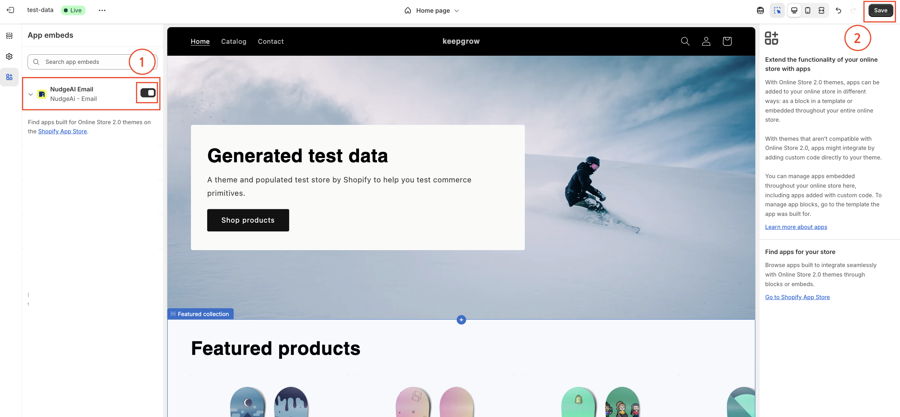

# First Steps After NudgeAI Installation

Once you have successfully installed the NudgeAI app in your Shopify store, you will go through a few simple initial setup steps to start using NudgeAI's powerful features. The very first steps involve **selecting a subscription plan** and completing the **Quick Settings**.

All plans include a **7-day free trial**, so you can experience all of NudgeAI's features without any commitment!

## Initial Setup Process

When you first access the NudgeAI app admin page, you will proceed with the initial setup in the following order:

### Step 1: Select Your Subscription Plan (Start Your 7-Day Free Trial)

To use all of NudgeAI's features, you first need to choose a subscription plan that suits your store's size and needs.

*   **Available Plans:** Various plans such as "Starter Plan," "AI-Growth Plan," and "AI-Scale Plan" are available. Each plan differs in the monthly limit of real-name email subscribers you can collect and the features provided. For more details, please refer to the [NudgeAI Subscription Plans & Pricing](../pricing/plans-pricing.md) page.
*   **7-Day Free Trial:** A 7-day free trial is offered for all paid plans. During this period, you can freely use all the features of your selected plan and see firsthand how NudgeAI can benefit your store.
*   **How to Select a Plan:** Compare the details of each plan and click the **"7-day free trial"** button (or a similar plan selection button) under the plan you think is most suitable for your store.

### Step 2: Complete Quick Settings

Once you have selected a subscription plan and started your free trial, you now need to complete the "Quick Settings" to ensure NudgeAI works correctly on your store.

#### 2-1. Service Settings

In the "Quick Settings" section of the NudgeAI app dashboard, configure and save the following items:

*   **Enable All Services:** Ensure this switch is turned on to activate all NudgeAI features.
*   **Marketing Consent Settings:** Choose how you want to handle customer marketing consent according to your store's privacy policy and marketing strategy. This setting primarily affects the consent UI on the login page when using Shopify's ['Classic (Legacy)' Customer Accounts](./shopify-customer-accounts.md). For a detailed explanation of each option (Opt-out, Opt-in with checkbox checked/unchecked) and how it applies to the login page, please refer to the [Login Page: Detailed Guide to Marketing Consent Settings](../features/login-page-consent-config-legacy.md) document. (Consent via AI Pop-ups follows the specific wording of each pop-up.)
*   **Save:** After completing the above settings, be sure to click the **"Save"** button to save your changes.

#### 2-2. Enable App Embed

For NudgeAI's UI elements, like pop-ups, to display correctly in your store, you need to enable the NudgeAI app embed in your Shopify theme.

*   Click the **"Enable app embed"** button within the NudgeAI app dashboard's "Quick Settings" section or as guided separately.
*   The Shopify theme editor page will open. Navigate to the **'App embeds'** section in the left sidebar.
*   Find **"NudgeAI Email"** (or a similarly named NudgeAI-related item) in the list and turn on its switch to activate it.
*   
*   Finally, click the **'Save'** button in the top right corner of the Shopify theme editor to apply the changes.

## Setup Complete

Once you have successfully completed all the steps above, NudgeAI is ready to start collecting valuable customer information on your store. You can now [verify that NudgeAI features are working correctly](./verifying-setup.md) on your storefront.

If you have any questions or encounter any difficulties during the initial setup process, please do not hesitate to contact the [NudgeAI Customer Support team](../support/contacting-support.md) at any time. 