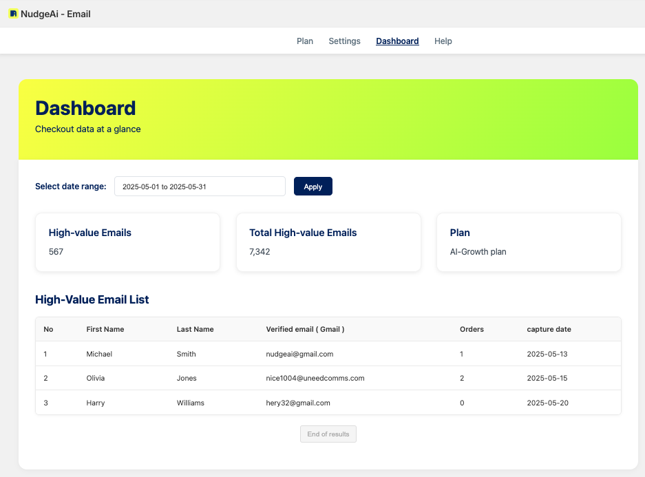
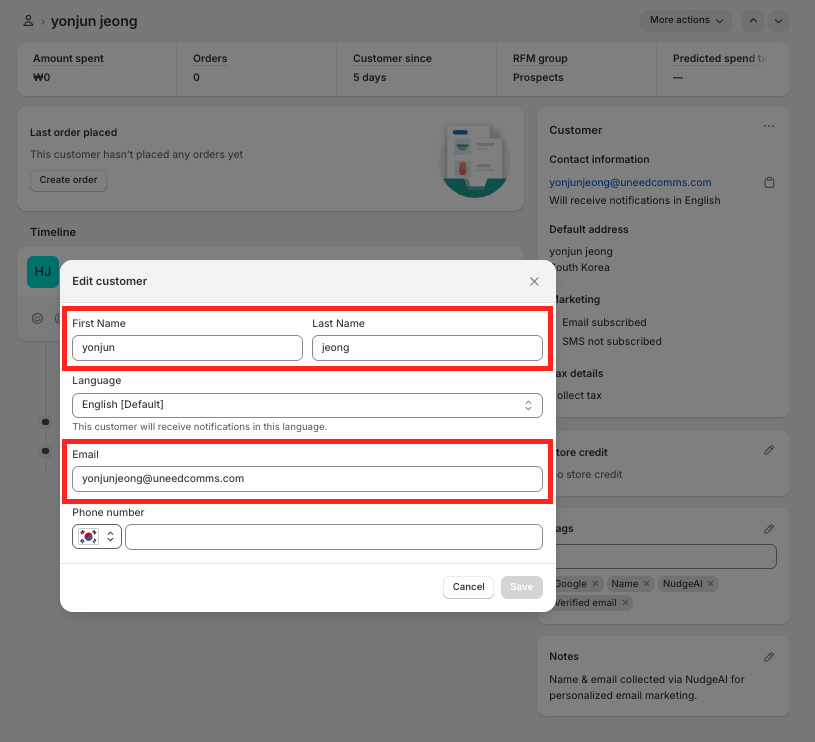
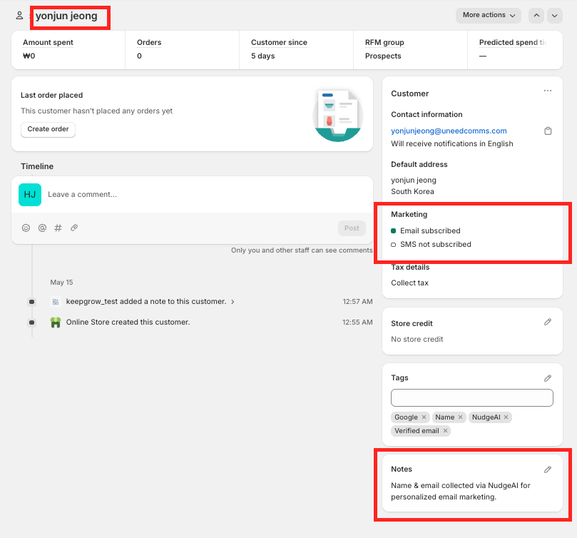
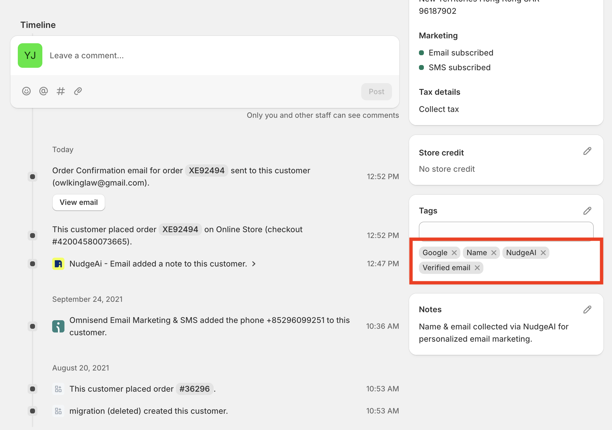
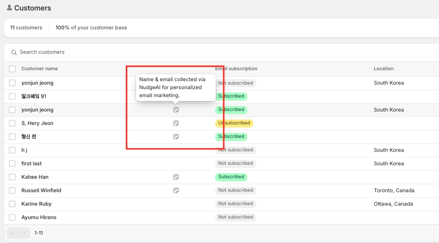
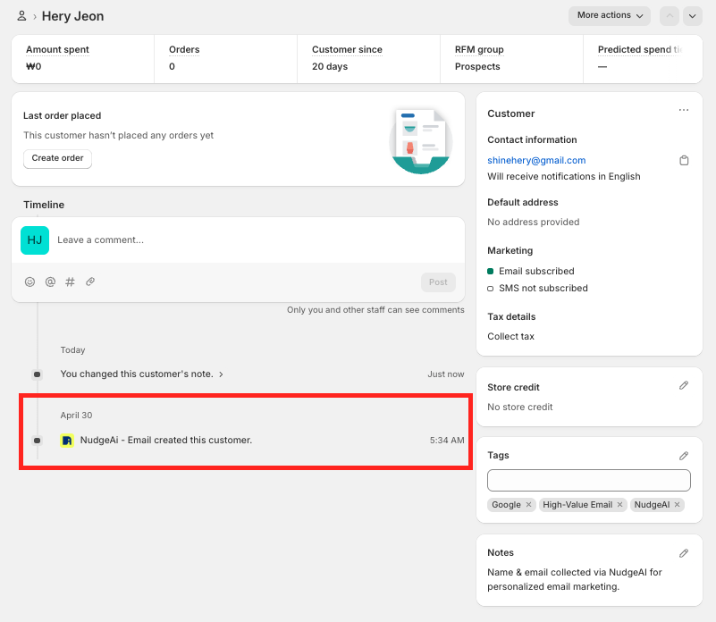
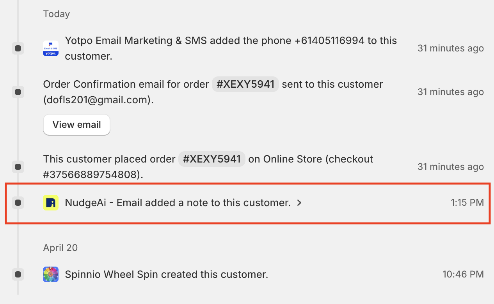

# Verifying Your NudgeAI Setup

After completing all the steps, including NudgeAI app installation, [initial setup](./initial-setup.md), and [App Embed activation](./app-embed-guide.md), it's time to verify that NudgeAI is working correctly on your store and that valuable customer information is being collected. You can check your NudgeAI setup and test its actual operation using the following two main methods.

## 1. Check Collection Status on the NudgeAI App Dashboard

If NudgeAI is set up correctly and has started working, you can directly check the status of collected 'High-value' customer information on the **"Dashboard"** tab of the NudgeAI app admin page.

*   **How to Access:** Shopify Admin Panel > Apps > NudgeAI app > Select "Dashboard" tab.

*   **What to Check:**
    *   **Core Performance Metrics:**
        *   
        *   Using the date range selector at the top of the dashboard, check if the number of **"High-value Emails"** is increasing over a specific period. This number will grow if new information is being collected.
        *   **"Total High-value Emails"** shows the cumulative total since you started using NudgeAI.
    *   **Recently Collected Customer List (High-Value Email List):**
        *   Below the core metrics, a table displays recently acquired customer information (name, verified email, order count, capture date, etc.). Confirm that new customer information is appearing in this list.

If data is displayed correctly on the NudgeAI app dashboard and the numbers are increasing, your basic setup is likely correct. (See [Navigating Your NudgeAI Dashboard](../analytics/dashboard-navigation.md) for more details.)

## 2. Test NudgeAI Features on Your Live Store (Most Reliable Method)

In addition to checking the dashboard, the most reliable way to confirm is to test NudgeAI features (pop-up display, information submission, etc.) directly on your store's front-end, just as a customer would experience them.

### Test Preparations

*   **Use Incognito Mode:** For accurate testing, it is crucial to use your **browser's Incognito Mode (or Private Window)** to ensure no previous store visit history or NudgeAI-related cookies/cache interfere.
*   **Prepare a Test Google Account (Optional):** To test the full information submission flow, it's recommended to be logged into a Google account that you can use for testing.

### NudgeAI Operational Test Steps

1.  **Test AI Plus Pop-up (Mobile Environment):**
    *   Using a smartphone or your browser's mobile view mode, visit your store's **main page, cart page, or the order completion page** after a purchase.
    *   Verify that the AI Plus Pop-up appears correctly at the bottom of the screen upon page load.
    *   Click (tap) the pop-up to confirm that the Google One Tap information submission interface launches correctly.

2.  **Test AI Lite Pop-up (PC/Mobile Environment):**
    *   On a PC or mobile device, visit your store's **main page or a product detail page**.
    *   Scroll down the page approximately **50%** and check if the AI Lite Pop-up (usually a bar prompting newsletter subscription) appears smoothly at the bottom of the screen or similar.
    *   Click the "Subscribe" button to confirm that the Google One Tap interface launches correctly.

3.  **Test 'Continue with Google' Button (If Using Classic Customer Accounts):**
    *   If your store uses ['Classic (Legacy)' Customer Accounts](./shopify-customer-accounts.md), navigate to your store's **login page (`/account/login`) or sign-up page (`/account/register`)**.
    *   Verify that the 'Continue with Google' button is displayed correctly.
    *   Click the button to confirm that the Google One Tap interface launches correctly and that the marketing consent UI (which varies based on NudgeAI app settings) appears as intended.

4.  **(Optional) Submit Information & Check Shopify Customer List:**
    *   Using a test Google account, complete the information submission (name, email, marketing consent) through one of the processes from steps 1-3.
    *   After a short while, go to your Shopify Admin Panel > Customers and verify that the test customer information has been correctly recorded in Shopify:
        *   Check if the customer's name and email are entered accurately.
            *   
        *   Verify that the marketing consent status ("Email subscribed") is correctly reflected.
            *   
        *   Check if NudgeAI-related tags (e.g., "NudgeAI", "Google", "Name", "Verified email") have been automatically added.
            *   
        *   Confirm that a NudgeAI collection record is present in the 'Notes' section of the customer details page.
            *    (Also visible as a speech bubble icon in the customer list)
        *   Check the customer timeline for NudgeAI activity (e.g., "NudgeAi - Email created this customer." or "NudgeAi - Email added a note to this customer.").
            *   
            *   

## Troubleshooting

If NudgeAI features do not work as expected during the test, or if information is not recorded correctly, please first review the following documents to double-check your settings:

*   [First Steps After NudgeAI Installation](./initial-setup.md)
*   [Detailed App Embed Guide](./app-embed-guide.md)
*   [Troubleshooting: Pop-up Not Displaying](../support/troubleshooting-popup-display.md)

If issues persist, please do not hesitate to [contact NudgeAI Customer Support](../support/contacting-support.md). Providing details about the problem (e.g., which pop-up, on which page/environment, what steps you've already checked) will help us resolve the issue more quickly. 