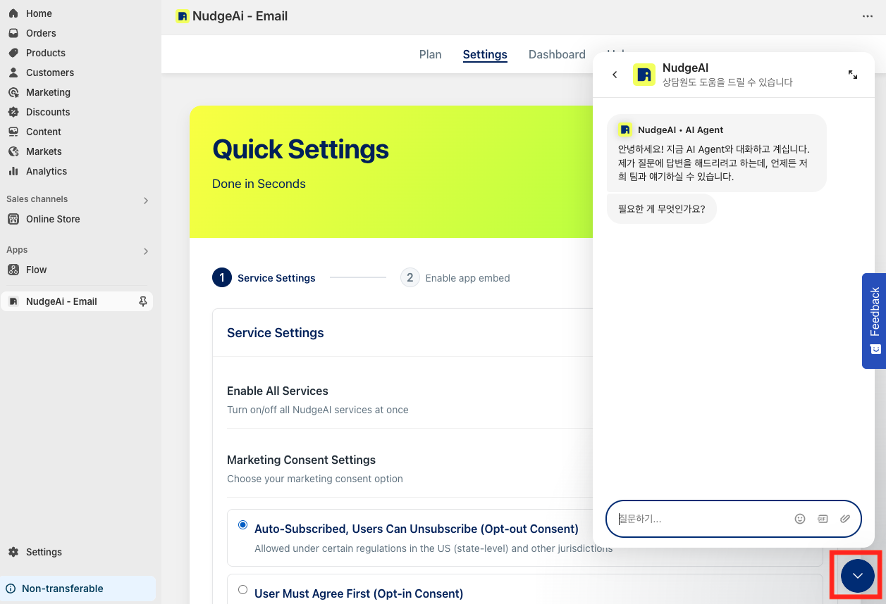

# Contacting NudgeAI Customer Support

When you have questions while using NudgeAI or need help with unexpected technical issues, our NudgeAI Customer Support team is ready to assist you promptly and courteously!

The **quickest and most convenient way** to make inquiries or request support related to NudgeAI is by using the **real-time chatbot consultation feature available within the NudgeAI app.**

## 1. Real-Time Chatbot Consultation within the NudgeAI App

*   **How to Use:**
    1.  Access the NudgeAI app admin page (dashboard, settings page, etc.) by running the NudgeAI app from your Shopify admin panel.
    2.  Click the **blue speech bubble-shaped chatbot icon located at the bottom right** of the screen.
    3.  When the chatbot window titled "NudgeAI - AI Agent" opens, you can type your questions or describe the problem to get immediate assistance.
*   **Advantages:**
    *   **Real-Time Response:** AI agents or support staff strive to provide answers as quickly as possible.
    *   **Better Contextual Understanding:** Inquiring directly from within the app allows for more accurate and swift support based on an understanding of your store information and the current screen you are viewing.
    *   **Convenience:** It's very convenient as you can inquire and receive answers instantly without needing to compose separate emails or navigate to different pages.
    *   

## 2. Email Support (If Chatbot Resolution is Difficult or for Additional Materials)

*   If your issue cannot be resolved through the chatbot consultation, or if you need to attach additional materials like screenshots or files for a detailed inquiry, you can also contact the NudgeAI Customer Support team via our official **email address**.
*   **NudgeAI Official Support Email:** `support@nudgeaiapp.com` (Example)
*   When emailing, please include your Shopify store address (`your-store-name.myshopify.com`) and provide as much detail as possible about your inquiry (question, problem description, error messages, etc.).

## 3. Help Section within the NudgeAI App

*   Before contacting via chatbot, it's also a good idea to first check if your question is already answered in the 'Help' tab or FAQ section within the app (if available).

## Useful Information When Making an Inquiry

Regardless of the channel you use, providing the following information will greatly help us understand the problem more quickly and accurately, and offer a solution:

*   Your Shopify store address
*   A detailed description of your inquiry
*   Error messages (if any) and relevant screenshots
*   The situation before and after the problem occurred, or steps to reproduce it

The NudgeAI Customer Support team promises to do our best to support you in achieving the best experience and results with NudgeAI. Please do not hesitate to contact us if you have any questions or difficulties! 