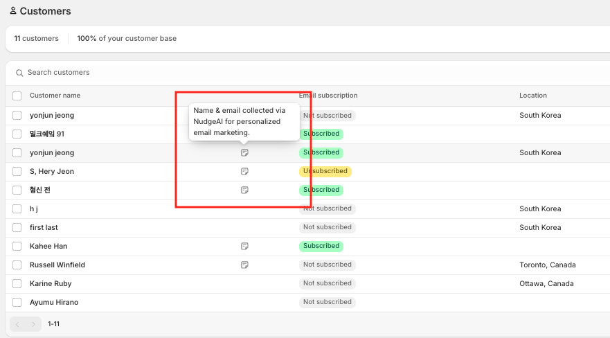
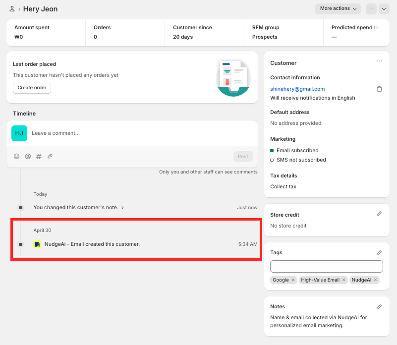

 

**I. NudgeAI 서비스 소개**

1. NudgeAI는 어떤 문제를 해결해주고, 어떤 가치를 제공하는 서비스인가요?
    
    Shopify 스토어를 운영하시면서 다음과 같은 어려움을 겪고 계신가요?
    
    - **고객 이름 확보의 어려움:** 개인화된 마케팅을 위해 고객의 실명을 알고 싶지만, 대부분 이메일 주소만 수집하게 됩니다.
    - **가짜 또는 잘못된 이메일 주소:** 힘들게 수집한 이메일 주소가 실제 사용되지 않거나 오타가 많아 마케팅 효율이 떨어집니다.
    - **낮은 이메일 구독률:** 많은 방문자가 스토어를 그냥 지나치거나, 복잡한 가입 절차 때문에 이메일 구독을 포기합니다.
    - **불편한 가입/구독 경험:** 고객이 이메일과 정보를 직접 입력해야 하는 번거로움 때문에 스토어 이용을 망설입니다.
    
    **NudgeAI는 이러한 문제들을 해결하고 다음과 같은 핵심 가치를 제공합니다:**
    
    1. **획기적인 고품질 이메일 리스트 성장**
    - Google One Tap 기술을 활용하여, 고객이 단 한 번의 클릭으로 이메일 구독 및 회원가입을 완료하도록 돕습니다. 이를 통해 기존 방식보다 훨씬 높은 전환율로 이메일 리스트를 빠르게 성장시킬 수 있습니다.
    1. **100% 검증된 Gmail 주소 확보**
    - 고객의 실제 Google 계정을 기반으로 이메일 주소를 수집하므로, 오타나 가짜 이메일 없는 100% 유효한 Gmail 주소를 확보할 수 있습니다. 이는 이메일 마케팅의 도달률과 효율성을 크게 향상시킵니다.
    1. **고객 실명 자동 획득으로 개인화 마케팅 강화**
    - 이메일 주소와 함께 고객의 Google 계정에 등록된 실명(이름+성)을 자동으로 수집합니다. 이를 통해 고객에게 더욱 친밀하고 개인화된 메시지를 전달하여 마케팅 효과를 극대화할 수 있습니다.
    1. **마케팅 수신 동의 명확화** 
    - Google One Tap 과정에서 고객에게 명확하게 마케팅 정보 수신 동의를 받을 수 있도록 설계되어, 스팸 관련 문제를 줄이고 고객과의 신뢰를 구축하는 데 도움을 줍니다.
    1. **최상의 고객 경험 제공**
    - 복잡한 정보 입력 과정 없이 단 한 번의 클릭으로 모든 절차가 완료되므로, 고객에게 매우 편리하고 매끄러운 가입/구독 경험을 제공합니다. 이는 고객 만족도를 높이고 스토어의 긍정적인 이미지를 구축하는 데 기여합니다.
    
    **간단히 말해, NudgeAI‑Valuable Email Capture는 Shopify 스토어 운영자분들이 더 쉽고 빠르게, 더 높은 품질의 고객 정보를 확보하여, 이를 바탕으로 효과적인 마케팅을 펼치고 비즈니스를 성장시킬 수 있도록 돕는 강력한 도구입니다.**
    
2. Shopify 스토어 운영자라면 NudgeAI를 왜 사용해야 할까요? (주요 이점)
    
    Shopify 스토어의 성장을 목표로 하신다면, NudgeAI는 다음과 같은 확실한 이점을 제공하여 고객님의 비즈니스에 강력한 성장 동력을 더해줄 수 있습니다.
    
    1. **고객 실명 자동 수집으로 '진짜' 개인화 마케팅 실현**
    - **문제점:** "고객님" 대신 "OOO님"이라고 부르고 싶지만, 고객 이름을 얻기 어렵습니다.
    - **NudgeAI의 해결책:** Google 계정에서 고객의 이름과 성을 자동으로 가져와, 수집된 이메일과 함께 제공합니다. 이를 통해 단순한 이메일 주소 목록이 아닌, 이름까지 포함된 고품질 고객 데이터베이스를 구축할 수 있습니다. 고객에게 이름으로 다가가는 진정한 개인화 마케팅으로 고객 충성도를 높여보세요.
    1. **평균 5~10배 높은 이메일 구독/가입 전환율 달성**
    - **문제점:** 기존 팝업이나 가입 양식은 고객에게 번거로움을 주어 이탈률이 높습니다.
    - **NudgeAI의 해결책:** Google One Tap 기술을 통해 단 한 번의 클릭으로 모든 가입/구독 절차가 완료됩니다. 이 혁신적인 간편함은 고객의 참여를 극대화하여, 평균적으로 5배에서 10배 더 높은 전환율을 기대할 수 있게 합니다. 더 많은 잠재 고객을 실제 구독자로 확보하세요.
    1. **100% 검증된 '진짜' 고객 이메일 확보로 마케팅 ROI 극대화**
    - **문제점:** 오타, 임시 이메일, 가짜 이메일 주소는 마케팅 예산 낭비의 주범입니다.
    - **NudgeAI의 해결책:** 고객의 실제 Google 계정에서 직접 이메일 주소를 가져오므로, 스팸이나 반송 걱정 없는 100% 유효한 Gmail 주소만 수집합니다. 이는 이메일 캠페인의 도달률과 오픈율을 높여 실질적인 마케팅 ROI 향상으로 이어집니다.
    1. **간편한 설치와 자동화된 운영으로 시간 및 리소스 절약**
    - **문제점:** 새로운 앱을 도입하고 운영하는 데 많은 시간과 노력이 필요합니다.
    - **NudgeAI의 해결책:** 단 5분이면 Shopify 스토어에 간편하게 설치하고 바로 사용을 시작할 수 있습니다. 복잡한 설정이나 코드 수정 없이 대부분의 기능이 자동으로 작동하여, 고객님은 핵심 비즈니스에 더 집중할 수 있습니다.
    1. **고객 경험 향상으로 스토어 이미지 제고** 
    - **문제점:** 귀찮은 가입 절차는 고객에게 부정적인 첫인상을 줄 수 있습니다.
    - **NudgeAI의 해결책:** 고객들은 이미 다양한 서비스에서 Google One Tap의 빠르고 편리한 로그인/가입 경험에 익숙해져 있으며, 이를 신뢰합니다. NudgeAI는 바로 이 **신뢰도 높은 Google One Tap 경험을 고객님의 스토어에 그대로 제공**합니다. 이를 통해 고객은 익숙하고 안전한 방식으로 정보를 제공하게 되어 고객 만족도가 향상될 뿐만 아니라, 스토어의 현대적이고 고객 중심적인 이미지와 함께 장기적인 브랜드 신뢰도 구축에도 크게 기여합니다.
    
    **결국, NudgeAI를 사용해야 하는 이유는 명확합니다:** 적은 노력으로 더 많은 고품질 고객 정보를 확보하고, 이를 통해 마케팅 성과를 극대화하며, 동시에 고객에게 최상의 사용 경험을 제공하여 스토어의 지속적인 성장을 이끌 수 있기 때문입니다.
    
3. NudgeAI의 가장 핵심적인 기능은 무엇인가요?
    
    NudgeAI의 가장 핵심적인 기능은 **"Google One Tap 기술을 활용하여, Shopify 스토어 방문 고객으로부터 단 한 번의 클릭으로 100% 검증된 Gmail 주소, 고객의 실명, 그리고 마케팅 수신 동의를 손쉽게 획득하는 것"**입니다.
    
    조금 더 풀어서 설명드리면, NudgeAI는 다음의 두 가지 주요 메커니즘을 통해 이 핵심 기능을 구현합니다:
    
    1. **Google One Tap 인터페이스 제공:**
    - 고객에게 매우 익숙하고 신뢰도 높은 Google의 'One Tap' 인증 방식을 스토어의 다양한 접점(예: AI Plus Pop-up, AI Lite Pop-up, 회원가입/로그인 페이지)에 제공합니다.
    - 이를 통해 고객은 별도의 정보 입력 없이, 클릭 한 번으로 자신의 Google 계정 정보를 스토어에 안전하게 제공할 수 있습니다.
    1. **고품질 핵심 정보 자동 수집:**
    - 위 Google One Tap 과정을 통해, 스토어는 다음과 같은 'High-value' 정보를 자동으로, 그리고 정확하게 수집합니다:
    - **100% 검증된 Gmail 주소:** 실제 사용 중인 유효한 이메일입니다.
    - **고객 실명 (이름+성):** Google 계정에 등록된 실제 이름입니다.
    - **명시적인 마케팅 수신 동의:** 고객이 정보 제공과 함께 마케팅 메시지 수신에 동의했음을 명확히 합니다.
    
    **이것이 왜 핵심 기능인가요?**
    
    이 핵심 기능을 통해 NudgeAI는 Shopify 스토어 운영자분들이 겪는 고질적인 문제(낮은 구독률, 부정확한 고객 정보, 개인화 마케팅의 어려움 등)를 해결하고, 마케팅 활동의 기반이 되는 가장 중요하고 가치 있는 고객 데이터를 효율적으로 구축할 수 있도록 직접적으로 돕기 때문입니다.
    
    결국, NudgeAI는 "클릭 한 번으로 진짜 고객 정보(이메일, 이름, 동의)를 얻어 마케팅을 강화하는 것"이 서비스의 가장 본질적인 핵심 기능이라고 할 수 있습니다.
    
4. NudgeAI는 Shopify 플랫폼에서만 사용할 수 있나요?
    
    **네, 현재 NudgeAI는 Shopify 플랫폼 전용으로 개발되어 Shopify 앱스토어를 통해서만 설치하고 사용하실 수 있습니다.**
    
    NudgeAI는 Shopify 스토어의 특성과 환경에 최적화된 기능을 제공하여, Shopify를 사용하시는 고객님들이 고객 정보를 효과적으로 수집하고 마케팅에 활용하실 수 있도록 특별히 설계되었습니다.
    
    따라서 NudgeAI의 모든 기능을 원활하게 이용하시려면 Shopify 스토어를 운영하고 계셔야 합니다.
    

**II. 시작하기: 설치부터 기본 설정까지**

- **앱 설치 및 요금제**
    1. Shopify 앱스토어에서 NudgeAI를 어떻게 찾아 설치할 수 있나요?
        
        NudgeAI 앱은 Shopify 앱스토어에서 쉽게 찾아 몇 단계만으로 간편하게 설치하실 수 있습니다. 아래 방법을 따라 진행해주세요.
        
        1. **Shopify 관리자 패널 접속:**
        - 먼저 운영하시는 Shopify 스토어의 관리자 패널에 로그인합니다. (예: 내스토어이름.myshopify.com/admin)
        1. **앱 메뉴 이동:**
        - 관리자 패널 왼쪽 메뉴에서 **'앱(Apps)'** 항목을 클릭합니다.
        1. **Shopify 앱스토어 방문:**
        - '앱' 페이지 오른쪽 상단 또는 페이지 내에 있는 **'Shopify 앱 스토어 방문(Visit Shopify App Store)'** 버튼 또는 **'앱 및 세일즈 채널 설정(App and sales channel settings)'**을 클릭 후 **'Shopify 앱 스토어(Shopify App Store)'** 버튼을 클릭합니다. (Shopify 관리자 화면 버전에 따라 버튼명이나 위치가 약간 다를 수 있습니다.)
        1. **NudgeAI 검색:**
        - Shopify 앱스토어가 열리면, 상단에 있는 검색창에 **"NudgeAI"** 또는 **"NudgeAI - Email"** 와 같이 앱 이름을 입력하고 검색합니다.
        1. **NudgeAI 앱 선택:**
        - 검색 결과에서 NudgeAI 앱 (NudgeAI 로고와 설명을 확인하세요)을 찾아 클릭합니다.
        1. **앱 추가:**
        - NudgeAI 앱 상세 페이지에서 **'앱 추가(Add app)'** 또는 **'설치(Install)'** 버튼을 클릭합니다.
        1. **권한 검토 및 설치 승인:**
        - Shopify가 NudgeAI 앱이 스토어 정보에 접근하기 위해 필요한 권한 목록을 보여줍니다. 내용을 검토하신 후, 페이지 하단 또는 상단의 **'앱 설치(Install app)'** 버튼을 클릭하여 설치를 최종 승인합니다.
        1. **설치 완료 및 초기 설정:**
        - 잠시 후 NudgeAI 앱이 스토어에 설치되며, 일반적으로 NudgeAI 앱의 관리자 페이지(대시보드)로 이동하게 됩니다. 여기서 요금제를 선택하고 필요한 초기 설정을 진행하실 수 있습니다. (초기 설정에 대한 자세한 안내는 별도 가이드를 참고해주세요.)
        
        이 단계를 통해 NudgeAI 앱을 성공적으로 설치하실 수 있습니다. 만약 설치 과정에서 어려움이 있으시면 언제든지 저희 고객 지원팀에 문의해주세요.
        
    2. NudgeAI를 설치하기 전에 스토어에서 준비해야 할 사항이 있나요? (요구사항)
        
        NudgeAI를 원활하게 설치하고 모든 기능을 효과적으로 사용하시려면, 스토어가 다음 몇 가지 기본적인 요구사항을 충족하는지 확인해주시는 것이 좋습니다.
        
        1. **Shopify 스토어 보유**
        - NudgeAI는 Shopify 플랫폼 전용 앱입니다. 따라서, 운영 중인 **활성 Shopify 스토어**가 반드시 필요합니다.
        1. **스토어 관리자 권한**
        - Shopify 앱스토어에서 앱을 설치하고 설정을 변경하려면, 해당 Shopify 스토어에 대한 **관리자(Admin) 접근 권한**이 있어야 합니다.
        1. **Shopify 고객 계정 기능 활성화**
        - NudgeAI는 고객의 가입 및 로그인 과정과 밀접하게 연관되어 작동합니다. 따라서 Shopify 스토어 설정에서 **고객 계정(Customer accounts) 기능이 활성화**되어 있어야 합니다.
        - Shopify 관리자 > 설정(Settings) > 고객 계정(Customer accounts)에서 Login links가 활성화 되어 있어야 합니다.
        
        
        
        1. **테마 호환성** 
        - NudgeAI는 표준 Shopify 테마 및 인기 테마와 잘 호환되도록 설계되었습니다.
        - 다만, 스토어 테마가 매우 광범위하게 커스텀되었거나 비표준적인 방식으로 수정된 경우에는 드물게 추가적인 확인이나 조정이 필요할 수 있습니다. 문제가 발생하는 경우 고객 지원팀에 문의해주시면 도움을 드릴 수 있습니다.
        1. **App Embed 기능 지원 (2.0 기반 테마 테마 기본 지원)**
        - NudgeAI의 일부 UI 요소(예: 팝업)는 Shopify의 App Embed 기능을 통해 스토어 테마에 통합됩니다. 대부분의 최신 Shopify 테마는 이 기능을 기본적으로 지원합니다.
        - App Embed 기능은 NudgeAI 설치 후 테마 편집기 내 '앱 임베드' 섹션에서 간단히 활성화할 수 있습니다.
        
        **요약하자면, Shopify 스토어를 운영 중이고 관리자 권한이 있으며 고객 계정 기능이 활성화되어 있다면 NudgeAI를 설치하고 사용하는 데 큰 어려움은 없습니다.** 나머지 사항들은 대부분의 스토어에서 이미 충족되거나 간단한 설정을 통해 해결될 수 있습니다.
        
        설치 전이나 후에 궁금한 점이 있으시면 언제든지 저희에게 문의해주세요!
        
    3. NudgeAI 앱 설치 시 어떤 권한을 요청하며, 왜 필요한가요?
        
        NudgeAI 앱을 설치하실 때 Shopify는 저희 앱이 고객님 스토어에서 정상적으로 작동하고 약속된 가치를 제공하기 위해 필요한 몇 가지 권한을 요청하는 화면을 보여줍니다. 이미지에서 보시는 것처럼, 요청되는 모든 권한은 NudgeAI의 핵심 기능을 구현하고 고객님께 최상의 서비스를 제공하는 데 필수적입니다. 저희는 고객님의 소중한 정보를 매우 중요하게 생각하고 안전하게 관리합니다.
        
        NudgeAI가 요청하는 주요 권한과 그 이유는 다음과 같습니다:
        
        1. **개인 정보 보기 (View personal data)**
        - **고객 정보 (Customers):** 이름, 이메일 주소, 전화번호, 실제 주소
        - **왜 필요한가요?** NudgeAI의 핵심 기능은 Google One Tap을 통해 고객의 이름과 이메일 주소를 수집하는 것입니다. 이 권한은 수집된 정보를 고객님의 Shopify 고객 데이터베이스에 정확하게 기록하고, 신규 고객으로 등록하거나 기존 고객 정보를 업데이트하기 위해 필요합니다. (현재 NudgeAI는 전화번호나 실제 주소를 직접 수집/사용하지는 않지만, Shopify 고객 데이터 구조상 포함될 수 있는 표준 항목에 대한 접근 권한입니다.)
        - **스토어 소유자 정보 (Store owner):** 이름, 이메일 주소, 전화번호, 실제 주소
        - **왜 필요한가요?** 앱 초기 설정 시 또는 고객 지원 시 스토어 운영에 필요한 기본 정보를 확인하거나, 앱 관련 주요 공지사항을 전달하기 위해 필요할 수 있습니다.
        1. **스토어 데이터 보기 및 수정 (View and edit store data)**
        - **고객 정보 수정 (Edit customers):** 고객 데이터
        - **왜 필요한가요?** Google One Tap을 통해 새로 수집된 고객의 이름, 이메일, 마케팅 동의 상태를 Shopify 고객 데이터에 생성하거나 업데이트하기 위해 필요합니다. 예를 들어, 고객이 NudgeAI 팝업을 통해 구독하면, 이 정보를 고객님의 Shopify 고객 목록에 반영합니다.
        - *참고: "NudgeAi - Email을 통해 쇼핑하는 고객은 고객 계정에 추가한 태그를 볼 수 있습니다."라는 안내는 NudgeAI가 고객 태그를 활용하여 특정 고객 그룹에게 다른 경험을 제공할 수 있는 가능성 또는 Shopify의 일반적인 스토어프론트 권한에 대한 설명일 수 있습니다. NudgeAI는 수집된 정보를 바탕으로 유용한 고객 태그를 생성하거나 활용할 수 있습니다.*
        1. **스토어 분석 보기 (View store analytics)**
        - **분석 (Analytics)**
        - **왜 필요한가요?** NudgeAI를 통해 얼마나 많은 이메일과 고객 정보가 수집되었는지, 팝업 노출 대비 전환율은 어떤지 등의 성과를 앱 대시보드에 표시하고 고객님께 유용한 분석 정보를 제공하기 위해 필요합니다.
        1. **온라인 스토어 보기 (View your Online Store)**
        - **테마 (Theme)**
        - **왜 필요한가요?** NudgeAI의 AI Plus Pop-up, AI Lite Pop-up과 같은 UI 요소들이 고객님의 스토어 테마에 올바르게 표시되고 작동하는지 확인하고, 필요한 경우 Shopify의 App Embed 기능을 통해 안전하게 통합하기 위해 테마 관련 정보에 접근해야 합니다.
        1. **기타 데이터 보기 (View other data)**
        - **보고서 (Reports)**
        - **왜 필요한가요?** 스토어 분석 데이터와 유사하게, NudgeAI의 성과 측정 및 기능 개선을 위한 내부적인 데이터 분석 리포트를 생성하거나 참고하기 위해 필요할 수 있습니다.
        
        **NudgeAI는 요청하는 모든 권한을 서비스 제공 목적에만 엄격하게 사용하며, 고객님의 데이터를 안전하게 보호하고 Shopify의 모든 정책을 준수할 것을 약속드립니다.**
        
        앱 설치 시 표시되는 권한은 NudgeAI가 고객님께 최고의 가치를 제공하기 위한 최소한의 요구사항입니다. 궁금한 점이 있으시면 언제든지 저희 개인정보처리방침을 확인하시거나 고객 지원팀에 문의해주시기 바랍니다.
        
    4. NudgeAI에는 어떤 요금제가 있으며, 무료로 사용해볼 수 있나요?
        
        네, NudgeAI는 스토어의 규모와 필요에 맞춰 선택하실 수 있는 다양한 요금제를 제공하고 있습니다. 각 요금제별로 제공되는 월별 이메일 마케팅 구독의 수집 한도 등에 차이가 있을 수 있습니다.
        
        **무료 체험**
        
        - **네, NudgeAI의 핵심 기능들을 충분히 경험해보실 수 있도록 모든 유료 요금제에 대해 [7일간의] 무료 체험 기간을 제공**하고 있습니다.
        - 무료 체험 기간 동안 NudgeAI를 스토어에 설치하고 직접 사용해보시면서 실제로 얼마나 많은 고품질 이메일과 고객 정보를 수집할 수 있는지, 그리고 사용 방법이 얼마나 간편한지 등을 직접 확인하실 수 있습니다.
        
        **요금제 확인 방법**
        
        NudgeAI의 최신 요금제 정보와 각 플랜별 상세 내용은 다음 경로에서 가장 정확하게 확인하실 수 있습니다:
        
        1. **Shopify 앱스토어 내 NudgeAI 페이지**
        - Shopify 앱스토어에서 NudgeAI를 검색하시면, 앱 상세 페이지 내에 '요금제(Pricing)' 섹션에서 현재 제공되는 플랜들을 확인하실 수 있습니다.
        1. **NudgeAI 앱 설치 후 플랜 페이지**
        - NudgeAI 앱을 스토어에 설치하신 후, 앱 관리자 페이지 내의 '요금제' 또는 '계정' 관련 메뉴에서도 자세한 요금제 정보를 확인하고 플랜을 선택하거나 변경하실 수 있습니다.
        
        일반적으로 NudgeAI는 스토어의 마케팅 구독 이메일 수집량, 트래픽 규모 따라 여러 단계의 요금제를 구성하여 합리적인 선택을 하실 수 있도록 돕고 있습니다.
        
        무료 체험을 통해 NudgeAI가 고객님의 스토어 성장에 어떻게 기여할 수 있는지 직접 경험해보시는 것을 적극 추천드립니다!
        
- **필수 초기 설정**
    1. NudgeAI 설치 후 가장 먼저 해야 할 설정은 무엇인가요?
        
        NudgeAI 앱을 Shopify 스토어에 성공적으로 설치하셨다면, NudgeAI의 강력한 기능들을 사용하기 위해 가장 먼저 **구독 플랜을 선택**해주셔야 합니다. 좋은 소식은, **플랜에 7일 무료 체험 기간이 제공**되므로 부담 없이 NudgeAI의 모든 기능을 경험해보실 수 있다는 점입니다!
        
        NudgeAI 앱 관리자 페이지에 처음 접속하시면, 다음과 같은 단계로 초기 설정을 진행하시게 됩니다:
        
        **1단계: Subscription Plan (구독 플랜) 선택하기**
        
        NudgeAI의 모든 기능을 이용하려면 먼저 스토어에 맞는 구독 플랜을 선택해야 합니다.
        
        - **Available Plans (선택 가능한 플랜):**
        - "Starter plan", "AI-Growth plan", "AI-Scale plan" 등 스토어의 규모와 필요에 맞는 다양한 플랜이 준비되어 있습니다.
        - 각 플랜은 월별 수집 가능한 "real-name email subscribers (실명 이메일 구독자 수)" 한도, Google One Tap을 통한 이메일 인증, 최적화된 이메일 수집 UI, AI 기반 전환율 향상 팝업 등의 핵심 기능을 포함하고 있습니다.
        - "AI-Growth" 및 "AI-Scale" 플랜의 경우 "24/7 chat support"와 같은 추가적인 혜택도 제공될 수 있습니다.
        - **7-day free trial (7일 무료 체험)**
        - **모든 플랜에는 7일의 무료 체험 기간이 포함**되어 있습니다. 이 기간 동안 선택하신 플랜의 모든 기능을 자유롭게 사용해보시고 NudgeAI의 효과를 직접 확인하실 수 있습니다.
        - **플랜 선택**
            - 각 플랜의 상세 내용을 비교해보시고, 스토어에 가장 적합하다고 생각되는 플랜 하단의 **"7-day free trial"** 버튼 또는 유사한 플랜 선택 버튼을 클릭하여 진행합니다.
        
        **2단계: Quick Settings (빠른 설정) 완료하기**
        
        구독 플랜을 선택하고 무료 체험을 시작하셨다면, 이제 NudgeAI가 실제 스토어에서 작동하도록 "Quick Settings (빠른 설정)"을 완료합니다. 이 과정은 이전 답변에서 안내드린 내용과 유사합니다:
        
        - **Service Settings (서비스 설정) save 버튼은 service settings을 완료 후 save 버튼을 클릭합니다.**
            - **"Enable All Services (모든 서비스 활성화)"** 스위치가 켜져 있는지 확인합니다.
            - **"Marketing Consent Settings (마케팅 수신 동의 설정)"**을 스토어 정책에 맞게 선택합니다
            - **"Save (저장)"** 버튼을 클릭합니다.
        
        - **Enable app embed (앱 임베드 활성화) 진행하기**
            - NudgeAI 앱 내의 **"Enable app embed"** 버튼을 클릭합니다.
            - Shopify 테마 편집기의 '앱 임베드(App embeds)' 섹션에서 **"NudgeAI Email"** 항목을 찾아 활성화하고, 테마 편집기에서 **'저장(Save)'** 합니다.
            
            
            
        
        **요약하자면, NudgeAI 설치 후 진행 순서는 다음과 같습니다**
        
        1. 1. **NudgeAI 앱 실행 및 구독 플랜 선택 (7일 무료 체험 시작)**
        2. 1. **Quick Settings - 서비스 설정 (기능 활성화, 동의 방식 설정 후 저장)**
        3. 1. **Quick Settings - 앱 임베드 활성화 (테마 편집기에서 NudgeAI 연결 후 저장)**
        
        이 모든 단계를 완료하시면 NudgeAI가 고객님의 스토어에서 본격적으로 가치 있는 고객 정보 수집을 시작할 준비가 완료되어 쇼핑몰에서 NudgeAI를 확인 하실 수 있습니다. 
        
    2. Shopify의 "Legacy 고객 계정"과 "신규 고객 계정(New customer accounts)"은 무엇이며, NudgeAI 사용과 어떤 관련이 있나요?
        - 내 스토어가 어떤 고객 계정 유형을 사용하는지 어떻게 확인하나요?
        - "Legacy 고객 계정"을 사용하는 경우, NudgeAI를 위해 어떤 설정을 해야 하나요? 왜 필요한가요?
        - "신규 고객 계정"을 사용하는 경우, NudgeAI 설정에 영향이 있나요?
    3. "App Embed 활성화"는 무엇이며, NudgeAI를 위해 어떻게 설정해야 하나요?
    4. 모든 설치와 설정이 올바르게 완료되었는지 어떻게 확인할 수 있나요? (대시보드 및 테스트 방법)

**III. NudgeAI 핵심 기능 상세 안내**

- **Google One Tap: NudgeAI의 핵심 기술 이해하기**
    - NudgeAI가 사용하는 "Google One Tap" 기술이란 무엇인가요?
        
        NudgeAI의 핵심에는 고객 경험을 혁신하는 **"Google One Tap (구글 원탭)"** 기술이 있습니다.
        
        **Google One Tap이란?**
        
        Google One Tap은 Google 사용자가 웹사이트나 앱에서 **단 한 번의 클릭 또는 탭만으로 간편하게 회원가입하거나 로그인할 수 있도록 Google이 제공하는 인증 서비스**입니다. 고객이 이미 자신의 브라우저에 Google 계정에 로그인 되어 있다면, 복잡하게 아이디, 비밀번호, 또는 기타 개인 정보를 직접 입력할 필요 없이, 익숙한 Google 계정을 통해 즉시 인증을 완료할 수 있습니다.
        
        **NudgeAI는 이 Google One Tap 기술을 어떻게 활용하나요?**
        
        NudgeAI는 이 강력하고 편리한 Google One Tap 기술을 고객님의 Shopify 스토어에 효과적으로 접목합니다. 
        
        - **고객의 가입/구독 장벽을 획기적으로 낮춥니다:** 고객은 여러 정보를 직접 타이핑하는 대신, 친숙한 'Continue with Google' (Google 계정으로 계속하기) 버튼을 클릭하는 것만으로 필요한 정보(이메일, 이름 등)를 스토어에 안전하게 제공하고, 동시에 마케팅 수신 동의까지 간편하게 완료할 수 있습니다.
        - **신뢰도 높은 경험을 제공합니다:** 고객들은 이미 많은 서비스에서 Google 계정을 통한 간편 로그인을 경험했기 때문에, Google One Tap 인터페이스에 대해 높은 신뢰도와 익숙함을 가지고 있습니다. NudgeAI는 이러한 긍정적인 사용자 경험을 스토어에 그대로 가져와, 고객이 안심하고 정보를 제공하도록 유도합니다.
        
        결국, NudgeAI가 Google One Tap 기술을 사용한다는 것은, 고객님의 스토어가 고객에게 **가장 빠르고, 가장 쉽고, 가장 안전하다고 느껴지는 방식으로 이메일 구독 및 고객 정보 제공 경험을 선사**할 수 있음을 의미합니다. 이는 곧 더 높은 전환율과 고품질 고객 데이터 확보로 이어집니다.
        
    - Google One Tap을 통해 고객은 어떤 편리함을 경험하고, 스토어는 어떤 핵심 정보(이메일, 실명, 이메일 구독)을 얻을 수 있나요?
        
        NudgeAI는 고객 경험을 최우선으로 생각하며, 이를 위해 **Google One Tap 기술을 서비스의 다양한 접점(예: AI Plus Pop-up, AI Lite Pop-up, 그리고 Shopify '클래식(Legacy)' 고객 계정 설정 시의 로그인/회원가입 페이지 등)에 활용**합니다. 고객이 NudgeAI의 어떤 기능을 통해 Google One Tap을 만나든, 다음과 같은 일관된 편리함을 경험하고, 스토어는 변함없이 가치 있는 핵심 정보를 얻을 수 있습니다.
        
        **1. 고객이 NudgeAI의 Google One Tap을 통해 경험하는 편리함**
        
        - **비교할 수 없는 간편함 (Effortless Interaction):** NudgeAI가 제공하는 어떤 형태의 Google One Tap 인터페이스를 만나든, 고객은 이메일 주소, 이름 등을 **직접 입력할 필요 없이 단 한 번의 클릭(또는 탭)으로** 필요한 과정을 완료할 수 있습니다.
        - **시간 절약 (Time-Saving):** 정보 입력에 소요되던 시간이 사라져, 고객은 스토어의 콘텐츠나 상품에 더 빠르게 집중할 수 있습니다.
        - **오타 및 비밀번호 관리 부담 제로 (No Typos, No New Passwords):** Google 계정 정보를 직접 활용하므로 오타 걱정이 없으며, 새로운 사이트마다 비밀번호를 만들고 기억할 필요도 없습니다.
        - **익숙하고 안전한 경험 (Familiar and Secure Experience):** 대부분의 고객에게 익숙한 Google의 인증 방식을 사용하므로, NudgeAI의 어떤 기능을 통해서든 고객은 안심하고 정보를 제공할 수 있습니다.
        
        **2. 스토어가 NudgeAI의 Google One Tap을 통해 얻을 수 있는 핵심 정보 (High-Value Data)**
        
        NudgeAI가 어떤 UI(팝업, 로그인 페이지 등)를 통해 Google One Tap 기능을 제공하든, 스토어는 고객의 명시적인 동의 하에 다음과 같은 핵심 정보를 정확하게 수집합니다
        
        - **100% 검증된 이메일 주소 (Verified Email Address):** 고객 Google 계정의 **실제 사용 중인 Gmail 주소**를 확보하여 마케팅 도달률을 높입니다.
        - **고객 실명 (Customer's Real Name):** Google 계정의 **이름(First Name)과 성(Last Name)을 모두** 자동으로 가져와 개인화된 커뮤니케이션을 가능하게 합니다.
        - **명시적인 이메일 구독 동의 (Explicit Email Subscription Opt-in):** Google One Tap 과정 중 (NudgeAI 앱의 "Marketing Consent Settings" 설정과 연동되거나, 각 UI 요소의 디자인에 따라) 고객에게 **이메일 구독에 대한 동의를 명확하게 받을 수 있습니다.**
        
        **결론적으로,** NudgeAI는 AI Plus Pop-up이든, AI Lite Pop-up이든, 또는 특정 조건의 로그인/회원가입 페이지든, Google One Tap 기술이 적용된 모든 곳에서 고객에게는 최상의 편리함을, 스토어에는 가장 가치 있는 고객 정보(유효 이메일, 실명, 이메일 구독 동의)를 제공하는 것을 목표로 합니다. 이는 NudgeAI 서비스 전체를 관통하는 핵심 가치입니다.
        
    - NudgeAI가 말하는 "High-value 이메일"이란 구체적으로 무엇이며, 어떻게 확보되나요?
        
        NudgeAI에서 강조하는 **"High-value 이메일(고가치 이메일)"**은 단순히 이메일 주소 그 이상을 의미합니다. 이는 고객님의 마케팅 활동에 즉각적이고 실질적인 가치를 더해줄 수 있는, 다음과 같은 요소들이 결합된 **양질의 고객 정보 패키지**를 뜻합니다.
        
        **1. "High-value 이메일"을 구성하는 핵심 요소들:**
        
        - **① 100% 검증된 실제 사용 이메일 주소 (Verified & Active Email Address):** 가짜 이메일이나 오타가 있는 주소가 아닌, **고객이 실제로 사용하고 있는 Google 계정의 이메일(주로 Gmail)**입니다. 이는 이메일 마케팅 시 반송률을 최소화하고 메시지 도달률을 극대화하여, 마케팅 예산 낭비를 막고 캠페인 효과를 높이는 가장 기본적이면서도 중요한 요소입니다.
        - **② 고객의 정확한 실명 (Customer's Real Full Name):** 단순히 닉네임이나 아이디가 아닌, 고객의 **Google 계정에 등록된 이름(First Name)과 성(Last Name) 전체**를 의미합니다. 이를 통해 "고객님"이 아닌 "OOO 고객님"과 같이 훨씬 더 개인적이고 친밀한 소통이 가능해집니다. 개인화된 메시지는 고객의 주목도를 높이고 브랜드와의 긍정적인 관계 형성에 기여합니다.
        - **③ 명시적인 이메일 구독 동의 (Explicit Email Subscription Opt-in):** 고객이 단순히 정보를 제공하는 것을 넘어, 스토어로부터 뉴스레터나 프로모션 등의 **마케팅 이메일을 받아보는 것에 대해 명확하게 동의했다는 증거**입니다. 이는 스팸 관련 규정을 준수하고, 고객이 원치 않는 메시지로 인한 불쾌감을 방지하며, 장기적으로 고객과의 신뢰를 구축하는 데 필수적입니다. 마케팅 수신에 동의한 고객은 스토어의 정보에 더 높은 관심을 가질 가능성이 큽니다.
        
        **2. NudgeAI는 이러한 "High-value 이메일"을 어떻게 확보하나요?**
        
        NudgeAI는 **Google One Tap 기술**을 핵심적인 방법으로 활용하여 위 세 가지 요소를 효율적이고 정확하게 확보합니다:
        
        - **Google One Tap을 통한 자동 정보 연동:** 고객이 NudgeAI의 UI(AI Plus Pop-up, AI Lite Pop-up, 또는 Legacy 계정의 로그인/회원가입 페이지 버튼 등)에서 'Continue with Google' 버튼을 클릭하면, 고객의 Google 계정에 저장된 **이메일 주소와 실명이 자동으로 NudgeAI 시스템에 전달**됩니다. 이 과정에서 고객의 추가적인 입력이나 스토어의 수동 작업은 필요하지 않습니다.
        - **통합된 동의 절차:** Google One Tap을 통한 정보 제공 과정 중에 (NudgeAI 앱의 "Marketing Consent Settings" 설정에 따라) **이메일 구독에 대한 동의 여부를 명확하게 확인**하는 절차가 포함됩니다. 이를 통해 마케팅 수신 동의 정보까지 한번에 확보합니다.
        
        결국, NudgeAI는 Google One Tap이라는 편리하고 신뢰도 높은 수단을 통해, 단순한 이메일 주소 수집을 넘어 **실제 사용자의 검증된 이메일, 정확한 이름, 그리고 명확한 구독 동의까지 한 세트로 구성된 "High-value 이메일"을 확보**하여, 고객님의 마케팅 활동이 즉각적인 성과로 이어질 수 있도록 강력하게 지원합니다. 
        
    - 고객은 Shopify 스토어에서 NudgeAI의 Google One Tap 기능을 어떤 방식으로 경험하게 되나요? (전반적인 UI/UX 간략 소개)
- **NudgeAI의 고객 접점(UI)별 상세 기능 및 마케팅 동의 처리**
    - **A. AI Plus Pop-up**
        1. AI Plus Pop-up은 어떤 목적으로 사용되며, 주요 특징은 무엇인가요? (예: 모바일 전용, 디자인, 노출 위치, 첨부 이미지의 팝업 예시 참조 등)
            
            NudgeAI의 **AI Plus Pop-up**은 스토어 방문 고객의 **이메일 구독률을 극대화**하고, 동시에 **가장 가치 있는 고객 정보(실명, 100% 검증된 이메일, 마케팅 수신 동의)를 효과적으로 확보**하는 것을 주된 목적으로 하는 **모바일 전용** 팝업 기능입니다. 고객의 쇼핑 경험을 최대한 존중하면서도, 중요한 순간에 나타나 간편한 정보 제공을 유도합니다.
            
            **AI Plus Pop-up의 주요 특징은 다음과 같습니다**
            
            1. **모바일 환경에 완벽 최적화:** AI Plus Pop-up은 스마트폰이나 태블릿 등 **모바일 장치에서 접속한 고객에게만 표시**됩니다. 작은 화면에서도 고객이 불편함 없이 정보를 확인하고 손쉽게 참여할 수 있도록 디자인되었습니다.
            2. **눈에 잘 띄면서도 친숙한 하단 알림 디자인**
            - AI Plus Pop-up은 일반적으로 화면 하단에 Google One Tap 인터페이스의 크기 및 디자인으로 나타납니다.
            
            
            
            - 이는 고객의 화면을 과도하게 가리지 않으면서도 중요한 정보 획득 기회를 놓치지 않도록 하며, Google 서비스에 익숙한 고객에게는 **친숙함과 신뢰감**을 주어 팝업에 대한 거부감을 줄입니다.
            1. **클릭 즉시 Google One Tap 실행**
            - AI Plus Pop-up은 단순한 알림 배너가 아닙니다. 고객이 팝업(배너)을 클릭(또는 탭)하면, **즉시 Google One Tap 기능이 실행**됩니다.
            - 이를 통해 고객은 별도의 페이지 이동이나 복잡한 정보 입력 없이, 그 자리에서 바로 Google 계정을 통해 간편하게 로그인하거나 신규 가입하면서 필요한 정보(이메일, 실명, 마케팅 동의)를 제공하게 됩니다.
            1. **고품질 핵심 정보 동시 확보**
            - 팝업 클릭과 이어지는 Google One Tap 과정을 통해, 스토어는 고객의 **100% 검증된 이메일 주소, 정확한 실명(이름+성), 그리고 명시적인 이메일 구독 동의**를 한 번에, 그리고 매우 효과적으로 확보할 수 있습니다.
            1. **사용자 선택 존중 (닫기 기능)**
            - AI Plus Pop-up은 고객의 선택을 존중합니다. 팝업을 원치 않는 고객은 언제든지 손쉽게 팝업을 닫을 수 있는 명확한 옵션(예: 'X' 버튼)을 제공합니다. (닫았을 때의 자세한 동작 규칙은 별도 항목에서 안내됩니다.)
            
            **결국 AI Plus Pop-up의 목적은** 모바일 사용자에게 최적화된 방식으로, 가장 간편하고 신뢰도 높은 Google One Tap 경험을 제공하여, 스토어의 "High-value 이메일" 수집 성과를 극대화하는 데 있습니다.
            
        2. AI Plus Pop-up은 고객에게 어떤 조건과 방식으로 노출되나요? (예: 노출 타이밍, 빈도, 닫기 기능 유무 및 효과)
        NudgeAI의 **AI Plus Pop-up**은 고객님의 스토어 방문 경험을 최대한 존중하면서도, **모바일 환경에서** 중요한 순간에 나타나 가치 있는 고객 정보(실명, 검증된 이메일, 마케팅 동의) 획득 기회를 효과적으로 제공하도록 설계되었습니다.
            
            
            
            **AI Plus Pop-up의 주요 노출 방식 및 조건은 다음과 같습니다:**
            
            1. **모바일 전용 작동:**
            - AI Plus Pop-up은 스마트폰이나 태블릿과 같은 **모바일 장치로 접속한 고객에게만 표시**됩니다. (PC 환경에서는 나타나지 않습니다.)
            
            1. **페이지별 즉시 노출 및 개별 닫기 규칙:**
            
            1. 1. **페이지별 즉시 노출 및 개별 닫기 규칙:** AI Plus Pop-up은 고객이 특정 주요 페이지에 **방문하는 즉시(랜딩 시) 화면 하단에 나타나** 정보 제공을 유도합니다. 각 페이지에서의 닫기 규칙은 서로 독립적으로 작동합니다.
                - **메인 페이지**
                    - **노출:** 고객이 스토어의 메인(홈) 페이지에 방문하면 즉시 AI Plus Pop-up이 표시됩니다.
                    - **닫기 효과:** 고객이 메인 페이지에서 팝업의 'X' 버튼을 클릭하여 닫으면, 해당 고객에게는 팝업을 **클릭한 시간으로부터 24시간 동안 메인 페이지에서 AI Plus Pop-up이 다시 나타나지 않습니다.**
                - **장바구니 페이지**
                    - **노출:** 고객이 장바구니 페이지에 방문하면 즉시 AI Plus Pop-up이 표시됩니다.
                    - **닫기 효과:** 고객이 장바구니 페이지에서 팝업을 닫으면, 해당 고객에게는 팝업을 **클릭한 시간으로부터 24시간 동안 장바구니 페이지에서 AI Plus Pop-up이 다시 나타나지 않습니다.**
                - **결제 완료 페이지 (Thank You Page)**
                    - **노출:** 고객이 상품 구매 및 결제를 성공적으로 완료한 후 이동하는 결제 완료 페이지에 방문하면 즉시 AI Plus Pop-up이 표시됩니다.
                    - **닫기 효과:** 고객이 결제 완료 페이지에서 팝업을 닫으면, 해당 고객에게는 팝업을 **클릭한 시간으로부터 7일 동안 결제 완료 페이지에서 AI Plus Pop-up이 다시 나타나지 않습니다.**
                - **중요 (개별 작동):** 한 페이지에서 팝업을 닫았다고 해서 다른 페이지의 팝업 노출에 영향을 주지는 않습니다. 예를 들어, 메인 페이지에서 팝업을 닫았더라도, 이후 장바구니 페이지나 결제 완료 페이지에서는 (각 페이지의 닫기 규칙에 해당하지 않는 한) AI Plus Pop-up이 정상적으로 노출될 수 있습니다.
            
            1. **고객의 이전 행동 및 상태에 따른 미노출 조건 (노출 빈도 조절):**
            
            1. 1. **고객의 이전 행동 및 상태에 따른 미노출 조건 (노출 빈도 조절):** NudgeAI는 고객에게 과도한 피로감을 주지 않고 최적의 경험을 제공하기 위해, 다음과 같은 경우에는 AI Plus Pop-up의 노출을 제한합니다.
            - **NudgeAI를 통해 이미 성공적으로 정보를 제공/로그인한 고객:**
                - 고객이 이전에 **AI Plus Pop-up, AI Lite Pop-up, 또는 (Shopify '클래식(Legacy) 고객 계정' 사용 시) 로그인 페이지의 'Continue with Google' 버튼**을 클릭하여 Google One Tap 과정을 **성공적으로 완료했다면** (즉, 이름, 이메일, 마케팅 동의 정보가 NudgeAI를 통해 처리되었거나, 이를 통해 로그인이 이루어졌다면), **그 고객에게는 더 이상 AI Plus Pop-up이 표시되지 않습니다.**
                - 이는 이미 NudgeAI와의 주요 상호작용(정보 제공, 구독, 로그인 등)을 마친 고객에게 중복된 팝업 노출을 피하기 위함입니다.
            
            **참고: Shopify 고객 계정 유형에 따른 추가 고려 사항:**
            
            - AI Plus Pop-up의 노출 여부는 고객의 Shopify **로그인 상태** 및 스토어의 **고객 계정 설정 방식('클래식 Legacy' 또는 '신규 New')**에 따라서도 영향을 받을 수 있습니다. 이와 관련된 더 자세한 내용은 "AI Plus Pop-up은 Shopify 고객 계정 유형 및 로그인 상태에 따라 어떻게 다르게 작동하나요?" 질문의 답변을 참고해 주시기 바랍니다.
            
            이러한 규칙들은 고객에게는 쾌적한 쇼핑 환경을 제공하고, 스토어에는 가장 효과적인 순간에 고품질 고객 정보를 얻을 기회를 드리기 위해 세심하게 조정됩니다. (세부적인 규칙은 서비스 업데이트에 따라 변경될 수 있습니다.)
            
        3. AI Plus Pop-up을 통해 정보를 제공할 때, 고객의 **마케팅 수신 동의**는 어떻게 처리되나요? (NudgeAI 앱의 중앙 "Marketing Consent Settings"을 따르는지, 아니면 AI Plus Pop-up 자체에 별도의 동의 UI/옵션이 있는지 명확히 설명)
        NudgeAI의 AI Plus Pop-up은 고객이 Google One Tap을 통해 간편하게 이름과 이메일 정보를 제공하도록 유도하는 동시에, 마케팅 정보 수신에 대한 동의 또한 **팝업 배너 자체의 안내 문구를 통해 명확하게 처리**합니다.
            
            **AI Plus Pop-up에서의 마케팅 수신 동의 방식은 다음과 같습니다:**
            
            1. **팝업 배너 내 명확한 사전 안내:**
            - AI Plus Pop-up 배너에는 **"By clicking Continue, you'll get news and offers by email."** (한국어 번역 예시: "계속하기를 클릭하시면 이메일로 뉴스 및 혜택을 받으시게 됩니다.")와 같은 명확한 안내 문구가 포함되어 있습니다.
            - 이 문구는 고객이 팝업(배너)을 클릭하여 다음 단계(Google One Tap 정보 제공)로 진행하는 것이 곧 이메일 마케팅 정보 수신에 동의하는 것임을 고객에게 미리 명확하게 알려줍니다.
            1. **팝업 클릭 시 동의 간주 및 Google One Tap 실행:**
            - 고객이 이 안내 문구가 포함된 AI Plus Pop-up 배너를 클릭(또는 탭)하면, 해당 마케팅 정보 수신 조건에 **동의한 것으로 간주**되며, 즉시 Google One Tap 인터페이스가 화면에 나타납니다.
            1. **Google One Tap 인터페이스 내 별도 동의 체크박스 없음:**
            - AI Plus Pop-up을 통해 실행된 Google One Tap 인터페이스에는, 고객의 정보 확인 및 제공을 위한 UI만 표시되며, **별도의 마케팅 수신 동의를 위한 체크박스는 나타나지 않습니다.** 이미 팝업 배너 클릭 시 해당 내용에 대한 고객의 동의 의사가 확인되었기 때문입니다.
            1. **정보 수집 및 '마케팅 수신 동의함' 상태로 기록:**
            - 고객이 Google 계정을 선택하여 이름과 이메일 정보 제공을 최종적으로 완료하면, NudgeAI는 수집된 정보와 함께 고객의 마케팅 정보 수신 상태를 **'동의함(Subscribed)'으로 Shopify 고객 정보에 정확하게 기록**합니다.
            
            **결론적으로, AI Plus Pop-up을 통한 마케팅 수신 동의 처리는 NudgeAI 앱의 중앙 설정인 "Marketing Consent Settings(마케팅 수신 동의 설정)"와는 별개로, 팝업 배너 자체의 명확한 안내 문구에 의해 이루어집니다.** (참고: "Marketing Consent Settings"은 주로 Shopify '클래식(Legacy) 고객 계정' 설정 시 로그인/회원가입 페이지에 적용되는 'Continue with Google' 버튼 하단의 동의 UI에 영향을 줍니다.)
            
            이는 고객에게 팝업 클릭과 동시에 마케팅 정보 수신에 대한 명확한 인지를 제공하고, 가장 간소화된 방식으로 고품질 고객 정보와 마케팅 동의를 함께 얻기 위함입니다.
            
        
        1. AI Plus Pop-up은 Shopify 고객 계정 유형(Legacy/신규) 및 고객의 로그인 상태에 따라 어떻게 다르게 작동하나요? (특히 로그인 고객 대상 노출 여부 및 그 이유 상세 설명)
        NudgeAI의 AI Plus Pop-up은 모바일 환경에서 고객 정보를 효과적으로 수집하도록 설계되었지만, 스토어의 Shopify 고객 계정 설정 방식과 고객의 로그인 상태에 따라 **로그인한 고객에게 표시되는 방식에 몇 가지 중요한 차이점**이 있습니다. 이는 각 환경의 특성을 고려하여 최적의 고객 경험과 정보 수집 효율을 제공하기 위함입니다.
            
            **1. "클래식(Legacy) 고객 계정"을 사용하는 스토어의 경우:**
            
            - **로그인한 고객에게 AI Plus Pop-up은 기본적으로 표시되지 않습니다.**
            - **왜 그런가요?**
            - **회원가입/로그인 페이지의 역할:** 클래식(Legacy) 고객 계정 설정에서는, NudgeAI가 고객님의 스토어의 **회원가입 페이지와 로그인 페이지 자체에 'Continue with Google' 버튼을 직접 적용**합니다. 이를 통해 고객은 별도의 팝업 없이도, 해당 페이지에서 Google 계정으로 간편하게 가입 또는 로그인을 완료하면서 이메일 주소, 실명, 그리고 마케팅 수신 동의까지 한 번에 제공할 수 있습니다.
            - **AI Plus Pop-up의 주된 대상:** AI Plus Pop-up은 주로 회원가입/로그인 페이지를 아직 거치지 않은 **새로운 방문자나 비로그인 사용자**에게 Google One Tap을 통한 간편한 정보 제공(이름, 이메일, 마케팅 동의) 경험을 제공하여 **high-value 이메일을 획득**하도록 유도하는 역할을 합니다.
            - **중복 안내 방지:** 따라서 고객이 이미 Shopify에 로그인을 했다는 것은, (1) 회원가입/로그인 페이지의 Google One Tap을 통해 필요한 정보를 이미 제공했거나, (2) NudgeAI 도입 전의 기존 회원일 가능성이 높습니다. 두 경우 모두, 이미 계정이 있거나 정보 제공 과정을 거친 고객에게 다시 적극적인 정보 수집 팝업인 AI Plus Pop-up을 표시하는 것은 불필요한 반복이 될 수 있습니다.
            - **고객 경험 존중:** 이는 고객 경험을 존중하고, 이미 정보를 제공한 고객에게 중복된 안내를 피하기 위한 NudgeAI의 세심한 배려입니다. (만약 Legacy 계정의 기존 회원이지만 이름이나 마케팅 동의 정보가 없는 경우, 이러한 정보는 AI Lite Pop-up 등을 통해 더 부드러운 방식으로 업데이트될 기회가 있을 수 있습니다.)
            
            **2. "신규(New) 고객 계정"을 사용하는 스토어의 경우:**
            
            - 고객이 Shopify에 **로그인한 상태이더라도, (아래 '노출 예외 조건'에 해당하지 않는 한) AI Plus Pop-up은 정상적으로 표시될 수 있습니다.**
            - **왜 그런가요?**
            - **Shopify의 기본 로그인 방식:** 신규 고객 계정 방식에서는 고객이 이메일 주소를 입력하고 이메일로 전송된 6자리 코드(매직 넘버)를 통해 로그인합니다. NudgeAI는 이 Shopify의 기본 로그인 페이지 자체를 변경하거나 'Continue with Google' 버튼을 추가하지 않습니다.
            - **로그인과 마케팅 동의는 별개:** 신규 고객 계정 방식에서 고객이 로그인했다고 해서, 그것이 이메일 마케팅 수신에 자동으로 동의한 것을 의미하지는 않습니다. 또한, Shopify 기본 로그인 과정에서는 고객의 실명을 필수로 수집하지 않을 수도 있습니다.
            - **NudgeAI 팝업의 역할:** 따라서 신규 고객 계정 환경에서는 AI Plus Pop-up(및 AI Lite Pop-up)이 고객의 로그인 상태와 관계없이 나타나, Google One Tap을 통해 **고객의 실명과 명시적인 마케팅 수신 동의를 얻는 중요한 역할**을 합니다. 이미 스토어에 가입/로그인한 고객이라도, NudgeAI를 통해 이름 정보를 보충하고 마케팅 메시지 수신에 동의할 기회를 제공하는 것입니다.
            
            **3. 모든 경우에 적용될 수 있는 일반적인 노출 예외 조건:**
            
            - **NudgeAI를 통해 이미 모든 정보(이름, 이메일, 마케팅 동의)를 제공하고 성공적으로 구독(또는 정보 제공)을 완료한 고객에게는, 고객 계정 유형이나 로그인 상태와 관계없이 더 이상 AI Plus Pop-up이 표시되지 않습니다.** 이는 이미 필요한 모든 정보를 제공한 고객에게 중복된 팝업을 노출하지 않기 위함입니다.
            
            이처럼 AI Plus Pop-up은 스토어의 고객 계정 설정과 고객의 상태를 종합적으로 고려하여, 가장 적절한 방식으로 고객에게 다가가고 필요한 정보를 효과적으로 수집하도록 설계되어 있습니다.
            
    - **B. AI Lite Pop-up**
        1. AI Lite Pop-up은 어떤 기능이며, AI Plus Pop-up과의 주요 차이점은 무엇인가요? (예: PC/모바일 지원 여부, 디자인, 노출 방식의 적극성 차이 등)
        NudgeAI는 스토어의 다양한 상황과 마케팅 목표에 맞춰 활용하실 수 있도록 두 가지 유형의 팝업, 즉 **AI Plus Pop-up**과 **AI Lite Pop-up**을 제공합니다. AI Lite Pop-up은 고객의 쇼핑 경험을 최대한 방해하지 않으면서 부드럽게 다가가, 자연스러운 방식으로 가치 있는 고객 정보(실명, 검증된 이메일, 뉴스레터 구독 동의)를 얻는 데 초점을 맞춘 기능입니다.
        ****
            
            
            
            **AI Lite Pop-up의 주요 기능 및 특징:**
            
            1. **PC와 모바일 모든 환경에서 작동:**
            - AI Plus Pop-up이 모바일 전용인 것과 달리, AI Lite Pop-up은 **데스크톱 PC와 모바일 장치 모두에서** 고객에게 표시될 수 있습니다. 이를 통해 더 넓은 범위의 방문객에게 다가갈 수 있습니다.
            1. **덜 적극적이고 부드러운 노출 방식 (예: 스크롤 시 하단 알림):**
            - AI Lite Pop-up은 일반적으로 AI Plus Pop-up보다 덜 적극적인 방식으로 고객에게 나타납니다. 첨부된 이미지에서 볼 수 있듯이, 고객이 페이지 콘텐츠를 어느 정도 소비했을 때 (예: **메인 페이지나 상품 상세 페이지에서 화면을 50% 정도 스크롤했을 때**) 페이지 하단에 부드럽게 표시되어 쇼핑 경험을 크게 방해하지 않으면서 자연스럽게 구독을 유도합니다.
            1. **명확한 가치 제안 및 간편한 클릭 유도 디자인:**
            - 이미지에서 보시는 것처럼, 팝업 왼쪽에는 **"Subscribe to our newsletter. Get the latest updates first."** (뉴스레터를 구독하고 최신 업데이트를 가장 먼저 받아보세요.)와 같이 고객에게 제공될 수 있는 가치를 명확히 제시하는 문구가 포함됩니다.
            - 오른쪽에는 **Google 로고와 함께 "Subscribe (구독하기)"라는 텍스트가 포함된 버튼**이 있어, 고객이 무엇을 하는 버튼인지 쉽게 인지하고 클릭 한 번으로 간편하게 다음 단계를 진행할 수 있도록 안내합니다.
            1. **클릭 시 Google One Tap 실행 및 정보/동의 확보:**
            - 고객이 "Subscribe" 버튼을 클릭하면, AI Plus Pop-up과 마찬가지로 **즉시 Google One Tap 기능이 실행**됩니다.
            - 이를 통해 고객은 간편하게 이름, 이메일 정보를 제공하고, 팝업 문구에 안내된 대로 뉴스레터 구독(즉, 마케팅 수신)에 동의하게 됩니다. Google One Tap 인터페이스 내에는 별도의 마케팅 동의 체크박스가 표시되지 않습니다. (팝업 자체의 문구와 클릭 행위로 동의 간주)
            
            **AI Plus Pop-up과의 주요 차이점 요약:**
            
            
            
            | 특징 | AI Plus Pop-up | AI Lite Pop-up |
            
            | :--------------- | :------------------------------------------------------------------------------------------------------------ | :------------------------------------------------------------------------------------------------------------------- |
            
            | **작동 환경** | **모바일 전용** | **PC 및 모바일** |
            
            | **노출 방식** | 더 적극적 (페이지 랜딩 시 즉시 화면 하단 전체 너비 차지) | 덜 적극적 (**페이지 50% 스크롤 시 하단 고정 바 형태**) |
            
            | **디자인/문구** | "계속하면 이메일로 뉴스/혜택을 받음" 등 포괄적 동의 유도형 문구 (클릭 시 동의 간주) | "뉴스레터 구독" 등 명확한 제안형 문구와 "Subscribe" 버튼 |
            
            | **주요 목적/뉘앙스** | 적극적인 첫 정보 획득 및 구독률 극대화, **모바일 환경에서의 즉각적인 행동 유도** | 부드러운 뉴스레터 구독 유도, 정보 업데이트 기회 제공, **사용자 경험 중시** |
            
            | **Shopify 계정/로그인 상태별 동작** | 모바일 환경에서 방문 즉시 적극적인 첫 상호작용 유도에 더 초점 | 다양한 고객 상태에서 정보 보완/획득에 유연하게 활용 가능, 특히 PC 사용자 및 스크롤을 통해 관심 보인 고객 대상 |
            
            **AI Lite Pop-up은 언제 사용될까요?**
            
            - PC 사용자에게도 팝업을 통해 정보 수집 기회를 제공하고 싶을 때
            - 고객의 쇼핑 흐름을 최대한 방해하지 않으면서, 페이지 콘텐츠에 대한 일정 수준의 관심을 보인 고객에게 자연스럽게 구독을 유도하고 싶을 때
            - 기존 고객에게 마케팅 수신 동의를 받거나 부족한 정보를 업데이트할 기회를 부드럽게 제공하고 싶을 때
            
            NudgeAI는 이 두 가지 팝업 유형을 통해 스토어의 다양한 상황과 전략에 맞춰 최적의 고객 정보 수집 방식을 선택하고 조합하여 사용하실 수 있도록 지원합니다.
            
        2. AI Lite Pop-up은 어떤 환경에서, 어떤 디자인으로 고객에게 노출되나요?
            
            NudgeAI의 **AI Lite Pop-up**은 고객의 쇼핑 경험을 최대한 존중하면서 다양한 환경에서 자연스럽게 다가갈 수 있도록 세심하게 디자인되었습니다.
            
            
            
            **1. 노출 환경: 어디서 볼 수 있나요?**
            
            - **PC와 모바일 모든 환경 지원:** AI Lite Pop-up의 가장 큰 장점 중 하나는 **데스크톱 PC와 모바일 장치(스마트폰, 태블릿 등) 양쪽 환경 모두에서 작동**한다는 점입니다. 이를 통해 고객님께서는 더 폭넓은 방문객에게 NudgeAI의 편리한 정보 수집 기능을 제공하실 수 있습니다.
            
            **2. 노출 디자인: 어떻게 생겼나요?**
            
            - **페이지 하단 고정 바(Fixed Bar) 형태:** 첨부된 이미지에서 보시는 것처럼, AI Lite Pop-up은 일반적으로 **화면 하단에 고정된 바(bar) 형태**로 나타납니다. 이 디자인은 고객이 페이지를 스크롤하더라도 팝업이 화면의 특정 위치에 계속 머무르면서, 페이지의 주요 콘텐츠를 가리지 않고 부드럽게 메시지를 전달할 수 있도록 합니다.
            - **간결하고 명확한 구성:**
                - **왼쪽 문구 영역:** "Subscribe to our newsletter. Get the latest updates first." (뉴스레터를 구독하고 최신 업데이트를 가장 먼저 받아보세요.)와 같이 고객에게 제공되는 가치나 행동을 유도하는 **명확하고 간결한 메시지**가 표시됩니다.
                - **오른쪽 버튼 영역:** **Google 로고와 함께 "Subscribe (구독하기)"라는 텍스트가 포함된 클릭 유도 버튼**이 있어, 고객이 쉽게 다음 단계를 진행할 수 있도록 시각적으로 안내합니다. 버튼 디자인은 눈에 잘 띄면서도 페이지 전체 디자인과 조화를 이룰 수 있도록 고려됩니다.
                - **사용자 경험 중심:** 전체적으로 AI Lite Pop-up은 고객의 화면을 과도하게 점유하거나 시각적으로 부담을 주지 않으면서, 필요한 정보와 기능을 효과적으로 전달하는 데 중점을 둔 깔끔하고 현대적인 디자인을 채택하고 있습니다.
            
            **3. 노출 방식 (참고):**
            
            - AI Lite Pop-up은 일반적으로 고객이 페이지에 들어오자마자 바로 나타나기보다는, 특정 조건을 만족했을 때 (예: **메인 페이지 또는 상품 상세 페이지에서 화면을 50% 정도 스크롤했을 때**) 부드럽게 나타나 고객의 자연스러운 흐름 속에서 상호작용을 유도합니다. (자세한 노출 조건은 별도 질문에서 안내됩니다.)
            
            이처럼 AI Lite Pop-up은 다양한 접속 환경을 지원하고, 고객의 시야를 방해하지 않는 세련된 디자인을 통해 긍정적인 브랜드 경험을 유지하면서 효과적으로 고객 정보를 수집할 수 있도록 돕습니다.
            
        3. AI Lite Pop-up을 통해 정보를 제공할 때, 고객의 **마케팅 수신 동의**는 어떻게 처리되나요? 
        
            
            NudgeAI의 AI Lite Pop-up은 고객의 쇼핑 경험을 부드럽게 지원하면서도, NudgeAI의 핵심 목표인 **'가치 있는 고객 정보(High-value customer data)'를 효과적으로 확보**할 수 있도록 설계되었습니다. 여기서 '가치 있는 고객 정보'란 단순한 이메일 주소를 넘어, **고객의 실명, 100% 검증된 이메일, 그리고 명확한 뉴스레터 구독(마케팅 수신) 동의**까지 포함합니다.
            
            AI Lite Pop-up을 통해 이러한 정보를 얻을 때, 고객의 마케팅/뉴스레터 구독 동의는 다음과 같이 처리됩니다:
            
            1. **팝업 내 명확한 가치 제안 및 구독 유도:**
            - AI Lite Pop-up에는 **"Subscribe to our newsletter. Get the latest updates first."** (뉴스레터를 구독하고 최신 업데이트를 가장 먼저 받아보세요.)와 같이, 고객이 뉴스레터 구독을 통해 얻을 수 있는 가치를 명확히 알리는 문구가 포함됩니다.
            
            
            
            - 이 문구는 고객이 단순히 팝업을 클릭하는 것이 아니라, **뉴스레터 구독이라는 명확한 행동에 동의**하고 Google One Tap을 통해 필요한 정보를 제공하도록 자연스럽게 유도합니다.
            1. **"Subscribe" 버튼 클릭 = Google One Tap을 통한 간편 정보 제공 및 구독 동의:**
            - 고객이 AI Lite Pop-up의 "Subscribe (구독하기)" 버튼을 클릭하면, NudgeAI의 핵심 기술인 **Google One Tap 인터페이스가 즉시 실행**됩니다.
            - 이를 통해 고객은 번거로운 정보 입력 없이, 클릭 한 번으로 자신의 Google 계정에 있는 **정확한 실명과 100% 검증된 이메일 주소를 스토어에 간편하게 제공**하게 됩니다.
            - 동시에, 팝업에 명시된 "뉴스레터 구독" 제안에 동의한 것으로 간주되어, **별도의 체크박스 선택 과정 없이 마케팅/뉴스레터 수신 동의가 함께 처리**됩니다. Google One Tap 인터페이스 자체에는 추가적인 동의 체크박스가 표시되지 않아 고객 경험이 매우 간결합니다.
            1. **'구독 동의함' 상태로 Shopify에 정확히 기록:**
            - 고객이 Google One Tap 과정을 완료하면, NudgeAI는 수집된 이름, 이메일 정보와 함께 해당 고객의 마케팅 정보 수신 상태를 **'동의함(Subscribed)' 또는 '구독함'으로 Shopify 고객 정보에 정확하게 기록**합니다.
            
            **결론적으로, AI Lite Pop-up의 마케팅 수신 동의 처리는 다음과 같은 NudgeAI의 핵심 컨셉을 반영합니다:**
            
            - **고객 경험 최우선:** Google One Tap을 통해 가장 간편하고 마찰 없는 방식으로 정보를 제공하고 구독할 수 있도록 합니다.
            - **명확한 의사 확인:** 팝업 자체의 문구를 통해 고객이 무엇에 동의하는지(뉴스레터 구독) 명확히 인지하도록 합니다.
            - **고품질 정보 확보:** 이 모든 과정을 통해 스토어는 단순한 이메일이 아닌, 실명과 명확한 구독 의사까지 포함된 'High-value 고객 정보'를 확보하게 됩니다.
            
            AI Lite Pop-up에서의 이러한 동의 방식은 NudgeAI 앱의 중앙 설정인 "Marketing Consent Settings"와는 별개로 작동합니다. ("Marketing Consent Settings"은 주로 Shopify '클래식(Legacy) 고객 계정' 사용 시 로그인/회원가입 페이지의 'Continue with Google' 버튼 하단 UI에 영향을 줍니다.) 이는 각 고객 접점의 특성에 맞춰 최적의 동의 획득 방식을 제공하기 위함입니다.
            
        4. AI Lite Pop-up은 Shopify 고객 계정 유형(Legacy/신규) 및 고객의 로그인 상태에 따라 어떻게 다르게 작동하나요? (특히 Legacy 계정의 기존 회원 정보 보완 및 동의 획득에 어떻게 활용될 수 있는지 등)
        
            
            NudgeAI의 AI Lite Pop-up은 PC와 모바일 모든 환경에서 작동하며, 고객의 쇼핑 경험을 부드럽게 지원하는 것을 목표로 합니다. 이러한 특성 덕분에 스토어의 고객 계정 설정 방식(클래식 Legacy 또는 신규 New)과 고객의 현재 로그인 상태에 따라 다양한 방식으로 고객에게 다가가, 필요한 정보를 효과적으로 수집하는 데 유연하게 활용될 수 있습니다.
            
            **1. "클래식(Legacy) 고객 계정"을 사용하는 스토어의 경우:**
            
            - **로그인하지 않은 고객에게:**
            - AI Lite Pop-up은 일반적인 노출 규칙(예: 메인 페이지나 상품 상세 페이지 50% 스크롤 시 하단에 표시)에 따라 나타나, Google One Tap을 통한 간편한 뉴스레터 구독 및 정보 제공(이름, 이메일)을 유도합니다.
            - **로그인한 고객에게 (기존 회원 정보 보완 및 동의 획득):**
            - 클래식(Legacy) 계정 환경에서는 고객이 이미 스토어에 가입된 회원일 가능성이 높습니다. 하지만 NudgeAI 도입 전부터 활동했거나, 회원가입/로그인 페이지의 'Continue with Google' 버튼을 사용하지 않은 기존 회원이라면, 스토어는 아직 해당 고객의 정확한 실명이나 최신 마케팅 수신 동의 상태를 확보하지 못했을 수 있습니다.
            - **이때 AI Lite Pop-up이 중요한 역할을 합니다.** 로그인한 기존 고객이라도, 만약 NudgeAI를 통해 아직 실명 정보가 업데이트되지 않았거나, 명확한 뉴스레터 구독(마케팅 수신) 동의를 하지 않은 상태라면, AI Lite Pop-up이 부드러운 방식으로 나타나 "뉴스레터를 구독하고 최신 소식을 받아보세요"와 같이 제안하며 Google One Tap을 통해 이러한 정보를 보완하거나 새로 동의를 받을 수 있는 기회를 제공할 수 있습니다.
            - 이는 고객에게 부담을 주지 않으면서 자연스럽게 'High-value 고객 정보'를 완성해나가는 방법입니다.
            - (*단, 해당 고객이 이미 이전에 NudgeAI의 어떤 기능을 통해서든 필요한 모든 정보(이름, 이메일, 마케팅 동의)를 제공하고 성공적으로 구독을 완료했다면, AI Lite Pop-up은 더 이상 표시되지 않습니다.*)
            
            **2. "신규(New) 고객 계정"을 사용하는 스토어의 경우:**
            
            - **로그인하지 않은 고객에게:**
            - 클래식(Legacy) 계정 환경과 마찬가지로, AI Lite Pop-up은 일반적인 노출 규칙에 따라 나타나 Google One Tap을 통한 정보 제공 및 뉴스레터 구독을 유도합니다.
            - **로그인한 고객에게:**
            - 신규 고객 계정 방식에서는 고객이 Shopify의 기본 방식(이메일과 6자리 코드로 로그인)으로 로그인을 했더라도, 그것이 NudgeAI를 통해 실명이나 마케팅/뉴스레터 구독 동의까지 완료했다는 의미는 아닙니다.
            - 따라서, **로그인한 고객이라도 NudgeAI를 통해 아직 이름 정보가 수집되지 않았거나 뉴스레터 구독 동의를 하지 않았다면, AI Lite Pop-up이 표시되어** Google One Tap을 통해 이러한 정보를 수집하고 구독 동의를 받을 수 있는 기회를 제공합니다.
            - 이는 AI Plus Pop-up과 유사한 목적이지만, AI Lite Pop-up은 PC 환경에서도 작동하며 좀 더 부드러운 방식으로 다가간다는 차이가 있습니다.
            - (*단, 해당 고객이 이미 이전에 NudgeAI의 어떤 기능을 통해서든 필요한 모든 정보(이름, 이메일, 마케팅 동의)를 제공하고 성공적으로 구독을 완료했거나, AI Plus/Lite 팝업을 통해 Google One Tap 로그인을 성공적으로 진행했다면, AI Lite Pop-up은 더 이상 표시되지 않습니다.*)
            
            **3. 모든 경우에 적용될 수 있는 일반적인 미노출 조건:**
            
            - 가장 중요한 원칙은, **고객이 NudgeAI의 어떤 기능(AI Plus Pop-up, AI Lite Pop-up, 또는 Legacy 계정의 로그인 페이지 버튼)을 통해서든 Google One Tap 과정을 성공적으로 완료하여 스토어가 필요로 하는 핵심 정보(이름, 검증된 이메일, 마케팅/뉴스레터 구독 동의)를 모두 제공했다면, 그 고객에게는 더 이상 AI Lite Pop-up (및 AI Plus Pop-up)이 중복으로 표시되지 않는다는 것**입니다.
            - 이는 이미 정보를 제공한 고객에게 반복적인 요청을 피하고, 쾌적한 사용 경험을 제공하기 위함입니다.
            
            이처럼 AI Lite Pop-up은 다양한 고객 상황에 맞춰 유연하게 작동하여, 스토어가 놓치기 쉬운 고객 정보까지 세심하게 확보할 수 있도록 돕는 중요한 기능입니다.
            
    - **C. 로그인/회원가입 페이지: 'Continue with Google' 버튼 적용**
        1. NudgeAI는 Shopify의 '클래식(Legacy) 고객 계정'으로 설정된 스토어의 로그인/회원가입 페이지를 어떻게 개선하나요?
        
            
            Shopify 스토어에서 **'클래식(Legacy) 고객 계정'** 방식을 사용하고 계신다면, NudgeAI는 고객의 로그인 및 회원가입 경험을 획기적으로 개선하고, 동시에 고객님께서는 매우 가치 있는 고객 정보를 손쉽게 확보하실 수 있도록 도와드립니다.
            
            NudgeAI는 다음과 같은 방식으로 고객님 스토어의 로그인 페이지와 회원가입 페이지를 개선합니다:
            
            1. **'Continue with Google' (Google 계정으로 계속하기) 버튼 직접 적용:**
            - 기존의 Shopify 로그인/회원가입 페이지에는 고객이 이메일 주소와 비밀번호를 직접 입력해야 하는 필드들이 있습니다. NudgeAI는 이 페이지들에 **'Continue with Google' 버튼을 눈에 잘 띄게 추가**합니다.
            
            
            
            - 이 버튼은 고객에게 훨씬 빠르고 간편한 대안을 제시하여, 정보 입력의 번거로움을 덜어줍니다.
            1. **클릭 한 번으로 Google One Tap을 통한 초간편 로그인/회원가입:**
            - 고객이 이 'Continue with Google' 버튼을 클릭하면, **즉시 Google One Tap 기능이 실행**됩니다.
            - 이를 통해 고객은 새로운 아이디와 비밀번호를 만들거나 기억할 필요 없이, 이미 사용 중인 자신의 Google 계정을 통해 **단 한 번의 클릭으로 안전하고 빠르게 로그인하거나 신규 회원으로 가입**할 수 있습니다.
            1. **'High-value 고객 정보' 동시 확보:**
            - 이 간편한 Google One Tap 과정에서, NudgeAI는 다음과 같은 핵심적인 'High-value 고객 정보'를 자동으로, 그리고 정확하게 수집합니다:
            - **100% 검증된 이메일 주소:** 고객의 실제 Google 계정 이메일입니다.
            - **고객 실명 (이름+성):** Google 계정에 등록된 정확한 이름 정보입니다.
            - **명시적인 이메일 마케팅 수신 동의:** 아래 설명 참고.
            1. **NudgeAI 앱 설정과 연동된 마케팅 수신 동의 처리:**
            - 'Continue with Google' 버튼 하단 또는 관련 영역에는 고객의 **마케팅 정보 수신 동의를 구하는 문구와 체크박스**가 표시될 수 있습니다.
            - 이 동의 UI(체크박스의 유무, 기본 선택 상태 등)는 **NudgeAI 앱의 "Quick Settings" 내 "Marketing Consent Settings(마케팅 수신 동의 설정)"에서 고객님께서 선택하신 방식(옵트아웃, 옵트인-기본 체크, 옵트인-기본 체크 해제)을 그대로 반영**합니다.
            - Auto-Subscribed 설정 시 화면
            
            
            
            - Checkbox checked 설정 시 화명
            
            
            - Checkbox unchecked 설정 시 화명
            
            
            
            - 이 이미지는 "Marketing Consent Settings"의 각 옵션이 로그인 페이지 하단의 동의 UI에 어떻게 다르게 적용되는지 보여줍니다.
            - 이를 통해 스토어는 고객의 명시적인 동의를 받고, 규정을 준수하면서 효과적인 이메일 마케팅을 진행할 수 있는 기반을 마련하게 됩니다.
            
            **결론적으로, NudgeAI는 '클래식(Legacy) 고객 계정'을 사용하는 스토어의 로그인/회원가입 페이지를 다음과 같이 혁신합니다:**
            
            - **고객에게는:** 비밀번호 없는 초간편 원클릭 로그인/가입 경험을 제공하여 편의성을 극대화합니다.
            - **스토어에게는:** 고객의 자발적인 참여를 통해 정확한 이메일, 실명, 그리고 명확한 마케팅 동의까지 한 번에 확보하여, 고품질 고객 데이터베이스 구축과 효과적인 개인화 마케팅의 발판을 마련해줍니다.
            
            (*참고: Shopify의 '신규(New) 고객 계정' 방식에서는 NudgeAI가 로그인/회원가입 페이지에 직접 버튼을 추가하지 않으며, 이 환경에서는 주로 AI Plus Pop-up 및 AI Lite Pop-up을 통해 고객 정보를 수집합니다.*)
            
        2. 이 'Continue with Google' 버튼을 통한 정보 수집 시, 고객의 **마케팅 수신 동의**는 NudgeAI 앱의 "Quick Settings" 내 **"Marketing Consent Settings(마케팅 수신 동의 설정)"과 어떻게 연동되어 처리**되나요?
            - (답변 시, NudgeAI 앱 설정의 3가지 옵션 - Opt-out, Opt-in with checkbox checked, Opt-in with checkbox unchecked - 각각이 로그인 페이지 하단의 동의 문구 및 체크박스 UI에 어떤 영향을 미치는지 첨부 이미지와 함께 상세히 설명)
            - (이 기능이 Legacy 계정 설정에만 해당함을 다시 한번 명시)
                
                NudgeAI는 Shopify '클래식(Legacy) 고객 계정'으로 설정된 스토어의 로그인 및 회원가입 페이지에 'Continue with Google' (Google 계정으로 계속하기) 버튼을 적용하여 고객 정보 수집 과정을 개선합니다. 이 과정에서 고객의 마케팅 정보 수신 동의는 NudgeAI 앱 관리자 페이지의 **"Quick Settings (빠른 설정)" 내 "Marketing Consent Settings (마케팅 수신 동의 설정)"에서 고객님께서 선택하신 옵션에 따라 다음과 같이 정확하게 연동되어 처리**됩니다.
                
                **중요: 이 로그인/회원가입 페이지에서의 마케팅 동의 처리 방식은 Shopify '클래식(Legacy) 고객 계정' 설정을 사용하시는 경우에만 해당합니다.**
                
                NudgeAI 앱의 "Marketing Consent Settings"에는 다음과 같은 세 가지 주요 옵션이 있으며, 각 옵션은 로그인/회원가입 페이지 하단에 표시되는 마케팅 동의 관련 사용자 인터페이스(UI)에 직접적인 영향을 미칩니다:
                
                **(첨부 이미지 [NudgeAI 앱 내 Marketing Consent Settings 화면 예시]와 각 옵션별 [로그인 페이지 하단 동의 UI 실제 적용 예시 이미지 1, 2, 3]을 함께 참고하시면 이해에 더욱 도움이 됩니다.)**
                
                1. **옵션 A: "Auto-Subscribed, Users Can Unsubscribe (Opt-out Consent)" 선택 시**
                - **로그인/회원가입 페이지 반영:** 이 "옵트아웃(사후 거부)" 방식을 선택하시면, 고객이 'Continue with Google' 버튼을 클릭하여 정보를 제공할 때, 페이지 하단에 **별도의 마케팅 동의 체크박스가 표시되지 않습니다.**
                
                
                
                - **처리 방식:** 고객은 정보 제공과 동시에 이메일 마케팅 수신에 자동으로 동의한 것으로 간주될 수 있습니다. 고객은 추후 수신되는 이메일 등에서 구독을 취소(Unsubscribe)할 수 있는 옵션을 통해 거부 의사를 밝힐 수 있습니다. (이 방식은 특정 국가/지역의 개인정보 보호 규정에 따라 사용 가능 여부가 다를 수 있으므로 주의가 필요합니다.)
                1. **옵션 B: "User Must Agree First (Opt-in Consent)" & 세부 옵션 "Checkbox checked by default" 선택 시**
                - **(NudgeAI 앱 설정 화면: 해당 옵션 및 세부 옵션 선택된 모습)**
                - **로그인/회원가입 페이지 반영:** 이 "옵트인(사전 동의)" 방식을 선택하고, "체크박스 기본 선택" 세부 옵션을 활성화하시면, 고객이 'Continue with Google' 버튼을 클릭할 때 페이지 하단에 **"Email me with news and offers" (뉴스 및 혜택 이메일 수신)와 같은 동의 문구와 함께 체크박스가 기본적으로 선택(체크)된 상태로 표시됩니다.**
                
                
                
                - **처리 방식:** 고객은 기본적으로 동의하는 것으로 설정되지만, 원치 않을 경우 직접 체크박스를 해제하여 동의하지 않을 수 있습니다. 최종적으로 체크박스가 선택된 상태로 정보 제공을 완료하면 마케팅 수신에 동의한 것으로 기록됩니다.
                1. **옵션 C: "User Must Agree First (Opt-in Consent)" & 세부 옵션 "Checkbox unchecked by default" 선택 시**
                - **(NudgeAI 앱 설정 화면: 해당 옵션 및 세부 옵션 선택된 모습)**
                - **로그인/회원가입 페이지 반영:** 이 "옵트인(사전 동의)" 방식을 선택하고, "체크박스 기본 선택 안 함" 세부 옵션을 활성화하시면, 페이지 하단에 **동일한 동의 문구와 함께 체크박스가 기본적으로 선택되지 않은(빈칸) 상태로 표시됩니다.**
                
                
                
                - **처리 방식:** 고객이 마케팅 정보 수신을 원할 경우, 반드시 직접 체크박스를 선택해야 합니다. 체크박스를 선택하고 정보 제공을 완료해야 마케팅 수신에 동의한 것으로 기록됩니다.
                
                이처럼 NudgeAI는 고객님께서 스토어의 정책과 주요 고객층의 개인정보 보호 규정을 고려하여 가장 적합한 마케팅 동의 방식을 선택하고 적용하실 수 있도록 유연한 옵션을 제공합니다. "Marketing Consent Settings"에서 선택하신 내용은 '클래식(Legacy) 고객 계정'을 사용하는 스토어의 로그인/회원가입 페이지에 즉시 반영되어, 고객으로부터 명확하고 투명한 방식으로 마케팅 수신 동의를 얻는 데 도움을 드립니다.
                
    1. **수집된 고객 정보의 확인, 관리 및 활용**
        - NudgeAI를 통해 수집된 고객 정보(이메일, 이름, 마케팅 동의 상태 등)는 어디에서 확인하고 관리할 수 있나요? (예: NudgeAI 대시보드, Shopify 고객 목록 등)
            
            NudgeAI를 통해 성공적으로 수집된 소중한 고객 정보(이메일 주소, 고객 실명, 그리고 이메일 마케팅 수신 동의 상태)는 고객님께서 이미 익숙하게 사용하고 계시는 **Shopify 관리자 패널의 '고객(Customers)' 섹션에서 매우 쉽고 편리하게 확인하고 관리**하실 수 있습니다. NudgeAI는 수집된 모든 정보를 Shopify 고객 데이터베이스에 실시간으로 정확하게 기록하여, 고객님께서 중앙에서 모든 고객 정보를 통합적으로 관리하실 수 있도록 돕습니다.
            
            별도의 NudgeAI 대시보드에서 고객 목록을 따로 확인하실 필요 없이, 다음과 같이 Shopify 내에서 바로 확인 가능합니다:
            
            **1. Shopify 고객 목록에서 NudgeAI로 수집된 고객 식별하기:**
            
            - Shopify 관리자 패널의 왼쪽 메뉴에서 **'고객(Customers)'**을 클릭하여 고객 목록 페이지로 이동합니다.
            
            
            
            - 이 목록에서 NudgeAI를 통해 이름과 이메일, 그리고 마케팅 동의 정보가 성공적으로 수집된 고객의 이름 옆에는 **특별한 말풍선 모양의 아이콘(P)이 표시**되는 것을 확인하실 수 있습니다.
            - 이 말풍선 아이콘에 마우스 커서를 올려보시면, **"Name & email collected via NudgeAI for personalized email marketing."** 이라는 안내 문구가 나타나, 해당 고객이 NudgeAI를 통해 확보된 소중한 'High-value' 리드임을 한눈에 알아보실 수 있습니다.
            
            **2. 개별 고객 상세 정보 페이지에서 구체적인 내용 확인하기:**
            
            고객 목록에서 특정 고객을 클릭하여 해당 고객의 상세 정보 페이지로 이동하면, NudgeAI가 수집하고 Shopify 고객 정보에 기록한 다음과 같은 구체적인 내용들을 확인하실 수 있습니다:
            
            - **정확한 고객 이름 및 이메일 주소:**
            - 고객의 실명(이름과 성) 및 100% 검증된 이메일 주소는 Shopify 고객 정보의 기본 '연락처 정보(Contact information)' 섹션에 정확하게 입력되어 있습니다.
            
            
            
            - 고객 정보 수정 화면을 통해 NudgeAI가 수집한 고객의 이름이 'First Name'과 'Last Name' 필드에 각각 구분되어 저장되고, 이메일 주소 또한 해당 필드에 정확히 반영된 것을 확인하실 수 있습니다.
            - **명확한 이메일 마케팅 수신 동의 상태:**
            
            
            
            - 고객 상세 페이지 우측의 **'Marketing (마케팅)'** 섹션에서 해당 고객의 **"Email subscribed (이메일 구독함)"** 또는 "Not subscribed (구독 안 함)" 상태를 명확하게 확인하실 수 있습니다. NudgeAI는 고객의 동의 의사를 이곳에 정확히 반영합니다.
            - **유용한 자동 태그 (Tags):**
                
                
                
                - NudgeAI는 정보 수집 시 고객에게 자동으로 관련 태그(예: **"Google"**, **"Name"**, **"NudgeAI"**, **"Verified email"**)를 추가합니다. 이 태그들은 향후 Shopify 내에서 NudgeAI를 통해 유입된 고객을 쉽게 필터링하거나, 특정 특성을 가진 고객 그룹을 만들어 타겟 마케팅 캠페인을 진행하는 등 매우 유용하게 활용될 수 있습니다.
            - **NudgeAI 수집 기록 (Notes):**
                - 고객 상세 페이지 우측 하단의 **'Notes (메모)'** 섹션에는 **"Name & email collected via NudgeAI for personalized email marketing."** 라는 메모가 자동으로 기록됩니다. 이는 해당 고객 정보가 NudgeAI를 통해 확보되었음을 다시 한번 명확히 하여, 정보 출처를 쉽게 파악하고 관리할 수 있도록 돕습니다. 이 내용은 고객 목록의 말풍선 아이콘에 표시되는 내용과 동일합니다.
            - **기존 고객 Shopify 고객 타임라인 기록 (NudgeAI 활동 이력):**
                
                
                
                - **기존 고객 정보 업데이트/동의 획득 시:** 이미 스토어에 등록된 **기존 고객이 NudgeAI의 팝업(AI Plus/Lite) 또는 로그인 페이지의 'Continue with Google' 버튼을 통해 이름, 이메일 정보를 제공하거나 마케팅 수신에 새롭게 동의하는 경우**에도, 해당 고객의 타임라인에는 **"NudgeAi - Email added a note to this customer."** 와 같은 활동 기록이 남게 됩니다. 이 기록은 NudgeAI가 해당 고객 정보에 "Name & email collected via NudgeAI..."와 같은 중요한 메모를 추가했음을 의미합니다.
                - 이를 통해 고객님께서는 어떤 고객이 NudgeAI를 통해 신규로 유입되었는지, 또는 기존 고객이 언제 NudgeAI를 통해 정보를 업데이트하고 마케팅에 동의했는지 등의 중요한 고객 터치포인트 이력을 Shopify 타임라인에서 직접 확인하실 수 있습니다.
            - **Shopify 고객 타임라인 기록 (신규 고객의 경우):**
                
                
                
                - 만약 NudgeAI를 통해 **새로운 고객이 스토어에 처음으로 등록되는 경우**, 해당 고객의 Shopify 타임라인에는 **"NudgeAi - Email created this customer."** 라는 활동 기록이 생성된 날짜 및 시간과 함께 명확하게 표시됩니다. 이를 통해 어떤 고객이 NudgeAI를 통해 신규로 유입되었는지 그 생성 이력을 쉽게 추적하고 확인하실 수 있습니다. (기존 고객의 정보만 업데이트되는 경우에는 타임라인에 별도의 기록이 남지 않을 수 있습니다.)
            
            **정보 관리 및 활용:**
            
            이렇게 Shopify 고객 정보에 완벽하게 통합된 NudgeAI 수집 데이터는 Shopify의 강력한 기본 고객 관리 기능을 통해 언제든지 손쉽게 검색, 필터링, 그룹핑, 그리고 CSV 파일 등으로 내보내기가 가능합니다. 또한, Shopify와 연동된 다른 마케팅 앱이나 분석 도구에서도 이 고객 데이터를 원활하게 활용하실 수 있습니다.
            
            NudgeAI는 단순히 정보를 수집하는 것을 넘어, 고객님께서 수집된 정보를 Shopify라는 익숙한 환경 내에서 즉시 확인하고 효과적으로 관리하여 마케팅 성과를 높이실 수 있도록 최선을 다하고 있습니다.
            
        - 수집된 이메일 목록을 Shopify 이외의 다른 이메일 마케팅 플랫폼(예: Klaviyo, Mailchimp 등)과 연동하여 사용할 수 있나요? 가능하다면 어떻게 연동하나요?
        
        네, 물론입니다! NudgeAI를 통해 수집하신 소중한 'High-value' 고객 이메일 목록(실명, 100% 검증된 이메일, 마케팅 수신 동의 정보 포함)은 Klaviyo, Mailchimp 등 고객님께서 이미 사용 중이시거나 선호하시는 다양한 외부 이메일 마케팅 플랫폼과 **매우 자연스럽게 연동하여 활용**하실 수 있습니다.
            
            **NudgeAI 데이터가 외부 플랫폼과 연동되는 방식:**
            
            NudgeAI는 수집한 모든 고객 정보(이름, 이메일, 마케팅 동의 상태, 관련 태그 등)를 **Shopify 스토어의 기본 고객 데이터베이스에 표준화된 방식으로 즉시 저장하고 업데이트**합니다.
            
            바로 이 점 때문에, 고객님께서 이미 Klaviyo, Mailchimp 또는 다른 유사한 이메일 마케팅 플랫폼을 Shopify 스토어와 연동하여 사용하고 계신다면, **특별한 추가 설정 없이도 NudgeAI를 통해 새롭게 수집되거나 업데이트된 고객 정보가 해당 플랫폼으로 자연스럽게 동기화될 가능성이 매우 높습니다.**
            
            - **Shopify와 마케팅 플랫폼 간의 기존 연동 활용:**
            - 대부분의 주요 이메일 마케팅 플랫폼(Klaviyo, Mailchimp 등)은 Shopify와의 강력한 직접 연동 기능을 제공합니다. 이 기능은 Shopify 고객 데이터베이스의 변경 사항(신규 고객 추가, 기존 고객 정보 업데이트 등)을 주기적으로 감지하여 마케팅 플랫폼의 고객 목록에 자동으로 반영합니다.
            - NudgeAI가 Shopify 고객 정보를 업데이트하면, 이 기존 연동 메커니즘을 통해 해당 정보가 마케팅 플랫폼으로 자연스럽게 흘러 들어가는 것입니다.
            - **따라서, NudgeAI가 특정 마케팅 플랫폼과 직접적인 API 연동 기능을 제공하지 않더라도, Shopify를 중심 허브로 하여 문제없이 데이터를 활용하실 수 있습니다.**
            - **필요시 Shopify 고객 데이터 수동 내보내기/가져오기:**
            - 만약 자동 동기화가 원활하지 않거나, 특정 고객 그룹만 선별적으로 사용하고 싶으시다면, 이전 답변에서 안내드린 것처럼 Shopify 고객 목록에서 NudgeAI 관련 태그(예: "NudgeAI", "High-Value Email")로 필터링하여 CSV 파일로 내보낸 후, 사용하시는 마케팅 플랫폼에 직접 가져오는 방식도 여전히 유효합니다.
            
            **NudgeAI로 수집된 정보 활용의 이점 (외부 플랫폼에서도 동일):**
            
            어떤 방식으로 연동하시든, NudgeAI를 통해 확보한 정확한 실명, 검증된 이메일 주소, 그리고 명확한 마케팅 수신 동의 정보는 외부 이메일 마케팅 플랫폼에서 다음과 같은 강력한 이점을 제공합니다:
            
            - 높은 이메일 도달률 및 오픈율
            - 정교한 고객 세분화 (NudgeAI 태그 활용)
            - 효과적인 개인화 마케팅 (실명 활용)
            - 캠페인 성과 극대화
            
            NudgeAI는 가장 기본적인 고객 데이터의 '품질'을 높이는 데 집중함으로써, 고객님께서 이미 사용하고 계신 다양한 마케팅 도구들의 효과를 간접적으로 극대화하는 것을 목표로 합니다. Shopify 고객 데이터베이스를 기준으로 원활한 정보 흐름을 경험해보세요.
            
            특정 플랫폼과의 연동에 대해 더 자세한 설정 방법이나 확인이 필요하시면, 해당 마케팅 플랫폼의 Shopify 연동 가이드 또는 고객 지원팀에 문의하시는 것이 가장 정확합니다.
            
        - NudgeAI는 Shopify의 고객 태그(Customer Tags) 기능과 어떻게 연동되며, 이를 마케팅에 어떻게 효과적으로 활용할 수 있나요?
            
            NudgeAI는 단순히 고객 정보를 수집하는 것을 넘어, 수집된 고객 정보를 고객님께서 마케팅에 더욱 효과적으로 활용하실 수 있도록 Shopify의 강력한 기능 중 하나인 **'고객 태그(Customer Tags)' 기능을 적극적으로 활용하고 자동으로 연동**합니다.
            
            **1. NudgeAI가 자동으로 추가하는 유용한 고객 태그:**
            
            NudgeAI를 통해 고객 정보(이름, 이메일, 마케팅 동의 등)가 성공적으로 수집되거나 업데이트되면, NudgeAI는 해당 Shopify 고객 정보에 다음과 같은 **의미 있는 태그들을 자동으로 추가**합니다. 이를 통해 고객의 특성을 파악하고 그룹화하는 데 도움을 드립니다:
            
            - **NudgeAI**: 해당 고객이 NudgeAI 서비스를 통해 유입되었거나 정보가 업데이트되었음을 나타내는 가장 기본적인 태그입니다. 이 태그를 통해 NudgeAI로 확보된 고객을 쉽게 식별할 수 있습니다.
            - **Google**: 고객이 Google One Tap 기능을 통해 자신의 Google 계정 정보를 제공했음을 명확히 나타냅니다. 이는 해당 고객이 Google 생태계에 익숙하며, 정보의 신뢰도가 높을 수 있음을 시사합니다.
            - **Name**: NudgeAI를 통해 고객의 실명(이름 및 성) 정보가 성공적으로 수집되었음을 의미합니다. 이 태그는 개인화된 마케팅 메시지를 보내고자 할 때 중요한 기준이 됩니다.
            - **Verified email**: 고객으로부터 수집된 이메일 주소가 Google 계정을 통해 검증된, 실제 사용 중인 유효한 이메일 주소임을 나타냅니다. 이는 이메일 마케팅 캠페인의 도달률과 효율성을 높이는 데 직접적으로 기여합니다.
            
            
            
            이 고객 상세 정보의 'Tags (태그)' 섹션에 어떻게 자동으로 추가되는지 확인하실 수 있습니다.
            
            **2. NudgeAI 자동 태그를 마케팅에 효과적으로 활용하는 방법:**
            
            이렇게 NudgeAI가 자동으로 추가해주는 고객 태그들은 다음과 같이 다양한 마케팅 활동에 매우 유용하게 활용될 수 있습니다:
            
            - **정교한 고객 세분화 (Customer Segmentation):**
                - Shopify 고객 목록에서 특정 태그(예: NudgeAI, Verified email)를 기준으로 고객을 필터링하여 NudgeAI를 통해 유입된, 이메일이 검증된 고객 그룹만을 쉽게 추출할 수 있습니다.
                - 예를 들어, "NudgeAI 태그와 Name 태그를 모두 가지고 있으면서, 특정 상품군에 관심을 보인 고객"과 같이 다른 조건과 조합하여 더욱 정교한 타겟 고객 그룹을 만들 수 있습니다.
            - **타겟 마케팅 캠페인 실행:**
                - 이렇게 세분화된 고객 그룹에게만 특별 프로모션, 신상품 안내, 맞춤형 콘텐츠 등의 타겟 이메일 마케팅 캠페인을 발송하여 전환율과 고객 참여도를 크게 높일 수 있습니다.
                - Klaviyo, Mailchimp 등 Shopify와 연동된 대부분의 이메일 마케팅 플랫폼에서도 Shopify 고객 태그 정보를 가져와 캠페인 대상을 더욱 정밀하게 설정하는 데 활용할 수 있습니다.
            - **고객 분석 및 인사이트 도출:**
                - NudgeAI 관련 태그를 가진 고객들의 구매 패턴, 평균 주문 금액(AOV), 재구매율 등을 분석하여 NudgeAI를 통해 유입된 고객들의 전반적인 가치와 특성을 파악하고, 향후 마케팅 전략 수립 및 예산 분배에 중요한 인사이트를 얻을 수 있습니다.
            - **자동화된 마케팅 흐름(Automation Flow) 구축:**
                - 특정 태그(예: NudgeAI 태그가 새로 추가된 고객, 또는 Verified email과 Name 태그가 모두 있는 고객)를 트리거(Trigger) 조건으로 설정하여, 개인화된 환영 이메일 시리즈, 특정 고객 그룹 대상 온보딩 프로세스, 또는 맞춤형 할인 제공과 같은 자동화된 마케팅 흐름을 구축하는 데 효과적으로 활용할 수 있습니다.
            - **고객 지원 효율화 및 맞춤 응대:**
                - 고객 지원 시 NudgeAI 관련 태그를 통해 해당 고객이 어떤 경로와 방식으로 정보를 제공했는지(예: Google 계정 정보 활용) 빠르게 파악하여, 더욱 신속하고 개인화된 응대를 제공함으로써 고객 만족도를 높일 수 있습니다.
            
            **결론적으로,** NudgeAI는 단순히 정보를 수집하는 것을 넘어, Shopify의 고객 태그 기능을 통해 수집된 정보의 '활용 가치'를 극대화합니다. 자동으로 추가되는 태그들을 통해 고객님께서는 별도의 수동 작업 없이도 NudgeAI를 통해 확보된 고객 그룹을 손쉽게 식별하고, 이를 바탕으로 더욱 정교하고 효과적인 데이터 기반 마케팅 전략을 펼치실 수 있도록 지원합니다.
            

**IV. 성과 분석 및 스토어 관리**

1. NudgeAI 대시보드에서는 어떤 주요 지표와 데이터를 확인할 수 있나요? 

    
    네, NudgeAI 앱을 설치하고 초기 설정을 마치셨다면, 이제 NudgeAI가 얼마나 효율적으로 고객 정보를 수집하고 있는지 궁금하실 텐데요. NudgeAI 앱 관리자 페이지의 **"Dashboard (대시보드)"** 탭에서 이러한 핵심 성과 지표와 수집된 데이터를 한눈에, 그리고 매우 편리하게 확인하실 수 있습니다.
    
    
    
    **NudgeAI 대시보드에서 제공하는 주요 정보는 다음과 같습니다:**
    
    1. **기간별 성과 조회 (Select date range):**
    - 대시보드 상단에는 **"Select date range (날짜 범위 선택)"** 기능이 있어, 특정 기간 동안의 NudgeAI 성과를 집중적으로 살펴보실 수 있습니다. 원하시는 시작일과 종료일을 선택하고 파란색 **"Apply (적용)"** 버튼을 클릭하시면, 해당 기간의 데이터가 아래 지표와 목록에 반영됩니다. (스크린샷 예시: "2025-05-01 to 2025-05-31")
    
    1. **핵심 성과 지표 (Core Performance Metrics):**
    
    1. 1. **핵심 성과 지표 (Core Performance Metrics):**
    
    선택하신 기간을 기준으로, NudgeAI의 주요 성과가 보기 쉬운 카드 형태로 요약되어 제공됩니다:
    
    - **High-value Emails (고가치 이메일 수):** 해당 기간 동안 NudgeAI를 통해 새롭게 수집된 **"High-value Email" (고객 실명, 100% 검증된 이메일 주소, 그리고 명확한 마케팅 수신 동의까지 모두 포함된, 고객님의 비즈니스에 즉각적인 가치를 더할 수 있는 핵심 고객 정보)의 총 개수**를 보여줍니다.
    - **Total High-value Emails (총 고가치 이메일 수):** NudgeAI를 사용하기 시작한 시점부터 현재까지 누적된 **"High-value Email"의 전체 개수**입니다. 이를 통해 NudgeAI가 꾸준히 스토어의 소중한 고객 자산을 얼마나 늘려가고 있는지 확인하실 수 있습니다.
    - **Plan (현재 사용 플랜):** 고객님께서 현재 구독하고 계신 NudgeAI 요금제 플랜의 종류를 명확하게 표시하여, 현재 사용 중인 서비스 등급을 쉽게 인지할 수 있도록 합니다.
    
    1. **최근 수집된 고객 목록 (High-Value Email List):**
    
    1. 1. **최근 수집된 고객 목록 (High-Value Email List):**
    
    핵심 지표 아래에는 NudgeAI를 통해 최근에 확보된 **"High-Value Email List (고가치 이메일 목록)"** 가 상세한 표 형태로 제공됩니다. 이를 통해 어떤 고객 정보가 새롭게 수집되었는지 실시간으로 확인하고, 필요하다면 즉시 활용하실 수 있습니다.
    
    - **제공되는 정보 항목:**
        - **No:** 목록의 일련번호입니다.
        - **First Name (이름):** 수집된 고객의 이름입니다.
        - **Last Name (성):** 수집된 고객의 성입니다.
        - **Verified email (Gmail) (검증된 이메일 - Gmail):** Google을 통해 검증된, 실제 사용 중인 고객의 Gmail 주소입니다.
        - **Orders (주문 수):** 해당 고객이 고객님의 Shopify 스토어에서 지금까지 완료한 총 주문 횟수를 보여줍니다. (*이 정보는 NudgeAI가 수집한 고객 정보를 바탕으로 Shopify의 기존 주문 데이터를 연동하여 표시하는 것으로, 수집된 고객의 구매 활동성을 파악하는 데 유용하게 활용될 수 있습니다.*)
        - **capture date (수집일):** 해당 고객 정보가 NudgeAI를 통해 정확히 언제 수집되었는지 날짜를 기록합니다.
        - 목록의 데이터가 많을 경우, 하단에 "End of results (결과 끝)" 표시가 나타나 현재까지 로드된 목록의 마지막임을 알려줄 수 있습니다.
    
    이처럼 NudgeAI 대시보드는 고객님께서 복잡한 설정이나 분석 없이도 NudgeAI의 핵심 성과를 직관적으로 파악하고, 수집된 고품질 고객 데이터를 즉시 확인할 수 있도록 설계되었습니다. 이를 통해 데이터 기반의 효과적인 마케팅 전략을 수립하고 실행하는 데 큰 도움을 받으실 수 있습니다. 
    
2. NudgeAI를 통한 이메일 구독률, 전환율 등 성과를 어떻게 분석하고 개선할 수 있나요?

    
    네, NudgeAI를 통해 수집되는 'High-value' 고객 정보는 그 자체로도 매우 가치가 있지만, 이러한 성과를 꾸준히 분석하고 개선해나가는 것이 스토어 성장에 더욱 중요합니다. NudgeAI 대시보드에서 제공하는 데이터와 몇 가지 추가적인 방법을 통해 성과를 분석하고 개선 전략을 수립하실 수 있습니다.
    
    **1. NudgeAI 대시보드를 활용한 기본 성과 분석:**
    
    NudgeAI 대시보드는 성과 분석의 가장 기본적인 출발점입니다.
    
    - **주요 지표 추이 확인:**
        - 대시보드의 **"Select date range (날짜 범위 선택)"** 기능을 활용하여 주별, 월별 또는 특정 캠페인 기간별 **"High-value Emails (고가치 이메일 수)"**의 변화 추이를 살펴보세요. 꾸준히 증가하고 있는지, 특정 시점에 급증하거나 감소하는 패턴이 있는지 등을 파악할 수 있습니다.
        - 이를 통해 어떤 마케팅 활동이나 스토어 변경 사항이 NudgeAI의 정보 수집 성과에 영향을 미치는지 간접적으로 유추해볼 수 있습니다.
    - **수집된 고객 목록 검토:**
        - **"High-Value Email List (고가치 이메일 목록)"**에서 최근 수집된 고객들의 정보를 주기적으로 확인해보세요. 특히 **"Orders (주문 수)"** 항목을 통해 NudgeAI로 유입된 고객들이 실제 구매로 얼마나 이어지는지 대략적인 경향을 파악할 수 있습니다.
    
    **2. 이메일 구독률 및 전환율 분석 아이디어 (NudgeAI 데이터와 스토어 전체 데이터 비교):**
    
    NudgeAI 대시보드가 직접적으로 "구독률"이나 "전환율"과 같은 비율 지표를 제공하지 않더라도, 고객님께서 스토어의 다른 데이터와 결합하여 이러한 중요한 지표들을 직접 계산하고 분석해 보실 수 있습니다.
    
    - **NudgeAI를 통한 이메일 구독률 (참고 지표):**
        - **계산 예시:** (특정 기간 NudgeAI 대시보드의 "High-value Emails" 수집 개수 / 같은 기간 Shopify Analytics의 "총 스토어 방문자 수") * 100
        - **분석:** 이 비율을 통해 전체 방문자 중 NudgeAI가 얼마나 효과적으로 이메일 구독(및 정보 제공)을 이끌어내고 있는지 대략적으로 가늠해볼 수 있습니다.
    - **NudgeAI 수집 고객의 구매 전환율 (참고 지표):**
        - **계산 예시:** (특정 기간 NudgeAI로 수집된 고객 중 실제 구매를 완료한 고객 수 / 같은 기간 NudgeAI로 수집된 총 고객 수) * 100
        - **분석:** NudgeAI를 통해 확보한 'High-value' 고객들이 얼마나 실제 구매로 이어지는지 파악하여, NudgeAI 리드의 질을 평가해볼 수 있습니다.
    
    **3. 성과 개선을 위한 전략 (NudgeAI의 표준화된 접근 방식 활용):**
    
    NudgeAI는 모든 사용자에게 최적화된 일관된 경험을 제공하기 위해 **AI Pop-up(AI Plus Pop-up & AI Lite Pop-up)의 디자인이나 노출 타이밍을 표준화하여 제공**하고 있으며, 별도의 디자인 변경이나 A/B 테스트 기능은 지원하지 않습니다. 이는 Google One Tap의 익숙하고 신뢰도 높은 사용자 경험을 모든 고객에게 동일하게 제공함으로써, 이미 검증된 높은 전환율을 유지하기 위함입니다.
    
    따라서 성과 개선은 NudgeAI 자체의 설정을 변경하기보다는, 다음과 같은 전략에 초점을 맞추는 것이 효과적입니다:
    
    - **스토어 트래픽의 질 향상:**
        - NudgeAI는 방문한 고객을 대상으로 정보를 수집하므로, 스토어에 유입되는 트래픽의 질(타겟 고객 부합도 등)이 높을수록 NudgeAI의 성과도 자연스럽게 향상됩니다. 효과적인 광고 집행 및 SEO 전략을 통해 스토어의 잠재 고객 유입을 늘려보세요.
    - **수집된 고객 정보 활용 극대화:**
        - NudgeAI를 통해 확보한 정확한 실명과 검증된 이메일 주소를 활용하여, **고도로 개인화된 이메일 마케팅 캠페인**을 진행하세요. 이는 일반적인 이메일보다 훨씬 높은 반응률을 기대할 수 있습니다.
        - Shopify 고객 태그(NudgeAI, Google, Name, Verified email 등)를 적극적으로 활용하여 고객을 정교하게 분류하고, 각 그룹의 특성에 맞는 맞춤형 메시지나 혜택을 제공하는 전략이 매우 효과적입니다.
        - 예를 들어, NudgeAI를 통해 새로 유입된 고객 그룹에게는 특별한 환영 할인 쿠폰을 제공하거나, 특정 관심사를 보인 고객 그룹에게는 관련 상품 정보를 담은 뉴스레터를 발송할 수 있습니다.
    - **NudgeAI 기능의 전략적 배치 및 이해:**
        - AI Plus Pop-up(모바일 전용, 즉시 노출)과 AI Lite Pop-up(PC/모바일, 스크롤 시 노출)의 특징을 정확히 이해하고, 스토어의 주요 고객 유입 경로와 페이지별 특성에 맞춰 NudgeAI 기능이 최적으로 작동하고 있는지 확인합니다. (예: 모바일 트래픽이 많은 페이지에서는 AI Plus Pop-up의 역할이 중요합니다.)
    - **고객 피드백 수렴 및 서비스 개선 제안:**
        - NudgeAI는 표준화된 경험을 제공하지만, 고객의 전반적인 스토어 경험에 대한 피드백은 항상 중요합니다. 고객센터 문의나 리뷰 등을 통해 얻은 인사이트를 바탕으로 스토어 자체의 매력도를 높이는 노력이 NudgeAI의 성과에도 긍정적인 영향을 미칠 수 있습니다. NudgeAI 기능에 대한 개선 제안이 있으시다면 언제든지 저희에게 알려주세요.
    - **NudgeAI 최신 기능 및 가이드 활용:**
        - NudgeAI는 지속적으로 기능을 개선하고 새로운 활용법을 제시할 수 있습니다. 저희 Help Desk의 최신 정보나 앱 내 공지사항을 주기적으로 확인하여 NudgeAI를 최대한 효과적으로 활용하세요.
    
    NudgeAI는 이미 최적화된 방식으로 고품질 고객 정보를 수집하는 데 집중하고 있으므로, 고객님께서는 이렇게 확보된 소중한 데이터를 어떻게 활용하여 고객과의 관계를 강화하고 실질적인 매출 증대로 이어갈지에 더욱 집중하실 수 있습니다.
    
3. NudgeAI 사용과 관련된 Shopify 스토어 테마 호환성 문제가 있나요? 주의해야 할 점은 무엇인가요?

    
    NudgeAI는 다양한 Shopify 스토어 환경에서 원활하게 작동하도록 개발되었으며, **대부분의 최신 Shopify 공식 테마 및 인기 있는 테마들과 높은 호환성**을 가지고 있습니다. 저희는 고객님들께서 별도의 복잡한 기술적 작업 없이 NudgeAI를 바로 사용하실 수 있도록 최선을 다하고 있습니다.
    
    **NudgeAI의 테마 호환성 및 주의사항:**
    
    1. **표준 테마 및 App Embed 기능 활용:**
    - NudgeAI의 UI 요소(AI Pop-up 등)는 Shopify의 **'App Embed'** 기능을 통해 스토어 테마에 안전하고 효율적으로 통합됩니다. 'App Embed'는 Shopify가 앱 개발사에게 권장하는 최신 방식으로, 테마 코드를 직접 수정하지 않고도 앱 기능을 스토어에 적용할 수 있게 해줍니다.
    - 대부분의 현대적인 Shopify 테마(특히 Shopify 테마 스토어에서 제공하는 테마들)는 이 'App Embed' 기능을 완벽하게 지원하므로, NudgeAI 설치 후 테마 편집기 내 '앱 임베드' 섹션에서 간단히 NudgeAI를 활성화하는 것만으로 정상적인 사용이 가능합니다.
    1. **일반적인 호환성:**
    - 지금까지 NudgeAI는 매우 광범위한 종류의 Shopify 테마에서 성공적으로 작동하는 것을 확인했습니다. 저희는 지속적으로 다양한 테마 환경에서의 테스트를 진행하고 있으며, 호환성 유지를 위해 노력하고 있습니다.
    1. **주의해야 할 경우 (매우 드문 경우):**
    - **과도하게 커스텀된 테마 또는 비표준적인 수정:** 만약 스토어에서 사용 중인 테마가 Shopify의 표준 구조에서 크게 벗어나도록 개별적으로 많은 코드를 수정했거나, 매우 오래된 버전의 테마를 기반으로 과도한 커스터마이징이 이루어진 경우에는 드물게 NudgeAI의 특정 UI 요소가 예상과 다르게 표시되거나 작동할 가능성이 전혀 없다고는 말씀드리기 어렵습니다. 이는 NudgeAI뿐만 아니라 다른 많은 Shopify 앱에서도 유사하게 발생할 수 있는 상황입니다.
    - **다른 앱과의 충돌 가능성 (일반적인 주의사항):** Shopify 스토어에는 여러 앱이 동시에 설치되어 사용되는 경우가 많습니다. 극히 드물지만, 다른 앱이 스토어의 특정 코드나 UI를 수정하는 방식이 NudgeAI의 작동에 예기치 않은 영향을 미칠 수도 있습니다.
    1. **문제 발생 시 대처 방안:**
    - 만약 NudgeAI를 설치하고 앱 임베드를 활성화했음에도 불구하고 AI Pop-up이 정상적으로 보이지 않거나, 특정 기능이 예상대로 작동하지 않는다고 생각되시면, **가장 먼저 저희 NudgeAI 고객 지원팀으로 문의**해주시기 바랍니다.
    - 문의 시, 사용 중이신 **Shopify 테마의 이름**과 발생한 문제에 대한 구체적인 설명을 함께 알려주시면 문제 해결에 큰 도움이 됩니다.
    - 저희 지원팀은 신속하게 상황을 파악하고, 테마 관련 문제인지 아니면 다른 원인인지 확인하여 해결책을 안내해 드릴 것입니다. 경우에 따라 간단한 테마 코드 조정(Shopify 전문가의 도움이 필요할 수 있음)이나 설정 변경으로 해결될 수도 있습니다.
    
    **결론적으로,** 대부분의 Shopify 스토어 운영자께서는 NudgeAI의 테마 호환성에 대해 크게 걱정하지 않으셔도 됩니다. NudgeAI는 표준적인 방식으로 Shopify 테마와 안전하게 통합되며, 저희는 지속적으로 높은 호환성을 유지하기 위해 노력하고 있습니다.
    
    혹시라도 테마 관련으로 예상치 못한 문제가 발생한다면, 주저하지 마시고 저희에게 바로 알려주세요. 신속하게 지원해 드리겠습니다!
    

**V. 계정, 요금제, 정책**

1. NudgeAI 요금제 플랜별 상세 기능과 가격은 어떻게 되나요?

NudgeAI는 스토어의 규모와 필요에 맞춰 최적의 가치를 제공할 수 있도록 다음과 같이 세 가지 주요 요금제 플랜을 준비해두고 있습니다. 각 플랜은 Shopify 스토어의 성장을 돕는 NudgeAI의 핵심 기능들을 포함하고 있으며, **모든 플랜에 7일간의 무료 체험 기간이 제공**되므로 부담 없이 경험해보시고 결정하실 수 있습니다!

**NudgeAI 요금제 플랜 상세 안내:**

1. **Starter Plan (스타터 플랜)**
- **월 사용료:** **$9.9 USD**
- **월간 수집 한도:** 최대 **300건**의 검증된 이메일 (실명 포함)
- **추천 스토어 규모:** 월 방문객 약 **5,000명 미만**의 스토어, NudgeAI를 처음 시작하거나 소규모로 운영 중인 스토어에 적합합니다.
- **포함된 주요 기능:**
    - **AI Pop-up (AI Plus Pop-up & AI Lite Pop-up):** 최대 전환율을 위해 사전 제작된 디자인과 AI 기반 자동 타이밍으로 작동하는 스마트 팝업 기능 (별도 디자인 변경 또는 A/B 테스트 기능은 제공되지 않으며, 모든 사용자에게 최적화된 표준 경험을 제공합니다.)
    - **고객 실명 및 100% 검증된 이메일 주소 수집:** Google One Tap 기술을 통해 정확한 고객 이름(First Name, Last Name)과 실제 사용 중인 유효한 이메일 주소를 확보합니다.
    - **Google One Tap 기술 기본 포함:** 고객에게 가장 간편하고 신뢰도 높은 정보 제공 경험을 선사합니다.
    - **단 1분 만에 설치 및 즉시 사용 가능:** 복잡한 과정 없이 매우 빠르고 쉽게 NudgeAI를 스토어에 적용하고 바로 효과를 경험하실 수 있습니다.
1. **AI-Growth Plan (AI-성장 플랜)**
- **월 사용료:** **$29.9 USD**
- **월간 수집 한도:** 최대 **1,000건**의 검증된 이메일 (실명 포함)
- **추천 스토어 규모:** 월 방문객 약 **5,000명 ~ 50,000명** 사이의 성장 중인 스토어, 더 많은 고객 정보를 확보하여 적극적인 마케팅을 펼치고자 하는 스토어에 적합합니다.
- **포함된 주요 기능:**
    - **AI Pop-up (AI Plus Pop-up & AI Lite Pop-up):** 최대 전환율을 위해 사전 제작된 디자인과 AI 기반 자동 타이밍으로 작동하는 스마트 팝업 기능 (별도 디자인 변경 또는 A/B 테스트 기능은 제공되지 않으며, 모든 사용자에게 최적화된 표준 경험을 제공합니다.)
    - **고객 실명 및 100% 검증된 이메일 주소 수집:** Google One Tap 기술을 통해 정확한 고객 이름(First Name, Last Name)과 실제 사용 중인 유효한 이메일 주소를 확보합니다.
    - **Google One Tap 기술 기본 포함:** 고객에게 가장 간편하고 신뢰도 높은 정보 제공 경험을 선사합니다.
    - **단 1분 만에 설치 및 즉시 사용 가능:** 복잡한 과정 없이 매우 빠르고 쉽게 NudgeAI를 스토어에 적용하고 바로 효과를 경험하실 수 있습니다.
1. **AI-Scale Plan (AI-스케일 플랜)**
- **월 사용료:** **$89.9 USD**
- **월간 수집 한도:** **무제한** (제한 없이 검증된 이메일 수집 가능)
- **추천 스토어 규모:** 월 방문객 약 **50,000명 이상**의 대규모 스토어 또는 매우 활발한 마케팅 활동으로 많은 고객 정보가 필요한 스토어에 최적화되어 있습니다.
- **포함된 주요 기능:**
    - **AI Pop-up (AI Plus Pop-up & AI Lite Pop-up):** 최대 전환율을 위해 사전 제작된 디자인과 AI 기반 자동 타이밍으로 작동하는 스마트 팝업 기능 (별도 디자인 변경 또는 A/B 테스트 기능은 제공되지 않으며, 모든 사용자에게 최적화된 표준 경험을 제공합니다.)
    - **고객 실명 및 100% 검증된 이메일 주소 수집:** Google One Tap 기술을 통해 정확한 고객 이름(First Name, Last Name)과 실제 사용 중인 유효한 이메일 주소를 확보합니다.
    - **Google One Tap 기술 기본 포함:** 고객에게 가장 간편하고 신뢰도 높은 정보 제공 경험을 선사합니다.
    - **단 1분 만에 설치 및 즉시 사용 가능:** 복잡한 과정 없이 매우 빠르고 쉽게 NudgeAI를 스토어에 적용하고 바로 효과를 경험하실 수 있습니다.

**모든 플랜 공통 사항:**

- **7일 무료 체험:** 어떤 플랜을 선택하시든, 가입 후 첫 7일 동안은 해당 플랜의 모든 기능을 무료로 사용해보실 수 있습니다. 이 기간 동안 NudgeAI가 고객님의 스토어에 어떤 긍정적인 변화를 가져다주는지 직접 경험해보세요!
- **'High-value' 고객 정보 확보:** 모든 플랜에서 NudgeAI는 단순한 이메일 주소가 아닌, 고객의 실명, 100% 검증된 이메일, 그리고 명확한 마케팅/뉴스레터 구독 동의까지 포함된 '고가치 고객 정보'를 수집하는 데 중점을 둡니다.

**플랜 선택 및 변경:**

- NudgeAI 앱을 설치하신 후, 앱 관리자 페이지 내의 '요금제(Plan)' 또는 '계정(Account)' 관련 메뉴에서 각 플랜의 최신 상세 정보를 다시 한번 확인하시고, 스토어에 가장 적합한 플랜을 선택하거나 기존 플랜을 변경하실 수 있습니다.

고객님의 스토어 규모와 마케팅 목표에 맞는 최적의 NudgeAI 플랜을 선택하셔서, 고객 정보 수집의 새로운 경험과 뛰어난 마케팅 성과를 만들어가시길 바랍니다!

1. 내 스토어의 월 방문객 수는 어떻게 확인할 수 있으며, NudgeAI 요금제 선택 시 어떤 팁이 있을까요?

NudgeAI 요금제는 스토어의 월간 방문객 규모에 따라 추천 플랜이 안내되어 있습니다. 고객님 스토어의 방문객 수를 정확히 확인하시고, 어떤 NudgeAI 플랜이 가장 적합할지 선택하시는 데 도움이 되는 몇 가지 유용한 팁을 함께 알려드릴게요!
****

**1. 내 스토어의 월 방문객 수 확인 방법 (Shopify Analytics 활용):**

Shopify 스토어의 월간 방문객 수는 Shopify 관리자 패널의 분석 기능을 통해 다음과 같이 직접 확인하실 수 있습니다. NudgeAI 요금제 선택 전, 이 지표를 먼저 파악하시는 것이 좋습니다.

- **Shopify 관리자 패널 접속:** 가장 먼저, 운영하시는 Shopify 스토어의 관리자 페이지에 로그인합니다.
- **분석(Analytics) 메뉴 이동:** 관리자 패널 왼쪽 메뉴에서 **'분석(Analytics)'** 항목을 찾아 클릭합니다.
- **'Visitors over time' 리포트 확인:**
    - 분석(Analytics) 페이지로 이동하시면, 스토어의 다양한 성과 지표를 보여주는 여러 리포트 카드들이 나타납니다. 여기서 **"Visitors over time (시간 경과에 따른 방문자 수)"** 라는 제목의 리포트 카드를 찾아보세요. 이 카드가 바로 스토어의 방문자 수 변화 추이를 보여주는 핵심 지표입니다.
    
    
    

- 해당 리포트 카드의 우측 상단에 있는 날짜 필터를 사용하여 조회 기간을 **'지난 달(Last month)'** 또는 특정 기간(예: 최근 30일)으로 설정하시면, 해당 기간 동안의 총 방문자 수 또는 일별/주별 방문자 추세를 확인하실 수 있습니다. 일반적으로 이 데이터를 통해 월 평균 방문객 규모를 파악합니다.
- **만약 'Visitors over time' 리포트가 대시보드에 보이지 않는다면? (리포트 추가하는 방법):**
- 간혹 Analytics 대시보드의 기본 설정에 따라 "Visitors over time" 리포트가 바로 표시되지 않을 수도 있습니다. 하지만 걱정하지 마세요! 다음과 같이 간단한 단계를 통해 직접 추가하실 수 있습니다:
    1. Analytics 페이지 우측 상단에 있는 **"Customize (맞춤 설정)"** 버튼을 클릭합니다.
    2. 화면 왼쪽에 'Add report (보고서 추가)' 또는 유사한 이름의 패널이 나타나면, 그 패널 상단의 검색창에 **"visitors over time"**이라고 입력하여 검색합니다.
    3. 검색 결과에 "Visitors over time" 리포트가 나타나면, 해당 항목을 클릭하거나 선택하여 현재 보고 있는 Analytics 대시보드에 추가합니다.
    4. 이렇게 "Visitors over time" 리포트를 대시보드에 추가하신 후, 위에서 설명드린 대로 기간을 설정하여 월 방문객 수를 확인하시면 됩니다.
    
    
    

**(참고:** Shopify Analytics에서 '세션(Sessions)'은 특정 기간 동안 스토어에서 발생한 사용자 활동의 그룹을 의미하며, 순 방문자 수(Unique Visitors)와는 약간의 차이가 있을 수 있습니다. 하지만 'Visitors over time' 리포트는 일반적으로 월간 트래픽 규모를 파악하고 NudgeAI 플랜 선택을 위한 참고 지표로 활용하기에 충분합니다.)

**2. NudgeAI 요금제 선택을 위한 팁:**

내 스토어의 월 방문객 수를 확인하셨다면, 이제 어떤 NudgeAI 플랜이 우리 스토어에 가장 적합할지 고민되실 텐데요. 다음 팁들을 참고하시면 합리적인 결정을 내리시는 데 도움이 될 것입니다. (모든 플랜에는 **7일 무료 체험 기간**이 있으니, 부담 없이 시작해보시고 결정하셔도 좋습니다!)

- **가장 먼저 고려할 것은 '월간 수집 한도'입니다:**
    - NudgeAI의 각 플랜("Starter", "AI-Growth", "AI-Scale")은 월별로 수집할 수 있는 '검증된 이메일(실명 포함)'의 최대 개수에 차이가 있습니다 (AI-Scale 플랜은 무제한).
    - 일반적으로 스토어 방문객 수가 많을수록 이메일을 수집할 기회도 늘어납니다. 따라서 고객님 스토어의 **월 방문객 수와 기대하시는 이메일 구독률을 고려**하여, 수집 한도가 충분한 플랜을 선택하는 것이 중요합니다.
    - 예를 들어, 월 방문객이 10,000명이고 평균 2%의 방문자가 이메일을 제공한다고 가정하면 월 200개의 이메일이 수집될 수 있으므로 Starter Plan(월 300개 한도)으로 시작해볼 수 있습니다. 하지만 더 적극적인 마케팅으로 높은 구독률을 목표로 하시거나 방문객 수가 빠르게 증가하는 추세라면 AI-Growth Plan(월 1,000개 한도)을 고려하시는 것이 좋습니다.
- **NudgeAI 추천 스토어 규모를 참고하세요:**
    - **Starter Plan:** 월 방문객 약 5,000명 미만
    - **AI-Growth Plan:** 월 방문객 약 5,000명 ~ 50,000명
    - **AI-Scale Plan:** 월 방문객 약 50,000명 이상 (이 플랜은 이메일 수집 한도가 무제한입니다!)
    - 이 추천 규모는 일반적인 가이드라인이므로, 스토어의 특성(예: 특정 시즌에 트래픽이 집중되는 경우, 특정 상품의 고객 참여도가 매우 높은 경우 등)을 함께 고려하여 플랜을 선택하시는 것이 좋습니다.
- **처음에는 한 단계 낮은 플랜으로 시작 후 필요시 업그레이드하는 것도 좋은 방법입니다:**
    - NudgeAI의 효과가 어느 정도일지 아직 확신이 서지 않으신다면, 현재 스토어 규모에 따른 추천보다 한 단계 낮은 플랜으로 시작하여 7일 무료 체험 기간 동안 실제 수집되는 이메일의 양과 질을 직접 확인해보시는 것도 현명한 방법입니다.
    - 만약 사용하시면서 월간 수집 한도에 빠르게 도달하거나, 더 많은 고객 정보를 바탕으로 적극적인 마케팅을 펼치고 싶다는 확신이 드시면, 언제든지 NudgeAI 앱 내에서 간편하게 상위 플랜으로 업그레이드하실 수 있습니다.
- **단순히 방문객 수만 보기보다는 'High-value 이메일'의 가치를 고려하세요:**
    - NudgeAI는 단순한 이메일 주소만 수집하는 것이 아니라, 고객의 정확한 실명, 100% 검증된 이메일, 그리고 명확한 마케팅/뉴스레터 구독 동의까지 한 번에 확보하는 'High-value 이메일'에 집중합니다. 이러한 고품질 데이터는 일반적인 이메일 목록보다 훨씬 높은 마케팅 효과를 기대할 수 있습니다. 따라서 스토어의 주요 목표가 양보다는 질 좋은 고객 정보를 확보하여 충성도 높은 고객 관계를 구축하는 것이라면, 적절한 플랜 선택이 중요한 투자가 될 수 있습니다.
- **7일 무료 체험을 적극 활용하세요:**
    - 가장 좋은 방법은 역시 직접 경험해보시는 것입니다! 어떤 플랜을 선택하시든 제공되는 7일 무료 체험 기간 동안 NudgeAI의 모든 핵심 기능을 사용해보시고, 실제 수집 성과와 사용 편의성을 직접 느껴보세요. 이를 통해 우리 스토어에 가장 적합한 플랜을 자신 있게 결정하실 수 있을 것입니다.

플랜 선택에 대한 추가적인 궁금증이나 스토어 상황에 맞는 맞춤형 조언이 필요하시면, 언제든지 저희 NudgeAI 고객 지원팀에 문의해주시기 바랍니다. 고객님의 성공적인 스토어 운영을 위해 최선을 다해 돕겠습니다!

1. 무료 체험 기간 이후 유료 플랜으로 전환 절차는 어떻게 되나요?

NudgeAI의 7일 무료 체험 기간 동안 저희 서비스의 강력한 기능들을 충분히 경험해보셨기를 바랍니다! 무료 체험 기간이 종료된 후에도 NudgeAI를 계속 사용하시려면, 선택하셨던 요금제 플랜에 대한 유료 구독으로 자연스럽게 전환됩니다. 이 모든 과정은 Shopify의 안전하고 편리한 빌링 시스템을 통해 진행됩니다.

**1. 무료 체험 기간 만료 및 자동 유료 구독 시작:**

- 고객님께서 무료 체험 시작 시 선택하셨던 NudgeAI 요금제 플랜(예: Starter, AI-Growth, AI-Scale)으로 **무료 체험 기간(7일) 종료 익일부터 자동으로 유료 구독이 시작**됩니다.
- 별도로 구독을 취소하시거나 다른 플랜으로 변경하지 않으시는 한, 선택하셨던 플랜의 월 사용료가 다음 Shopify 정기 결제일에 Shopify 스토어 운영 요금과 함께 청구됩니다.
- NudgeAI 앱 사용료는 **Shopify의 통합 빌링 시스템을 통해 청구**되므로, 별도의 결제 정보를 NudgeAI에 제공하실 필요 없이 안전하게 관리됩니다. 청구 내역은 Shopify 관리자 패널의 '설정(Settings)' > '청구(Billing)' 섹션에서 확인하실 수 있습니다.
- 일반적으로 무료 체험에서 유료 플랜으로 전환될 때 NudgeAI 서비스는 중단 없이 계속 이용 가능합니다.

**2. 요금제 플랜 변경 방법 및 요금 적용:**

무료 체험 기간 중이나 유료 구독 중 언제든지 필요에 따라 NudgeAI 요금제 플랜을 변경하실 수 있습니다.

- **플랜 변경 절차:**
1. Shopify 관리자 패널에 로그인하여, 왼쪽 메뉴의 **'앱 및 판매 채널(Apps and sales channels)'** 섹션에서 **NudgeAI 앱**을 클릭합니다.
2. NudgeAI 앱 대시보드(관리자 페이지) 상단 또는 관련 메뉴에서 **'Billing (청구)'** 또는 'Plan (요금제)' 메뉴를 선택합니다.
3. 현재 사용 중인 플랜과 함께 변경 가능한 다른 플랜들(상위 또는 하위 플랜)의 목록이 표시됩니다.
4. 변경을 원하시는 새로운 플랜을 선택하신 후, **'Change Plan (플랜 변경)'** 버튼을 클릭합니다.
5. Shopify의 안내에 따라 플랜 변경 확인 절차를 완료합니다.

- **플랜 업그레이드 시:**
    - 업그레이드는 **즉시 적용**되어, 바로 더 높은 수집 한도나 추가 기능을 이용하실 수 있습니다.
    - 요금은 현재 진행 중인 결제 주기의 남은 기간에 대해, 기존 플랜과 새 플랜 간의 **차액만큼만 비례 계산되어 청구**됩니다.

- **플랜 다운그레이드 시:**
    - 다운그레이드도 **즉시 적용**됩니다.
    - 기존 플랜의 남은 기간에 대한 요금 차액은 Shopify 시스템 정책에 따라 현금 환불이 아닌, 향후 다른 Shopify 앱 구매나 서비스 이용에 사용할 수 있는 **애플리케이션 크레딧(Application Credit)으로 제공**됩니다.

**3. 구독 취소 방법 및 취소 후 데이터 처리:**

NudgeAI 서비스 이용을 중단하고 싶으시다면, 다음 절차에 따라 Shopify 관리자 패널에서 직접 구독을 취소(앱 제거)하실 수 있습니다.

- **구독 취소(앱 제거) 절차:**
    1. Shopify 관리자에 로그인합니다.
    2. 관리자 패널 왼쪽 메뉴 하단의 **'설정(Settings)'**으로 이동한 후, **'앱 및 판매 채널(Apps and sales channels)'**을 선택합니다.
    3. 설치된 앱 목록에서 **NudgeAI 앱**을 찾습니다.
    4. NudgeAI 앱 이름 옆에 있는 **'...' (더 보기) 버튼**을 클릭한 후, 드롭다운 메뉴에서 **'제거(Uninstall)'** 또는 **'Remove'**를 클릭합니다.
    5. (선택 사항) 앱을 제거하는 이유를 선택하거나 입력할 수 있는 화면이 나타날 수 있습니다.
    6. 마지막으로 **'제거(Uninstall)'** 또는 **'Remove'** 버튼을 다시 한번 클릭하여 앱 제거를 최종 확인합니다.
- **처리 및 향후 청구:** 앱 삭제(구독 취소)는 즉시 처리되며, 다음 결제 주기부터는 NudgeAI 앱에 대한 요금이 청구되지 않습니다. 현재 진행 중인 결제 주기의 남은 기간 동안 서비스 이용 가능 여부는 Shopify의 앱 빌링 정책을 따릅니다.
- **매우 중요: 구독 취소 후에도 고객님의 데이터는 안전합니다!**
    
    NudgeAI는 고객님께서 수집하신 고객 데이터의 소유권을 매우 중요하게 생각합니다. 구독을 취소하시더라도 NudgeAI를 통해 수집된 모든 'High-value' 이메일 데이터(실명, 검증된 이메일, 마케팅 동의 상태 등)는 **다음과 같이 안전하게 보존되며 계속 활용하실 수 있습니다:**
    
    1. **데이터 소유권은 100% 고객님 스토어에 있습니다:** 수집된 모든 정보는 고객님의 Shopify 고객 데이터베이스에 직접 저장됩니다.
    
    2. **Shopify 내에서 데이터 지속 접근 및 활용 가능:** NudgeAI 앱을 제거하시더라도, 이미 Shopify 고객 목록에 저장된 고객 정보(NudgeAI가 추가한 이름, 이메일, 마케팅 동의 상태, 태그, 노트 등)는 사라지지 않고 계속 접근 및 활용 가능합니다.
    
    3. **연동된 외부 마케팅 플랫폼 데이터 유지:** 이미 Klaviyo, Mailchimp 등 외부 마케팅 플랫폼에 동기화된 이메일 데이터는 NudgeAI 구독 취소 후에도 해당 플랫폼에서 계속 사용 가능합니다.
    

NudgeAI는 고객님께서 안심하고 서비스를 이용하고, 수집된 귀중한 고객 데이터를 안전하게 관리하며 지속적으로 활용하실 수 있도록 최선을 다하고 있습니다. 유료 플랜 전환, 플랜 변경, 구독 취소 또는 데이터 관련하여 추가적인 질문이 있으시면 언제든지 저희 고객 지원팀에 문의해주시기 바랍니다.

1. 결제 수단 변경, 인보이스 확인 등 계정 관리는 어떻게 하나요?

NudgeAI 앱 사용료를 포함한 모든 구독 관련 계정 관리는 Shopify 스토어의 **중앙 빌링 시스템**을 통해 이루어지므로, 고객님께서는 이미 익숙하신 방식으로 매우 편리하고 안전하게 관리하실 수 있습니다. NudgeAI 앱 내에서 별도의 결제 정보를 입력하거나 복잡한 계정 관리 페이지를 찾아다니실 필요가 없습니다.

**주요 계정 관리 항목 및 확인 방법 (Shopify 관리자 패널 내):**

1. **결제 수단 변경:**
- NudgeAI 앱 사용료는 Shopify 스토어 운영 요금과 마찬가지로, Shopify에 등록된 고객님의 **기본 결제 수단을 통해 자동으로 청구**됩니다.
- 만약 결제 수단(예: 신용카드 정보)을 변경하고 싶으시다면, Shopify 관리자 패널의 다음 경로에서 수정하실 수 있습니다:
    1. Shopify 관리자에 로그인합니다.
    2. 왼쪽 하단의 **'설정(Settings)'** 메뉴를 클릭합니다.
    3. 설정 메뉴에서 **'청구(Billing)'** 항목을 선택합니다.
    4. '결제 방법(Payment methods)' 섹션에서 현재 등록된 결제 수단을 확인하고, 필요에 따라 수정하거나 새로운 결제 수단을 추가하실 수 있습니다.
- 여기서 변경된 결제 수단은 Shopify 스토어 운영 요금뿐만 아니라 NudgeAI를 포함한 모든 Shopify 앱 구독료 결제에 동일하게 적용됩니다.
1. **인보이스(청구서) 확인:**
- NudgeAI 앱 사용료가 포함된 월별 또는 연간 Shopify 청구서(인보이스)는 Shopify 관리자 패널의 **'청구(Billing)'** 섹션에서 확인하실 수 있습니다.
- '청구(Billing)' 페이지에서는 과거 청구 내역을 상세하게 볼 수 있으며, 각 청구서에는 Shopify 스토어 운영 요금과 함께 NudgeAI 앱 사용료를 포함한 모든 앱 구독료가 항목별로 명시되어 있어 투명하게 관리됩니다.
- 필요한 경우 각 인보이스를 PDF 파일 등으로 다운로드하실 수도 있습니다.

1. **구독 중인 NudgeAI 플랜 확인 및 변경:**
- 현재 구독 중인 NudgeAI 요금제 플랜을 확인하거나 다른 플랜으로 변경하고 싶으실 때는, **NudgeAI 앱 관리자 페이지(대시보드) 내의 'Billing (청구)' 또는 'Plan (요금제)' 메뉴**를 이용하시면 됩니다.
- 여기서 현재 플랜 정보와 함께 변경 가능한 다른 플랜들을 확인하고, 필요에 따라 업그레이드 또는 다운그레이드를 진행하실 수 있습니다. 플랜 변경 시 요금 적용 방식은 이전 질문의 답변에서 안내드린 내용을 참고해주시기 바랍니다.

**결론적으로,** NudgeAI의 구독료 결제 및 관련 계정 관리는 전적으로 **Shopify의 안전하고 통합된 빌링 시스템**을 통해 이루어집니다. 이는 고객님께서 여러 곳에 결제 정보를 분산하여 관리하실 필요 없이, 한 곳에서 모든 Shopify 관련 비용을 효율적으로 관리하실 수 있도록 돕기 위함입니다.

계정 관리와 관련하여 추가적인 질문이나 어려움이 있으시면, Shopify의 청구 관련 도움말 문서를 참고하시거나 NudgeAI 고객 지원팀에 문의해주시면 친절하게 안내해 드리겠습니다.

1. NudgeAI의 서비스 이용약관과 개인정보처리방침은 어디서 확인할 수 있나요?

   NudgeAI의 서비스 이용약관 및 개인정보처리방침은 다음 경로에서 확인하실 수 있습니다:

   *   **서비스 이용약관:** `temp/이용약관.md`
   *   **개인정보처리방침:** `temp/privacy policy.md`

   Shopify 앱스토어 내 NudgeAI 앱 페이지 또는 NudgeAI 공식 웹사이트에서도 해당 내용을 찾아보실 수 있도록 안내하고 있습니다. (만약 웹사이트가 있다면 해당 링크도 추가해주시면 좋습니다.)

**VI. 문제 해결 및 고객 지원**

1. NudgeAI 팝업이 정상적으로 노출되지 않을 때 가장 먼저 확인해야 할 사항은 무엇인가요? (일반적인 문제 해결 단계)

"NudgeAI 팝업이 정상적으로 노출되지 않을 때 가장 먼저 확인해야 할 사항은 무엇인가요? (일반적인 문제 해결 단계)"라는 매우 실용적인 질문에 대한 답변 초안을 작성하겠습니다. 고객이 스스로 문제를 진단하고 해결해볼 수 있도록 단계별 점검 사항을 안내하는 것이 중요합니다.

**질문:** NudgeAI 팝업이 정상적으로 노출되지 않을 때 가장 먼저 확인해야 할 사항은 무엇인가요? (일반적인 문제 해결 단계)

**답변:**

NudgeAI 팝업(AI Pop-up: AI Plus Pop-up 또는 AI Lite Pop-up)이 스토어에 정상적으로 노출되지 않는다고 생각되시면, 몇 가지 간단한 사항들을 먼저 확인해보시는 것으로 문제를 해결할 수 있는 경우가 많습니다. 다음의 일반적인 문제 해결 단계를 순서대로 점검해 보시는 것을 권장합니다.

**NudgeAI 팝업 미노출 시 자가 점검 단계:**

1. **NudgeAI 앱 내 "Quick Settings (빠른 설정)" 확인:**
- 가장 먼저, NudgeAI 앱 관리자 페이지(대시보드)에 접속하여 **"Quick Settings"**의 두 가지 주요 설정이 올바르게 완료되었는지 확인합니다.
- **① Service Settings (서비스 설정):**
    - **"Enable All Services (모든 서비스 활성화)" 스위치가 파란색으로 켜져(ON) 있는지** 다시 한번 확인해주세요. 이 스위치가 꺼져 있다면 NudgeAI의 모든 기능이 작동하지 않습니다.
    - 설정 변경 후에는 반드시 **"Save (저장)"** 버튼을 클릭하셨는지 확인합니다.
- **② App Embed 활성화 (앱 임베드 켜기):**
    - Shopify 테마 편집기의 '앱 임베드(App embeds)' 섹션에서 **"NudgeAI Email" (또는 NudgeAI 관련 이름) 항목의 토글 스위치가 켜져 있고, 테마 편집기에서 '저장(Save)' 버튼을 눌러 변경사항이 최종 적용되었는지** 확인합니다. 앱 임베드가 비활성화되어 있거나 저장되지 않았다면 팝업이 스토어에 표시되지 않습니다.
1. **구독 플랜 상태 확인:**
- NudgeAI 앱 관리자 페이지 내 'Billing (청구)' 또는 'Plan (요금제)' 메뉴에서 현재 **구독 중인 플랜이 활성 상태인지, 무료 체험 기간이 만료되었거나 결제에 문제가 발생하지는 않았는지** 확인해주세요. 구독 상태에 문제가 있다면 서비스가 일시 중단될 수 있습니다.
1. **팝업 노출 규칙 및 조건 재확인:**
- **AI Plus Pop-up:** 이 팝업은 **모바일 장치에서만** 작동합니다. PC 환경에서 테스트하고 계시다면 보이지 않는 것이 정상입니다. 또한, 메인 페이지, 장바구니 페이지, 결제 완료 페이지 등 특정 페이지 랜딩 시 즉시 노출되며, 각 페이지에서 팝업을 한번 닫으면 일정 시간(메인/장바구니 24시간, 결제완료 7일) 동안 해당 페이지에서는 다시 보이지 않습니다.
- **AI Lite Pop-up:** 이 팝업은 PC와 모바일 모두에서 작동하지만, 일반적으로 페이지 **콘텐츠를 50% 정도 스크롤했을 때** 화면 하단 등에 나타납니다. 페이지에 들어오자마자 바로 보이지 않을 수 있습니다.
- **공통 미노출 조건:** 고객이 이전에 NudgeAI의 어떤 기능을 통해서든 이미 이름, 이메일, 마케팅 동의 등 필요한 정보를 모두 제공하고 성공적으로 구독(또는 로그인)을 완료했다면, 그 고객에게는 더 이상 팝업이 중복으로 표시되지 않습니다.
1. **브라우저 캐시 및 쿠키 문제 (테스트 시 유의사항):**
- 팝업 노출 여부를 직접 테스트하실 때, 이전에 이미 팝업을 보거나 닫았던 기록이 브라우저의 캐시나 쿠키에 남아있어 팝업이 보이지 않을 수 있습니다.
- **가장 정확한 테스트 방법은 브라우저의 '시크릿 모드(Incognito Mode 또는 Private Window)'를 사용**하거나, 브라우저 캐시와 쿠키를 삭제한 후 스토어에 접속해보는 것입니다.
1. **Shopify 테마 변경 또는 코드 수정 이력 확인:**
- 최근 Shopify 스토어의 테마를 변경했거나, 테마 코드를 직접 수정한 경우가 있다면, 이 과정에서 NudgeAI 앱 임베드 설정이 비활성화되었거나 다른 코드와 충돌이 발생했을 가능성이 있습니다. 위 1단계의 앱 임베드 활성화 상태를 다시 한번 확인해주세요.
1. **다른 앱과의 충돌 가능성 (드문 경우):**
- 매우 드물지만, 스토어에 설치된 다른 앱의 특정 기능이 NudgeAI 팝업의 정상적인 작동을 방해할 수도 있습니다. 최근 새로 설치한 앱이 있다면, 해당 앱을 일시적으로 비활성화한 후 NudgeAI 팝업이 나타나는지 확인해보는 것도 하나의 방법이 될 수 있습니다.

**위 단계를 모두 확인했음에도 문제가 지속된다면:**

주저하지 마시고 저희 **NudgeAI 고객 지원팀에 문의**해주시기 바랍니다. 문의 시, 어떤 종류의 팝업(AI Plus 또는 AI Lite)이 어떤 페이지/환경(PC/모바일, 특정 페이지 URL)에서 보이지 않는지, 그리고 위 자가 점검 단계 중 어떤 부분을 확인해보셨는지 등을 구체적으로 알려주시면 더욱 빠르고 정확한 문제 해결에 도움이 됩니다.

고객님의 스토어에서 NudgeAI가 원활하게 작동하여 최고의 성과를 낼 수 있도록 최선을 다해 돕겠습니다!

1. 자주 발생하는 오류 메시지와 그 해결 방법은 무엇인가요?

NudgeAI는 고객님께서 최대한 쉽고 편리하게 사용하실 수 있도록 안정적인 서비스 제공을 위해 노력하고 있습니다. 대부분의 경우 NudgeAI 사용 중 심각한 오류 메시지를 경험하시는 일은 드물 것입니다.

하지만 간혹 예기치 않은 상황이나 설정 문제로 인해 특정 기능이 원활하게 작동하지 않거나 알림 메시지가 표시될 수 있습니다. 다음은 몇 가지 발생 가능한 상황과 일반적인 해결 방법, 그리고 오류 발생 시 대처 요령입니다.

**1. NudgeAI 팝업이 전혀 보이지 않는 경우:**

- **상황:** AI Pop-up (AI Plus Pop-up 또는 AI Lite Pop-up)이 스토어에 전혀 노출되지 않습니다. (오류 메시지 없이 기능만 작동 안 하는 경우)
- **해결 방법:** 이전에 안내드린 **"NudgeAI 팝업이 정상적으로 노출되지 않을 때 가장 먼저 확인해야 할 사항"**의 자가 점검 단계를 순서대로 진행해주세요. (NudgeAI 앱 내 Quick Settings 확인, 구독 플랜 상태, 팝업 노출 규칙 이해, 브라우저 캐시/쿠키 문제, 테마 변경 이력, 다른 앱과의 충돌 가능성 점검 등)

**2. "App Embed Not Enabled" 또는 유사한 앱 임베드 관련 알림:**

- **상황:** NudgeAI 앱 대시보드나 Shopify 관리자 알림 등을 통해 "NudgeAI의 앱 임베드가 활성화되지 않았습니다." 와 유사한 메시지가 표시될 수 있습니다.
- **원인:** NudgeAI의 UI 요소(팝업 등)가 스토어에 표시되기 위해 필요한 Shopify 테마 편집기의 '앱 임베드' 설정이 꺼져 있거나 제대로 저장되지 않은 경우입니다.
- **해결 방법:**
1. Shopify 관리자 패널 > 온라인 스토어(Online Store) > 테마(Themes)로 이동합니다.
2. 현재 사용 중인 테마에서 '사용자 지정(Customize)' 버튼을 클릭합니다.
3. 테마 편집기 왼쪽 메뉴 하단의 '앱 임베드(App embeds)' 아이콘을 클릭합니다.
4. 목록에서 'NudgeAI Email' (또는 NudgeAI 관련 이름) 항목의 토글 스위치를 켜서 활성화합니다.
5. 화면 우측 상단의 '저장(Save)' 버튼을 반드시 클릭하여 변경사항을 적용합니다.

**3. "Subscription Issue" 또는 결제 관련 알림:**

- **상황:** NudgeAI 앱 사용과 관련하여 구독 또는 결제에 문제가 있다는 알림이 표시될 수 있습니다.
- **원인:** 구독 중인 NudgeAI 플랜의 무료 체험 기간이 종료되었으나 유료 구독으로 정상 전환되지 않았거나, Shopify에 등록된 결제 수단에 문제가 발생하여 앱 사용료 결제가 실패한 경우 등입니다.
- **해결 방법:**
1. NudgeAI 앱 관리자 페이지 내 'Billing (청구)' 또는 'Plan (요금제)' 메뉴에서 현재 구독 상태를 확인합니다.
2. Shopify 관리자 패널의 '설정(Settings)' > '청구(Billing)' 섹션으로 이동하여, 등록된 결제 수단이 유효한지, 미결제 금액은 없는지 등을 확인하고 필요한 경우 결제 정보를 업데이트합니다.
3. 문제가 지속되면 Shopify 지원팀 또는 NudgeAI 고객 지원팀에 문의하여 도움을 받으시기 바랍니다.

**4. Google One Tap 관련 오류 (드문 경우):**

- **상황:** 고객이 'Continue with Google' 버튼이나 NudgeAI 팝업을 클릭했을 때, Google 인증 과정에서 오류가 발생하거나 예상치 못한 메시지가 나타나는 경우입니다.
- **원인:** 이는 매우 드문 경우이며, 일시적인 Google 서비스의 문제, 고객의 브라우저 설정(예: 타사 쿠키 차단 과도하게 설정), 또는 Shopify와 Google 간의 연동 문제 등 다양한 원인이 있을 수 있습니다.
- **해결 방법:**
- 먼저 고객에게 다른 브라우저를 사용하거나, 시크릿 모드에서 다시 시도하도록 안내해볼 수 있습니다.
- 브라우저의 쿠키 및 캐시를 삭제하는 것도 도움이 될 수 있습니다.
- 만약 특정 고객에게만 문제가 발생하지 않고 다수의 고객에게 지속적으로 유사한 문제가 발생한다면, NudgeAI 고객 지원팀에 해당 오류 메시지나 상황을 구체적으로 알려주시면 원인 파악 및 해결에 도움을 드릴 수 있습니다.

**오류 메시지 발생 또는 문제 해결이 어려울 때:**

- **오류 메시지 기록:** 만약 특정 오류 코드가 포함된 메시지가 나타난다면, 해당 메시지 전체를 스크린샷으로 찍거나 정확히 기록해두시면 문제 해결에 큰 도움이 됩니다.
- **상황 상세 설명:** 어떤 페이지에서, 어떤 작업을 하다가, 어떤 문제가 발생했는지 구체적인 상황을 파악하는 것이 중요합니다.
- **고객 지원팀 문의:** 위의 방법으로 해결되지 않거나 원인을 알 수 없는 문제가 발생하면, 주저하지 마시고 **NudgeAI 고객 지원팀에 문의**해주세요. 기록해둔 오류 메시지나 스크린샷, 그리고 문제 발생 상황을 함께 알려주시면 더욱 빠르고 정확한 지원을 받으실 수 있습니다.

NudgeAI는 안정적인 서비스 제공을 위해 항상 노력하고 있으며, 문제 발생 시 신속하게 대응하여 고객님의 불편을 최소화하도록 최선을 다하겠습니다.

1. NudgeAI 사용 중 궁금한 점이나 기술적 문제가 발생했을 때 어디에 문의해야 하나요? (고객 지원 채널)

NudgeAI를 사용하시면서 궁금한 점이 생기시거나, 예기치 않은 기술적인 문제로 도움이 필요하실 때, 저희 NudgeAI 고객 지원팀이 신속하고 친절하게 도와드릴 준비가 되어 있습니다!

고객님께서 NudgeAI와 관련된 문의사항이나 지원 요청을 하실 수 있는 **가장 빠르고 편리한 방법은 NudgeAI 앱 내에 마련된 실시간 챗봇 상담 기능**을 이용하시는 것입니다.

**1. NudgeAI 앱 내 실시간 챗봇 상담 :**

- **이용 방법:**
    1. Shopify 관리자 패널에서 NudgeAI 앱을 실행하여 앱 관리자 페이지(대시보드, 설정 페이지 등)에 접속합니다.
    2. 화면 **우측 하단에 있는 파란색 말풍선 모양의 챗봇 아이콘**을 클릭합니다.
    3. "NudgeAI - AI Agent" 라는 이름의 챗봇 상담창이 열리면, 궁금한 점이나 문제 상황을 입력하여 바로 문의하실 수 있습니다.
- **장점:**
    - **실시간 응답:** AI 에이전트 또는 상담원이 최대한 빠르게 답변을 드리기 위해 노력합니다.
    - **맥락 이해 용이:** 앱 내에서 바로 문의하시므로, 고객님의 스토어 정보나 현재 보고 계신 화면에 대한 이해를 바탕으로 더욱 정확하고 신속한 지원이 가능할 수 있습니다.
- **간편함:** 별도의 이메일 작성이나 페이지 이동 없이 즉시 문의하고 답변을 받을 수 있어 매우 편리합니다.
    
    
    

**2. 이메일 지원 (챗봇으로 해결이 어렵거나 추가 자료 전달 시):**

- 만약 챗봇 상담으로 해결이 어렵거나, 스크린샷, 파일 등 추가 자료를 첨부하여 상세한 문의가 필요하신 경우, NudgeAI 고객 지원팀의 공식 **이메일 주소**를 통해 문의해주실 수도 있습니다.
- **(NudgeAI 공식 지원 이메일 주소를 여기에 명시합니다. 예: support@nudgeaiapp.com)**
- 문의 시에는 사용 중이신 Shopify 스토어 주소(000000.myshopify.com 주소)와 함께, 문의하시는 내용(궁금한 점, 발생한 문제 상황, 오류 메시지 등)을 최대한 구체적으로 작성해주시면 좋습니다.

**3. 기타 경로:**

- **NudgeAI 앱 내 도움말(Help) 섹션:** 챗봇 문의 전, 앱 내 'Help' 탭이나 FAQ 섹션에서 이미 궁금증에 대한 답변이 있는지 먼저 확인해보시는 것도 좋은 방법입니다.

**문의 시 유용한 정보:**

어떤 채널을 통해 문의하시든, 다음과 같은 정보를 함께 알려주시면 저희가 문제를 더 빠르고 정확하게 파악하고 해결책을 드리는 데 큰 도움이 됩니다:

- 고객님의 Shopify 스토어 주소
- 문의하시는 내용에 대한 구체적인 설명
- 오류 메시지 (표시된 경우) 및 관련 스크린샷

NudgeAI 고객 지원팀은 고객님께서 NudgeAI를 통해 최고의 경험과 성과를 얻으실 수 있도록 항상 최선을 다해 지원해 드릴 것을 약속드립니다. 궁금한 점이나 어려운 점이 있으시면 언제든지 문의해주시기 바랍니다!

1. NudgeAI 기능 개선을 위한 아이디어나 피드백은 어떻게 전달할 수 있나요?

NudgeAI는 고객님과 같은 실제 사용자분들의 소중한 의견과 제안을 통해 끊임없이 발전하고 더 나은 서비스를 제공하고자 노력하고 있습니다. NudgeAI를 사용하시면서 느끼신 점, 개선되었으면 하는 부분, 또는 새롭게 추가되었으면 하는 기능에 대한 아이디어가 있으시다면 언제든지 편하게 저희에게 전달해주세요! 고객님의 목소리가 NudgeAI를 더욱 강력하게 만듭니다.

고객님의 피드백을 전달하실 수 있는 주요 채널은 다음과 같습니다:

1. **NudgeAI 앱 내 실시간 챗봇 상담 활용 (가장 추천하는 방법):**
- NudgeAI 앱 관리자 페이지(대시보드, 설정 페이지 등)에 접속하시면, 화면 **우측 하단에 있는 파란색 말풍선 모양의 챗봇 아이콘**을 통해 저희와 실시간으로 대화하실 수 있습니다.
- 챗봇 상담 중 "기능 제안", "피드백 전달", 또는 "개선 아이디어"와 같이 말씀해주시면, 고객님의 소중한 의견을 담당팀에 정확히 전달하고 서비스 개선에 적극적으로 반영하도록 노력하겠습니다.
- 앱 내에서 바로 의견을 주시면, 현재 사용하고 계신 기능이나 상황에 대한 이해를 바탕으로 더욱 구체적인 논의가 가능할 수 있습니다.
1. **고객 지원 이메일로 전달:**
- 좀 더 상세한 내용을 작성하여 보내고 싶으시거나, 관련 자료(예: 참고 이미지)를 첨부하고 싶으시다면, NudgeAI 고객 지원팀의 공식 **이메일 주소**를 통해 피드백을 보내주실 수 있습니다.
- **(NudgeAI 공식 지원 이메일 주소를 여기에 명시합니다. 예: support@nudgeaiapp.com)**
- 이메일 제목에 "[피드백]" 또는 "[기능 제안]"과 같이 명시해주시면 저희가 내용을 더 빠르게 파악하고 처리하는 데 도움이 됩니다.

**어떤 내용을 전달해주시면 좋을까요?**

- **구체적인 상황 설명:** 어떤 기능을 사용하시다가 어떤 점이 불편했는지, 또는 어떤 상황에서 새로운 기능이 필요하다고 느끼셨는지 구체적으로 설명해주시면 좋습니다.
- **기대 효과:** 제안해주시는 아이디어나 개선 사항이 적용되었을 때 어떤 점이 좋아질 것으로 기대하시는지 함께 알려주시면 저희가 그 가치를 이해하는 데 큰 도움이 됩니다.
- **칭찬과 격려도 환영합니다!:** NudgeAI를 사용하시면서 만족스러웠던 부분이나 칭찬하고 싶은 점이 있다면 언제든지 알려주세요. 저희 팀에게 큰 힘이 됩니다.

고객님의 모든 의견은 NudgeAI를 더욱 강력하고 사용자 친화적인 서비스로 만들어나가는 데 밑거름이 됩니다. NudgeAI가 Shopify 스토어 운영에 실질적인 도움이 될 수 있도록, 고객님의 목소리에 항상 귀 기울이겠습니다. 주저하지 마시고 소중한 의견을 들려주세요!

**II. 시작하기: 설치부터 기본 설정까지" 보강을 위한 질문:**

1. **Shopify 고객 계정 유형 심층 이해:**
- Shopify의 '클래식(Legacy) 고객 계정'과 '신규(New) 고객 계정'의 가장 큰 차이점은 무엇이며, 각 방식이 스토어 운영 및 고객 경험에 어떤 영향을 미치나요?

Shopify는 스토어 고객들이 회원 계정을 만들고 로그인하는 방식에 대해 크게 두 가지 옵션을 제공하고 있습니다: 바로 **'클래식(Legacy) 고객 계정'**과 **'신규(New) 고객 계정'**입니다. 어떤 방식을 사용하시는지에 따라 고객이 경험하는 로그인/회원가입 절차가 달라지며, 이는 NudgeAI와 같은 앱의 특정 기능이 작동하는 방식에도 약간의 영향을 줄 수 있습니다.

고객님 스토어가 어떤 방식을 사용하는지는 Shopify 관리자 패널의 '설정(Settings)' > '고객 계정(Customer accounts)'에서 확인하고 변경하실 수 있습니다.

**1. 클래식(Legacy) 고객 계정 (Classic customer accounts):**

- **가장 큰 특징 (고객 경험):**
- 우리가 전통적으로 알고 있는 가장 일반적인 회원가입 및 로그인 방식입니다.
- 고객은 스토어에 가입할 때 **자신의 이메일 주소와 함께 직접 비밀번호를 설정**해야 합니다.
- 로그인 시에는 이렇게 설정한 이메일 주소와 비밀번호를 입력하여 인증합니다.
- **스토어 운영 및 고객 경험에 미치는 영향:**
- **장점:** 고객에게 매우 익숙한 방식이며, 많은 고객이 비밀번호를 사용하여 계정을 관리하는 것을 선호할 수 있습니다.
- **단점:** 고객이 새로운 사이트마다 비밀번호를 만들고 기억해야 하는 부담이 있으며, 비밀번호를 잊어버렸을 경우 재설정 과정이 필요합니다. 가입 절차가 상대적으로 여러 단계를 거칠 수 있습니다.
- **NudgeAI와의 관련성:** 이 방식에서는 NudgeAI가 로그인/회원가입 페이지에 **'Continue with Google' 버튼을 직접 적용**하여, 고객이 이메일/비밀번호 입력 대신 Google One Tap으로 훨씬 간편하게 가입/로그인하고, 동시에 이름, 이메일, 마케팅 동의까지 한 번에 제공하도록 개선할 수 있는 여지가 큽니다.

**2. 신규(New) 고객 계정 (New customer accounts):**

- **가장 큰 특징 (고객 경험):**
- **비밀번호 없는(Passwordless) 로그인 방식**을 핵심으로 합니다.
- 고객은 로그인 또는 회원가입(최초 로그인 시 계정 자동 생성 가능) 시 자신의 이메일 주소만 입력합니다.
- 그러면 해당 이메일 주소로 **일회용 6자리 인증 코드(매직 넘버)**가 전송되며, 고객은 이 코드를 입력하여 로그인을 완료합니다. 비밀번호를 만들거나 기억할 필요가 없습니다.
- **스토어 운영 및 고객 경험에 미치는 영향:**
- **장점:** 고객이 비밀번호를 관리할 필요가 없어 매우 편리하며, 특히 모바일 환경에서 빠르게 로그인할 수 있습니다. 비밀번호 분실이나 재설정의 번거로움이 없습니다. 보안 측면에서도 일회용 코드는 강력할 수 있습니다.
- **단점:** 일부 고객은 이메일로 코드를 받아 입력하는 것을 번거롭게 느낄 수도 있으며, 이메일 수신 지연 등의 문제가 발생하면 로그인에 어려움을 겪을 수 있습니다.
- **NudgeAI와의 관련성:** 이 방식에서는 Shopify가 제공하는 코드 인증 로그인 페이지가 기본적으로 사용되므로, NudgeAI가 해당 페이지에 'Continue with Google' 버튼을 직접 추가하지는 않습니다. 대신, NudgeAI의 **AI Pop-up(AI Plus Pop-up, AI Lite Pop-up)**이 더욱 중요한 역할을 합니다. 즉, 고객이 Shopify의 기본 방식으로 로그인했더라도, NudgeAI 팝업은 스토어 내 다양한 페이지에서 나타나 Google One Tap을 통해 고객의 실명 및 마케팅/뉴스레터 구독 동의를 추가적으로 얻거나, 아직 NudgeAI를 통해 정보를 제공하지 않은 고객의 첫 정보 수집을 유도하는 데 집중합니다.

**결론적으로,**

- **클래식(Legacy) 고객 계정**은 전통적인 비밀번호 기반 방식이며, NudgeAI는 이 방식의 로그인/가입 페이지를 Google One Tap으로 직접 개선합니다.
- **신규(New) 고객 계정**은 비밀번호 없는 코드 인증 방식이며, NudgeAI는 이 환경에서는 주로 AI Pop-up을 통해 고객 정보를 수집하고 보완합니다.

NudgeAI는 고객님 스토어가 어떤 고객 계정 방식을 사용하시든 그 환경에 맞춰 최적의 방식으로 작동하도록 설계되었습니다. 따라서 **고객님께서 NudgeAI를 사용하기 위해 현재 스토어의 고객 계정 설정을 반드시 변경하실 필요는 없습니다.** 다만, 각 방식의 특징을 이해하시면 NudgeAI의 각 기능이 왜 그렇게 작동하는지, 그리고 어떻게 하면 NudgeAI를 더욱 효과적으로 활용할 수 있을지에 대한 더 깊은 이해를 얻으실 수 있을 것입니다.

- NudgeAI의 AI Pop-up(AI Plus/Lite) 기능이 이 두 가지 고객 계정 유형에 따라 로그인한 사용자에게 다르게 동작하는 구체적인 시나리오와 그 이유는 무엇인가요? (예: Legacy에서는 로그인 시 팝업 미노출 vs New에서는 조건부 노출)

NudgeAI의 AI Pop-up(AI Plus Pop-up 및 AI Lite Pop-up 포함)은 고객님의 Shopify 스토어가 어떤 고객 계정 설정 방식을 사용하시는지, 그리고 고객이 현재 스토어에 로그인한 상태인지에 따라 **로그인한 사용자에게 다르게 동작**하도록 설계되어 있습니다. 이는 각 환경의 특성을 고려하여 최적의 고객 경험과 정보 수집 효율을 제공하기 위함입니다.

먼저, Shopify의 두 가지 주요 고객 계정 방식을 간략히 상기시켜 드리겠습니다:

- **"클래식(Legacy) 고객 계정 (Classic customer accounts)":** 고객이 이메일 주소와 함께 **직접 설정한 비밀번호를 사용**하여 로그인하는 전통적인 방식입니다.
- **"신규(New) 고객 계정 (New customer accounts)":** 고객이 이메일 주소를 입력하면, 해당 이메일로 전송된 **일회용 6자리 인증 코드(매직 넘버)를 입력하여 로그인**하는 비밀번호 없는(Passwordless) 방식입니다.

이제 이 두 가지 고객 계정 방식에 따라, 이미 스토어에 로그인한 고객에게 NudgeAI의 AI Pop-up이 어떻게 다르게 표시되는지 구체적인 시나리오와 이유를 설명드리겠습니다.

**1. "클래식(Legacy) 고객 계정 (Classic customer accounts)"을 사용하는 스토어의 경우:**

- **로그인한 고객에 대한 AI Pop-up 동작:**
    - 일반적으로, "클래식(Legacy) 고객 계정" 설정을 사용하는 스토어에 **고객이 이미 로그인한 상태라면, AI Pop-up(AI Plus Pop-up 및 AI Lite Pop-up 모두)은 기본적으로 표시되지 않습니다.**
- **그 이유는 무엇인가요?**
    - **로그인/회원가입 페이지의 NudgeAI 기능 활용:** "클래식(Legacy) 고객 계정" 환경에서는 NudgeAI가 스토어의 **로그인 페이지와 회원가입 페이지 자체에 'Continue with Google' 버튼을 직접 적용**합니다. 고객은 이 버튼을 통해 Google One Tap으로 간편하게 로그인하거나 신규 가입하면서, 필요한 핵심 정보(이메일, 실명, 마케팅 동의)를 이미 제공했을 가능성이 매우 높습니다.

- **중복 안내 방지 및 고객 경험 존중:** 이미 로그인을 완료한 고객에게 다시 AI Pop-up을 통해 적극적으로 정보 수집을 유도하는 것은 불필요한 반복이 될 수 있으며 고객 경험을 해칠 수 있습니다.
- **기존 회원의 정보 보완은 AI Lite Pop-up의 역할:** "클래식(Legacy) 고객 계정"의 기존 회원이지만 아직 이름이나 마케팅 수신 동의 정보가 부족한 경우, AI Lite Pop-up이 해당 고객에게 매우 부드러운 방식(예: 특정 페이지 스크롤 시)으로 나타나 정보 업데이트나 신규 동의를 유도하는 역할을 할 수 있습니다.

**2. "신규(New) 고객 계정 (New customer accounts)"을 사용하는 스토어의 경우:**

- **로그인한 고객에 대한 AI Pop-up 동작:**
    - "신규(New) 고객 계정" 설정을 사용하는 스토어에서는, **고객이 Shopify에 로그인한 상태이더라도, (아래 '일반적인 미노출 조건'에 해당하지 않는 한) AI Pop-up(AI Plus Pop-up 및 AI Lite Pop-up 모두)은 정상적으로 표시될 수 있습니다.**
- **그 이유는 무엇인가요?**
    - **Shopify 기본 로그인 방식과의 차별점:** "신규(New) 고객 계정" 방식에서는 고객이 이메일과 6자리 코드로 로그인하며, NudgeAI는 이 Shopify의 기본 로그인 페이지 자체를 변경하지 않습니다.
    - **로그인 ≠ 모든 정보 제공 완료:** 고객이 이 방식으로 로그인했다고 해서, NudgeAI가 목표로 하는 'High-value' 정보(특히, Google 계정을 통해 검증된 실명 및 명시적인 마케팅/뉴스레터 구독 동의)까지 모두 제공했음을 의미하지는 않습니다.
    - **NudgeAI 팝업의 보완적 역할:** 따라서 "신규(New) 고객 계정" 환경에서는 AI Pop-up이 로그인한 고객에게도 나타나, Google One Tap을 통해 고객의 실명 및 마케팅 수신 동의를 얻는 중요한 역할을 합니다.

**3. 모든 고객 계정 유형에 적용되는 일반적인 AI Pop-up 미노출 조건:**

- 가장 중요한 공통 규칙은, **고객이 이전에 NudgeAI의 어떤 기능(AI Plus Pop-up, AI Lite Pop-up, 또는 "클래식(Legacy) 고객 계정"의 로그인 페이지 버튼)을 통해서든 Google One Tap 과정을 성공적으로 완료하여 스토어가 필요로 하는 핵심 정보(이름, 검증된 이메일, 마케팅/뉴스레터 구독 동의)를 모두 제공했다면, 그 고객에게는 더 이상 해당 유형의 AI Pop-up이 중복으로 표시되지 않는다는 것**입니다.
- 또한, 고객이 특정 페이지에서 AI Plus Pop-up을 닫았다면, 해당 페이지에서는 정해진 시간 동안 다시 표시되지 않는 규칙도 적용됩니다.

이처럼 NudgeAI의 AI Pop-up은 스토어의 고객 계정 설정 및 고객의 현재 상태를 종합적으로 고려하여, 각 상황에 맞는 가장 적절하고 효과적인 방식으로 고객에게 다가가도록 설계되어 있습니다.

1. **"App Embed 활성화" 상세 가이드:**
- NudgeAI 앱 설치 후 Shopify 테마 편집기에서 'App Embed'을 활성화하는 정확한 단계별 과정을 알려주세요. (각 단계별로 고객이 보게 될 화면이나 클릭해야 할 버튼명을 명시해주시면 좋습니다. 관련 스크린샷을 준비해주시면 더욱 좋습니다.)

NudgeAI 앱을 설치하고 구독 플랜 선택 및 서비스 설정을 완료하셨다면, 마지막으로 NudgeAI의 멋진 기능들(AI Pop-up 등)이 고객님의 스토어에 실제로 나타나도록 **Shopify 테마 편집기에서 'App Embed (앱 임베드)'를 활성화**해주셔야 합니다. 이 과정은 매우 간단하며, 몇 번의 클릭만으로 완료할 수 있습니다!

아래의 단계별 안내를 따라 진행해주세요.

**(시작 전 참고: 이 과정은 NudgeAI 앱 관리자 페이지의 "Quick Settings (빠른 설정)" 2단계에 있는 "Enable app embed (앱 임베드 활성화)" 버튼을 클릭하여 시작하실 수도 있습니다. 해당 버튼을 클릭하면 Shopify 테마 편집기의 '앱 임베드' 섹션으로 바로 이동하거나 유사한 안내를 받을 수 있습니다.)**

**Shopify 테마 편집기에서 NudgeAI App Embed 활성화 단계:**

1. **Shopify 관리자 패널 접속 및 '온라인 스토어' 이동:**
- 먼저, Shopify 스토어 관리자 패널에 로그인합니다.
- 왼쪽 메뉴에서 **'온라인 스토어(Online Store)'** 섹션을 클릭합니다. (하위 메뉴로 '테마(Themes)' 등이 보입니다.)
1. **현재 사용 중인 테마 '사용자 지정(Customize)' 클릭:**
- '테마(Themes)' 페이지로 이동하면 현재 스토어에 적용되어 있는 라이브 테마가 표시됩니다.
- 해당 라이브 테마 오른쪽에 있는 **'사용자 지정(Customize)'** 버튼을 클릭하여 테마 편집기를 엽니다.
- **(이미지 제안: Shopify '테마' 페이지에서 현재 라이브 테마와 '사용자 지정' 버튼이 보이는 스크린샷)**

.png)

1. **테마 편집기 왼쪽 메뉴에서 '앱 임베드(App embeds)' 아이콘 선택:**
- 테마 편집기 화면이 열리면, 일반적으로 화면 왼쪽에 다양한 섹션과 설정을 관리하는 메뉴가 나타납니다.
- 이 왼쪽 메뉴의 가장 하단 부분(또는 사이드바 아이콘 목록 중)을 보시면 **퍼즐 조각 모양의 '앱 임베드(App embeds)' 아이콘**이 있습니다. 이 아이콘을 클릭해주세요.

appembed.png)

1. **'NudgeAI Email' (또는 NudgeAI 관련 앱) 찾아서 활성화:**
- '앱 임베드(App embeds)' 패널이 열리면, 현재 스토어에 설치된 앱 중 테마에 연결될 수 있는 앱들의 목록이 나타납니다.
- 이 목록에서 **"NudgeAI Email"** 또는 **"NudgeAI - Email & Name Capture"** 와 같이 NudgeAI와 관련된 이름의 항목을 찾습니다.
- 해당 항목의 오른쪽에 있는 **토글 스위치를 클릭하여 파란색으로 켜서 활성화**합니다. (스위치가 이미 켜져 있다면 정상적으로 활성화된 상태입니다.)

appembeds_02.png)

1. **변경사항 '저장(Save)' 클릭:**
- NudgeAI 앱 임베드 스위치를 성공적으로 켜셨다면, **매우 중요하게도** 화면 우측 상단(또는 테마 편집기의 저장 버튼 위치)에 있는 **'저장(Save)'** 버튼을 반드시 클릭하여 변경사항을 최종적으로 적용해야 합니다.
- 이 '저장' 버튼을 누르지 않으면 앱 임베드 활성화가 완료되지 않아 팝업이 표시되지 않을 수 있습니다.

appembeds_03.png)

**활성화 완료!**

위 단계를 모두 마치셨다면, NudgeAI 앱 임베드가 성공적으로 활성화된 것입니다. 이제 NudgeAI의 AI Pop-up 기능 등이 고객님의 스토어에 정상적으로 노출될 준비가 완료되었습니다!

**혹시 팝업이 바로 보이지 않는다면?**

- 이전에 안내드린 "NudgeAI 팝업이 정상적으로 노출되지 않을 때 가장 먼저 확인해야 할 사항"의 다른 점검 항목들(예: 브라우저 캐시 삭제 후 시크릿 모드에서 확인, NudgeAI 앱 내 서비스 활성화 여부 등)을 다시 한번 확인해보시는 것이 좋습니다.

앱 임베드 활성화 과정에서 어려움이 있으시거나 궁금한 점이 있으시면, 언제든지 저희 NudgeAI 고객 지원팀(앱 내 챗봇 또는 이메일)으로 문의해주시기 바랍니다.

- 만약 특정 테마에서 'App Embed' 설정 위치가 다르거나 주의할 점이 있다면 무엇인가요?

NudgeAI는 Shopify의 표준적인 'App Embed' 기능을 활용하므로, **대부분의 최신 Shopify 테마(특히 Shopify 2.0 이상 버전의 테마)에서는 이전 답변에서 안내드린 방법과 동일하게** 테마 편집기 왼쪽 메뉴 하단의 '앱 임베드(App embeds)' 아이콘을 통해 NudgeAI 설정을 찾고 활성화하실 수 있습니다. 이는 Shopify가 권장하는 방식으로, 대부분의 테마 개발사들이 이 표준을 따르고 있기 때문입니다.

하지만, 매우 드물게 다음과 같은 경우 'App Embed' 설정 위치가 약간 다르거나 추가적인 주의가 필요할 수 있습니다:

1. **매우 오래된 버전의 테마 (Shopify 2.0 이전 테마):**
- Shopify의 'Online Store 2.0' 아키텍처가 도입되기 이전의 오래된 테마(때때로 '빈티지 테마' 또는 '레거시 테마'라고도 불림)를 사용하고 계신 경우, 테마 편집기 내에 '앱 임베드(App embeds)' 섹션이 현재와 같은 방식으로 제공되지 않을 수 있습니다.
- **주의할 점 및 대처 방안:**
- 이러한 테마에서는 앱 기능을 활성화하기 위해 테마 코드를 직접 수정해야 하는 경우가 있을 수 있습니다. 하지만 NudgeAI는 가능한 한 코드 수정을 최소화하고 App Embed 방식을 우선으로 지원하려고 합니다.
- 만약 사용 중이신 테마가 매우 오래된 버전으로 의심되고 '앱 임베드' 메뉴를 찾기 어렵다면, **가장 먼저 NudgeAI 고객 지원팀에 문의**해주시는 것이 좋습니다. 저희가 해당 테마의 특성을 확인하고 최적의 적용 방법을 안내해 드릴 수 있습니다.
- 장기적으로는 스토어의 기능성, 속도, 보안 및 최신 앱과의 호환성을 위해 Shopify 2.0 이상 버전의 테마로 업데이트하시는 것을 권장합니다.
1. **일부 커스텀 테마 또는 특정 개발사의 테마:**
- 대부분의 테마 개발사들은 Shopify의 표준을 따르지만, 극히 일부 고도로 커스텀된 테마나 특정 개발사의 테마에서는 '앱 임베드' 관련 메뉴의 명칭이나 위치가 약간 다르게 표현될 수도 있습니다. (예: '앱 통합', '연결된 앱' 등)
- **주의할 점 및 대처 방안:**
- 이전 단계에서 안내드린 일반적인 '앱 임베드' 아이콘(퍼즐 조각 모양)이나 메뉴명이 보이지 않는다면, 테마 편집기 왼쪽 메뉴의 다른 설정 항목들(예: '테마 설정(Theme settings)'의 하위 메뉴, 또는 '섹션(Sections)'을 통해 추가된 특정 앱 관리 영역)을 한번 살펴보시는 것이 좋습니다.
- 해당 테마의 개발사가 제공하는 사용 설명서나 고객 지원 채널을 통해 앱 통합 방법을 확인해보시는 것도 방법입니다.
- 역시 가장 확실한 방법은 **NudgeAI 고객 지원팀에 문의**하여 도움을 받는 것입니다. 스토어 테마 이름과 함께 문의해주시면 신속하게 안내해 드릴 수 있습니다.
1. **테마 업데이트 후 설정 초기화:**
- Shopify 테마를 새로운 버전으로 업데이트하는 경우, 드물지만 이전에 활성화했던 앱 임베드 설정이 초기화되어 NudgeAI가 비활성화될 수 있습니다.
- **주의할 점 및 대처 방안:**
- 테마를 업데이트하신 후에는 NudgeAI 팝업 등이 정상적으로 작동하는지 다시 한번 확인해보시고, 만약 문제가 있다면 테마 편집기의 '앱 임베드' 섹션에서 NudgeAI가 여전히 활성화되어 있는지 점검해주시기 바랍니다.

**일반적인 권장 사항:**

- NudgeAI를 포함한 대부분의 Shopify 앱은 **최신 버전의 Shopify 테마에서 가장 원활하게 작동**하도록 설계됩니다. 가능하다면 스토어 테마를 최신 상태로 유지하시는 것이 좋습니다.
- 테마 관련 설정 변경 후에는 항상 **변경사항을 저장**하고, 실제 스토어에서 NudgeAI 기능이 정상적으로 작동하는지 **시크릿 모드 브라우저 등을 통해 확인**하는 습관을 들이시는 것이 좋습니다.

어떤 테마를 사용하시든, NudgeAI 팀은 고객님께서 저희 서비스를 원활하게 이용하실 수 있도록 최선을 다해 지원할 준비가 되어 있습니다. 'App Embed' 설정과 관련하여 어려움이 있으시면 언제든지 저희에게 문의해주세요!

1. **설치 및 설정 완료 확인 방법:**
- 고객이 NudgeAI 플랜 선택, 서비스 설정, 앱 임베드 활성화까지 모두 마쳤을 때, NudgeAI가 정상적으로 작동하고 있는지 가장 확실하게 확인할 수 있는 방법은 무엇인가요?
(예를 들어, (1) 스토어의 특정 페이지(메인, 상품 상세 등 PC/모바일 환경별)에 접속하여 AI Pop-up이 의도한 대로 노출되는지 확인하는 방법, (2) 테스트로 정보를 직접 제출해보고 NudgeAI 대시보드나 Shopify 고객 목록에 해당 정보가 정상적으로 기록되는지 확인하는 방법 등을 상세히 알려주세요.)

NudgeAI의 모든 초기 설정을 성공적으로 마치신 것을 축하드립니다! 이제 NudgeAI가 고객님 스토어에서 제 역할을 다하고 있는지 직접 확인해보실 차례입니다. 다음 두 가지 주요 방법을 통해 NudgeAI가 정상적으로 작동하고 있는지 가장 확실하게 확인하실 수 있습니다.

**확인 방법 1: 스토어에서 AI Pop-up 실제 노출 테스트하기**

가장 직접적인 방법은 실제 고객처럼 스토어에 접속하여 NudgeAI의 AI Pop-up(AI Plus Pop-up 및 AI Lite Pop-up)이 의도한 대로 잘 나타나는지 확인하는 것입니다.

- **테스트 전 중요 준비사항:**
    - **시크릿 모드(Incognito Mode 또는 Private Window) 사용:** 정확한 테스트를 위해, 사용하시는 웹 브라우저의 **시크릿 모드** 또는 **개인 정보 보호 창**을 열고 스토어에 접속해주세요. 이는 기존 방문 기록이나 쿠키의 영향을 받지 않고, 새로운 방문자처럼 테스트하기 위함입니다.
    - **여러 환경에서 테스트:**
        - **PC 환경:** 데스크톱이나 노트북에서 접속하여 AI Lite Pop-up의 노출을 확인합니다.
        - **모바일 환경:** 스마트폰이나 태블릿에서 접속하여 AI Plus Pop-up (모바일 전용) 및 AI Lite Pop-up의 노출을 확인합니다. (PC 브라우저의 '개발자 도구'를 사용하여 모바일 화면을 에뮬레이션하는 방법도 유용합니다.)
- **확인할 페이지 및 AI Pop-up 종류:**
    - **AI Plus Pop-up (모바일 환경에서 확인):**
        - **메인 페이지:** 스토어의 메인(홈) 페이지에 접속했을 때 화면 하단에 AI Plus Pop-up이 즉시 나타나는지 확인합니다.
        - **장바구니 페이지:** 상품을 장바구니에 담고 장바구니 페이지로 이동했을 때 AI Plus Pop-up이 즉시 나타나는지 확인합니다.
        - **결제 완료 페이지 (Thank You Page):** 테스트로 실제 주문을 완료한 후 (또는 테스트 주문 기능을 사용하여) 결제 완료 페이지로 이동했을 때 AI Plus Pop-up이 즉시 나타나는지 확인합니다.
- **AI Lite Pop-up (PC 및 모바일 환경에서 확인):**
    - **메인 페이지:** 스토어의 메인(홈) 페이지에 접속하여 **화면을 약 50% 정도 아래로 스크롤**했을 때, 화면 하단 등에 AI Lite Pop-up이 부드럽게 나타나는지 확인합니다.
    - **상품 상세 페이지:** 임의의 상품 상세 페이지에 접속하여 **화면을 약 50% 정도 아래로 스크롤**했을 때, AI Lite Pop-up이 나타나는지 확인합니다.
    

)

- **체크 포인트:**
    - 팝업이 의도한 디자인과 문구로 정확히 표시되는가?
    - 팝업 내 'Continue with Google' 또는 'Subscribe' 버튼이 정상적으로 보이는가?
    - 팝업 닫기('X') 버튼이 작동하는가? (닫은 후에는 해당 페이지/조건에서 정해진 시간 동안 다시 보이지 않아야 합니다.)

**확인 방법 2: 테스트 정보 제출 후 데이터 기록 확인하기**

AI Pop-up이 정상적으로 노출되는 것을 확인하셨다면, 다음 단계는 실제 고객처럼 팝업을 통해 정보를 제출해보고 해당 데이터가 NudgeAI와 Shopify에 올바르게 기록되는지 확인하는 것입니다.

1. **테스트용 Google 계정으로 정보 제출:**
- 스토어에 노출된 AI Pop-up(AI Plus 또는 AI Lite)의 'Continue with Google' 또는 'Subscribe' 버튼을 클릭합니다.
- Google One Tap 인터페이스가 나타나면, **테스트용으로 사용하실 수 있는 Google 계정 (실제 고객 정보가 아닌)**을 선택하여 정보 제공 및 (필요시) 마케팅/뉴스레터 구독 동의를 완료합니다.
1. **NudgeAI 대시보드에서 데이터 확인:**
- 정보 제출 후 잠시 기다렸다가 (데이터 동기화에 약간의 시간이 소요될 수 있습니다), NudgeAI 앱 관리자 페이지의 **"Dashboard (대시보드)"**로 이동합니다.
- **"High-Value Email List (고가치 이메일 목록)"**에 방금 테스트로 제출한 Google 계정의 이름과 이메일 주소가 올바르게 나타나는지, 그리고 'capture date (수집일)'이 정확한지 확인합니다.
- 대시보드 상단의 **"High-value Emails"** 및 **"Total High-value Emails"** 수치도 증가했는지 함께 확인해보세요.
- **(첨부 이미지 [NudgeAI 대시보드 예시] 참고)**

)

1. **Shopify 고객 목록에서 데이터 확인:**
- Shopify 관리자 패널의 **'고객(Customers)'** 메뉴로 이동합니다.
- 고객 목록에서 방금 테스트로 정보를 제출한 고객(이름 또는 이메일로 검색)을 찾아 클릭합니다.
- 고객 상세 정보 페이지에서 다음 사항들이 올바르게 기록되었는지 확인합니다:
- **연락처 정보(Contact information):** 정확한 이름(First Name, Last Name)과 이메일 주소가 입력되었는가?
- **마케팅(Marketing):** 이메일 구독 동의 상태("Email subscribed")가 올바르게 반영되었는가?
- **태그(Tags):** "NudgeAI", "Google", "Name", "Verified email" 등 NudgeAI 관련 태그가 자동으로 추가되었는가?
- **노트(Notes):** "Name & email collected via NudgeAI..." 와 같은 메모가 추가되었는가?
- **타임라인(Timeline - 신규 고객인 경우):** "NudgeAi - Email created this customer." 와 같은 기록이 생성되었는가? (기존 고객 정보 업데이트 시에는 "added a note" 기록 확인)
- **(첨부 이미지 [Shopify 고객 상세 정보 예시 - NudgeAI 정보 반영 모습] 참고)**

.png)

2.png)

**만약 위 방법으로 확인했을 때 문제가 있다면?**

- 먼저 "NudgeAI 팝업이 정상적으로 노출되지 않을 때 가장 먼저 확인해야 할 사항"의 자가 점검 단계를 다시 한번 꼼꼼히 진행해주세요.
- 그래도 문제가 해결되지 않는다면, 발생한 문제 상황(예: "모바일 메인 페이지에서 AI Plus Pop-up이 보이지 않아요", "테스트 정보를 제출했는데 Shopify 고객 목록에 반영되지 않아요")과 함께 테스트하신 환경(PC/모바일, 브라우저 종류, 사용한 테스트 계정 등)을 구체적으로 저희 NudgeAI 고객 지원팀(앱 내 챗봇 또는 이메일)에 알려주시면 신속하게 문제 해결을 도와드리겠습니다.

이 두 가지 확인 방법을 통해 NudgeAI가 스토어에서 완벽하게 작동하고 있음을 확신하실 수 있을 것입니다!

- 만약 팝업이 바로 보이지 않을 경우, 캐시나 쿠키 문제 외에 가장 먼저 체크해야 할 NudgeAI 앱 내 설정이나 Shopify 설정이 있다면 무엇인가요?

NudgeAI 팝업(AI Pop-up)이 스토어에 즉시 나타나지 않을 때, 브라우저의 캐시나 쿠키 문제 외에도 몇 가지 핵심적인 NudgeAI 앱 내 설정 및 Shopify 설정을 가장 먼저 확인해보시는 것이 중요합니다. 대부분의 팝업 미노출 문제는 이 설정들을 올바르게 맞추는 것으로 해결될 수 있습니다.

**가장 먼저 체크해야 할 NudgeAI 앱 내 설정:**

1. **"Enable All Services (모든 서비스 활성화)" 스위치 상태:**
- **확인 경로:** NudgeAI 앱 관리자 페이지(대시보드) > "Quick Settings (빠른 설정)" > "Service Settings (서비스 설정)" 섹션
- **체크 사항:** **"Enable All Services"** 토글 스위치가 **파란색으로 켜져(ON) 있는지** 반드시 확인해주세요. 이 스위치가 꺼져 있다면 NudgeAI의 모든 기능(팝업 포함)이 비활성화되어 작동하지 않습니다.
- **조치:** 만약 꺼져 있다면, 스위치를 켜고 반드시 우측 상단의 **"Save (저장)"** 버튼을 클릭하여 설정을 저장해주세요.

1. **월간 이메일 수집 한도 확인 (매우 중요!):**
- **확인 경로:** NudgeAI 앱 관리자 페이지(대시보드)
- **체크 사항:** NudgeAI의 각 요금제 플랜(Starter, AI-Growth)에는 **월별로 수집 가능한 "검증된 이메일"의 최대 개수 한도**가 설정되어 있습니다 (AI-Scale 플랜은 무제한). 만약 현재 사용 중이신 플랜의 이 **수집 한도를 이미 모두 사용하셨다면, AI Pop-up 기능은 해당 월의 남은 기간 동안 더 이상 동작하지 않게 됩니다.**
- NudgeAI 대시보드에서 **"High-value Emails"** (선택된 기간 동안 수집된 이메일 수)와 **"Total High-value Emails"** (누적 이메일 수) 지표를 확인하시고, 현재 구독 중인 플랜의 월간 수집 한도(예: Starter Plan의 경우 월 300개)와 비교해보세요.

)

- **조치:** 만약 월간 수집 한도를 초과하여 팝업이 동작하지 않는 것이라면, 다음 달 새로운 수집 주기가 시작될 때까지 기다리시거나, 더 높은 수집 한도를 제공하는 상위 플랜으로 업그레이드하는 것을 고려해보실 수 있습니다. (플랜 업그레이드는 NudgeAI 앱 내 'Billing' 또는 'Plan' 메뉴에서 가능합니다.)

**가장 먼저 체크해야 할 Shopify 설정:**

1. **"App Embed (앱 임베드)" 활성화 상태:**
- **확인 경로:** Shopify 관리자 패널 > '온라인 스토어(Online Store)' > '테마(Themes)' > 현재 라이브 테마의 '사용자 지정(Customize)' 버튼 클릭 > 테마 편집기 왼쪽 메뉴 하단의 '앱 임베드(App embeds)' 아이콘 클릭
- **체크 사항:** '앱 임베드' 목록에서 **"NudgeAI Email"** (또는 NudgeAI 관련 이름) 항목의 토글 스위치가 **켜져(활성화) 있는지** 확인합니다.
- **조치:** 만약 꺼져 있다면, 스위치를 켜서 활성화한 후, Shopify 테마 편집기 화면 우측 상단의 **'저장(Save)'** 버튼을 반드시 클릭하여 변경사항을 최종 적용해야 합니다. 앱 임베드가 활성화되지 않았거나 저장되지 않으면 팝업이 스토어에 표시될 수 없습니다.

appembeds_02.png)

**추가적으로 빠르게 확인해볼 만한 사항:**

- **NudgeAI 구독 플랜 상태:** NudgeAI 앱 내 'Billing (청구)' 또는 'Plan (요금제)' 메뉴에서 현재 구독 중인 플랜이 정상적으로 활성 상태인지, 무료 체험 기간이 만료되었거나 결제에 문제가 발생하여 서비스가 일시 중단된 것은 아닌지 확인해보세요.
- **특정 팝업의 기본 노출 규칙 이해:**
    - **AI Plus Pop-up**은 **모바일 환경에서만** 작동하며, 특정 페이지(메인, 장바구니, 결제 완료) 랜딩 시 즉시 노출됩니다. PC에서 테스트 중이시라면 보이지 않는 것이 정상입니다.
    - **AI Lite Pop-up**은 PC와 모바일 모두에서 작동하지만, 일반적으로 **페이지를 50% 정도 스크롤해야** 나타납니다. 페이지에 접속하자마자 바로 보이지 않을 수 있습니다.
    - **이미 정보를 제공한 경우:** 이전에 동일한 브라우저/기기에서 테스트로 NudgeAI 팝업을 통해 이미 정보를 성공적으로 제출하셨다면, 해당 고객에게는 팝업이 더 이상 노출되지 않는 규칙이 적용될 수 있습니다. (이 경우, 브라우저 시크릿 모드에서 테스트해보세요.)

위 NudgeAI 앱 내 서비스 활성화 스위치, **월간 이메일 수집 한도 확인**, 그리고 Shopify 테마 편집기의 앱 임베드 활성화 및 저장은 팝업 노출을 위한 가장 기본적인 선결 조건입니다. 이 세 가지 설정을 가장 먼저 확인하고 올바르게 설정해주시면 대부분의 팝업 미노출 문제가 해결될 수 있습니다.

만약 이 설정들을 모두 확인했음에도 팝업이 보이지 않는다면, 이전에 안내드린 "NudgeAI 팝업이 정상적으로 노출되지 않을 때 가장 먼저 확인해야 할 사항"의 다른 점검 항목들을 추가로 확인해보시거나 저희 고객 지원팀에 문의해주시기 바랍니다.

**"III. NudgeAI 핵심 기능 상세 안내" 내용 추가/세분화를 위한 질문:**

1. **Google One Tap 상세 사용자 경험 (UI/UX 흐름):**
- 고객이 NudgeAI의 UI 요소(AI Plus Pop-up, AI Lite Pop-up, Legacy 계정의 로그인 페이지 버튼)에서 'Continue with Google' 또는 'Subscribe' 버튼을 클릭한 직후부터, Google 계정 정보 제공을 완료하기까지 고객이 보게 되는 화면(Google 계정 선택창, 동의 화면 등)의 순서와 각 화면의 주요 내용을 설명해주세요.

NudgeAI는 고객님께서 Shopify 스토어의 다양한 접점(AI Plus Pop-up, AI Lite Pop-up, 또는 '클래식(Legacy) 고객 계정' 사용 시 로그인/회원가입 페이지의 'Continue with Google' 버튼)에서 NudgeAI의 기능을 클릭하셨을 때, **Google One Tap 기술을 통해 매우 빠르고 간편하게 정보 제공 및 인증 절차를 완료**하실 수 있도록 안내합니다.

고객님께서 NudgeAI의 'Continue with Google' 또는 'Subscribe' 버튼을 클릭하신 후 경험하게 되실 일반적인 화면 순서와 각 화면의 주요 내용은 다음과 같습니다:

[AI Plus Pop-up]

 

[AI Lite Pop-up]

[Legacy 계정의 로그인 페이지 버튼] 

**1단계: Google 계정 선택 화면 (Google Account Chooser)**

- **언제 나타나나요?**
    - NudgeAI의 UI 요소(팝업의 버튼 또는 로그인 페이지의 'Continue with Google' 버튼)를 클릭하면 **가장 먼저 Google 계정 선택 화면이 나타납니다.** (브라우저에 따라 팝업창 또는 화면 일부를 덮는 형태로 표시될 수 있습니다.)
- **어떤 내용이 보이나요?**
    - 고객님께서 현재 사용 중인 웹 브라우저에 **이미 로그인되어 있는 Google 계정 목록**이 표시됩니다.
    - 만약 여러 개의 Google 계정에 로그인되어 있다면, NudgeAI에 정보를 제공하거나 로그인할 계정을 직접 선택하실 수 있습니다.
    - 만약 브라우저에 로그인된 Google 계정이 없다면, Google 로그인 페이지로 이동하여 먼저 Google 계정으로 로그인하도록 안내될 수 있습니다.
    - **고객님의 역할:** 목록에서 사용할 Google 계정을 선택합니다.

**2단계: (필요시) 권한 동의 및 정보 확인 화면 (Consent Screen - 일반적으로 최소화됨)**

- **언제 나타나나요? (NudgeAI와 Google One Tap의 일반적인 경우)**
    - Google One Tap은 사용자 경험을 최적화하기 위해 **이 단계를 가능한 한 간소화하거나 건너뛰는 경우가 많습니다.** 특히, 고객님이 이전에 해당 스토어나 유사한 서비스에 Google 계정으로 정보를 제공한 경험이 있거나, NudgeAI가 요청하는 정보(기본 프로필 정보인 이름, 이메일 주소, 프로필 사진)가 Google의 기본 정보 공유 범위에 해당한다면, 이 화면은 **표시되지 않고 바로 다음 단계로 넘어갈 수 있습니다.**
- **만약 표시된다면 어떤 내용이 보이나요?**
    - 매우 드물지만, NudgeAI(또는 Shopify)가 고객님의 Google 계정 정보 중 특정 정보(예: 이름, 이메일 주소)에 접근하려고 하며, 이에 대한 고객님의 명시적인 동의가 필요한 경우 이 화면이 나타날 수 있습니다.
    - 화면에는 **"wants to access your Google Account"** (NudgeAI가 Google 계정에 액세스하려고 합니다)와 유사한 메시지와 함께, 어떤 정보에 접근하려고 하는지(예: "View your basic profile info", "View your email address")가 표시됩니다.
    - 하단에는 "Allow(허용)" 또는 "Deny(거부)"와 같은 버튼이 있을 수 있습니다.
    - **고객님의 역할:** (만약 이 화면이 나타난다면) NudgeAI(Shopify 스토어)에 제공될 정보의 범위를 확인하고 "Allow(허용)"을 클릭합니다.

**4단계: 인증 완료 및 스토어로 자동 리디렉션 (또는 팝업 닫힘)**

- 위의 모든 과정(Google 계정 선택, 필요한 경우 권한 동의 및 마케팅 동의)이 성공적으로 완료되면, 고객님의 정보가 NudgeAI를 통해 Shopify 스토어에 안전하게 전달됩니다.
- 일반적으로 Google One Tap 인터페이스는 자동으로 닫히거나, 고객님을 원래 보고 있던 스토어 페이지로 돌려보내거나, 또는 로그인/가입이 완료되었음을 알리는 간단한 메시지를 잠시 보여준 후 사라집니다.
- **고객님께서는 추가적인 정보 입력이나 페이지 이동 없이 매우 빠르고 매끄럽게 모든 과정을 완료**하실 수 있습니다.

이처럼 NudgeAI와 Google One Tap의 조합은 고객님께는 복잡한 절차 없는 최상의 편리함을, 고객님께는 정확하고 가치 있는 고객 정보를 손쉽게 얻을 수 있는 기회를 제공합니다.

- 이 과정에서 고객이 선택해야 하거나 주의해야 할 사항이 있나요? (관련 스크린샷이 있다면 큰 도움이 됩니다.)

NudgeAI가 제공하는 Google One Tap 정보 제공 및 인증 과정은 매우 간편하고 직관적으로 설계되어 있어 대부분의 경우 고객님께서 특별히 주의하시거나 복잡한 선택을 하실 필요는 거의 없습니다. 하지만 더욱 원활한 이용을 위해 몇 가지 알아두시면 좋은 점을 안내해 드립니다.

**1. 사용할 Google 계정 선택 (여러 계정 로그인 시):**

- **상황:** 고객님의 웹 브라우저에 여러 개의 Google 계정이 동시에 로그인되어 있는 경우, Google One Tap 초기 화면에 해당 계정 목록이 모두 표시됩니다.
- **선택/주의사항:**
- NudgeAI를 통해 Shopify 스토어에 제공하고 싶으신 **정확한 Google 계정을 직접 선택**해주셔야 합니다.
- 예를 들어, 개인용 이메일 주소와 업무용 이메일 주소가 모두 Google 계정으로 로그인되어 있다면, 스토어로부터 알림이나 마케팅 정보를 받고자 하는, 또는 주로 사용하는 이메일 주소가 연결된 계정을 선택하시는 것이 좋습니다.

**2. (매우 드문 경우) Google 계정 접근 권한 동의 확인:**

- **상황:** 대부분의 경우 Google One Tap은 이 단계를 자동으로 처리하거나 건너뛰지만, 간혹 NudgeAI(또는 Shopify)가 고객님의 Google 계정으로부터 이름, 이메일 주소 등 기본 프로필 정보에 접근하는 것에 대한 명시적인 동의를 요청하는 화면이 나타날 수 있습니다.
- **선택/주의사항:**
    - 화면에 어떤 정보(예: "View your basic profile info", "View your email address")에 대한 접근 권한을 요청하는지 간략히 표시됩니다. NudgeAI는 서비스 제공에 필요한 최소한의 정보만을 요청합니다.
    - 내용을 확인하시고, 정보 제공에 동의하시면 **"Allow(허용)"** 버튼을 클릭해주셔야 정상적으로 다음 단계가 진행됩니다. 만약 "Deny(거부)"를 선택하시면 정보 제공이 이루어지지 않습니다.
    - **(이미지 제안: Google 계정 접근 권한 동의 요청 화면 예시 스크린샷 - 만약 있다면)**

**3. (일반적인 주의사항) 팝업 차단 기능 또는 브라우저 확장 프로그램:**

- **상황:** 일부 고객님의 웹 브라우저에 강력한 팝업 차단 기능이 활성화되어 있거나, 특정 보안 관련 확장 프로그램이 설치되어 있는 경우, Google One Tap 인증 창이 정상적으로 뜨지 않거나 과정이 중단될 수 있습니다.
- **선택/주의사항:**
- 만약 NudgeAI 버튼 클릭 후 아무런 반응이 없거나 오류가 발생한다면, 일시적으로 브라우저의 팝업 차단 기능을 해제하거나 관련 확장 프로그램을 비활성화한 후 다시 시도해보시는 것이 좋습니다.
- 또는, 브라우저의 시크릿 모드/개인 정보 보호 창에서 시도해보시는 것도 도움이 될 수 있습니다.

대부분의 고객님께서는 위에 언급된 특별한 상황 없이, 몇 번의 클릭만으로 매우 빠르고 원활하게 NudgeAI의 Google One Tap 과정을 완료하실 수 있습니다. NudgeAI는 고객님의 편의를 최우선으로 생각하며, 최소한의 선택과 주의만으로 최대한의 가치를 경험하실 수 있도록 설계되었습니다.

1. **AI Lite Pop-up 상세 노출 규칙:**
- AI Lite Pop-up이 "메인 페이지나 상품 상세 페이지에서 화면을 50% 정도 스크롤했을 때" 노출된다고 하셨는데, 이 외에 다른 노출 페이지나 조건이 있나요? (예: 블로그 페이지, 컬렉션 페이지 등에서도 작동하는지? 특정 금액 이상 장바구니에 담았을 때 등)

NudgeAI의 AI Lite Pop-up은 고객님의 쇼핑 경험을 최대한 방해하지 않으면서, 적절한 관심의 순간에 부드럽게 다가가 뉴스레터 구독 등의 정보 제공을 유도하도록 설계되었습니다.

**현재 AI Lite Pop-up의 주요 노출 페이지 및 조건은 다음과 같습니다:**

1. **주요 노출 페이지:**
- **메인 페이지 (Homepage):** 고객님이 스토어의 첫 화면인 메인 페이지를 방문하여 콘텐츠를 둘러보실 때 AI Lite Pop-up이 나타날 수 있습니다.
- **상품 상세 페이지 (Product Detail Pages):** 고객님이 특정 상품에 관심을 가지고 상세 정보를 확인하고 계실 때 AI Lite Pop-up이 표시되어, 해당 상품 또는 스토어의 전반적인 소식에 대한 구독 기회를 제공할 수 있습니다.
1. **핵심 노출 조건 (위 페이지들에서):**
- **페이지 50% 스크롤 시:** 고객님이 해당 페이지(메인 또는 상품 상세 페이지)에 접속한 후, 페이지 콘텐츠의 **약 절반(50%) 정도를 아래로 스크롤**했을 때, 화면 하단 등에 AI Lite Pop-up이 부드럽게 나타납니다.
- 이는 고객님이 페이지 내용에 어느 정도 관심을 보이고 참여하고 있다는 신호로 판단하여, 그 순간에 맞춰 자연스럽게 팝업을 제시하는 방식입니다. 페이지에 접속하자마자 바로 나타나는 것이 아니므로, 고객의 첫인상을 방해하지 않습니다.

**다른 페이지 또는 추가 조건에 대한 현재 상황:**

- 현재까지는 **메인 페이지와 상품 상세 페이지에서의 50% 스크롤 조건**이 AI Lite Pop-up의 주요 노출 기준으로 설정되어 있습니다.
- 고객님께서 문의주신 블로그 페이지, 컬렉션 페이지, 또는 특정 장바구니 금액 조건 등과 같은 **다른 페이지나 더 세분화된 조건에서의 AI Lite Pop-up 노출 기능은 현재 기본 설정으로 제공되고 있지 않을 수 있습니다.**

**향후 확장 가능성 및 피드백 환영:**

NudgeAI는 항상 고객님 스토어의 성과를 극대화할 수 있는 더 나은 방법을 고민하고 있습니다. 만약 고객님께서 특정 다른 페이지(예: 블로그, 컬렉션)나 특별한 조건(예: 특정 시간 체류 후, 특정 상품 조회 후 등)에서 AI Lite Pop-up이 노출되었으면 하는 좋은 아이디어나 필요성이 있으시다면, 언제든지 저희 NudgeAI 고객 지원팀(앱 내 챗봇 또는 이메일)을 통해 피드백을 전달해주시면 감사하겠습니다.

고객님의 소중한 의견은 NudgeAI가 앞으로 더욱 다양한 상황에 맞춰 유연하게 작동하고 더 많은 가치를 제공하는 기능으로 발전하는 데 큰 도움이 될 것입니다. 현재로서는 위에 안내드린 메인 페이지 및 상품 상세 페이지에서의 스크롤 기반 노출을 통해 AI Lite Pop-up의 효과를 경험해보실 수 있습니다.

- AI Lite Pop-up을 고객이 닫았을 경우, AI Plus Pop-up처럼 페이지별/시간별 재노출 방지 규칙이 있나요? 있다면 구체적으로 알려주세요.

NudgeAI의 AI Lite Pop-up은 고객님의 쇼핑 경험에 자연스럽게 통합되어 부드럽게 정보 제공을 유도하도록 설계되었습니다. 한 가지 중요한 특징은, AI Plus Pop-up과 달리 **AI Lite Pop-up에는 고객이 직접 팝업을 닫을 수 있는 'X' 버튼과 같은 명시적인 닫기 기능이 제공되지 않습니다.**

따라서 "고객이 팝업을 닫았을 경우"에 대한 재노출 방지 규칙은 AI Lite Pop-up에는 해당하지 않습니다. 대신, AI Lite Pop-up의 노출은 다음과 같은 방식으로 관리됩니다:

1. **특정 조건 만족 시 노출:**
- AI Lite Pop-up은 페이지에 접속하자마자 즉시 나타나는 것이 아니라, 고객이 특정 행동(예: **메인 페이지 또는 상품 상세 페이지에서 화면을 50% 정도 스크롤했을 때**)을 취했을 때 화면 하단 등에 부드럽게 나타납니다.
1. **핵심 미노출 조건: NudgeAI를 통해 이미 성공적으로 정보를 제공/로그인한 고객:**
- AI Lite Pop-up(및 AI Plus Pop-up)의 가장 중요한 미노출 조건은 바로 **고객이 NudgeAI의 어떤 기능을 통해서든 Google One Tap 과정을 성공적으로 완료하여 스토어가 필요로 하는 핵심 정보(이름, 검증된 이메일, 마케팅/뉴스레터 구독 동의)를 이미 모두 제공했을 경우**입니다.
- 즉, 고객이 한번 NudgeAI를 통해 성공적으로 정보를 제공하거나, 이를 통해 로그인을 완료했다면, 그 고객에게는 더 이상 AI Lite Pop-up이 중복으로 표시되지 않습니다. 이는 이미 필요한 정보를 제공한 고객에게 반복적인 팝업 노출로 인한 불편함을 드리지 않기 위함입니다.
1. **페이지 이동 또는 새로고침 시의 동작:**
- AI Lite Pop-up에 명시적인 닫기 기능이 없더라도, 고객이 팝업이 표시된 현재 페이지에서 **다른 페이지로 이동하거나 페이지를 새로고침하면, 팝업은 일단 화면에서 사라집니다.**
- 이후 해당 고객이 **다시 AI Lite Pop-up의 노출 조건(예: 특정 페이지 50% 스크롤)을 만족**시키고, 위의 **"핵심 미노출 조건"에 해당하지 않는다면 AI Lite Pop-up은 다시 나타날 수 있습니다.** (이 부분은 AI Lite Pop-up의 구체적인 세션 관리 정책이나 내부적인 재노출 빈도 제한 로직에 따라 달라질 수 있으며, 무한정 반복적으로 뜨는 것을 방지하기 위한 최소한의 지연 시간 등이 적용될 수 있습니다.)

**결론적으로, AI Lite Pop-up은 고객이 직접 닫는 방식이 아니라, 고객이 NudgeAI를 통해 핵심적인 정보 제공/로그인 액션을 완료했는지 여부에 따라 주로 미노출 여부가 결정됩니다.** 페이지 이동 등으로 잠시 사라졌다가 노출 조건을 다시 만족하면 나타날 수 있지만, 이는 고객에게 부드럽게 지속적으로 가치를 제안하는 방식의 일환으로 볼 수 있습니다.

AI Lite Pop-up의 정확한 재노출 빈도 제한이나 세션별 정책 등 더 상세한 내부 로직에 대해서는 NudgeAI 고객 지원팀을 통해 추가적인 정보를 얻으실 수 있습니다. 가장 중요한 점은, NudgeAI는 고객 경험을 해치지 않는 선에서 효과적으로 정보를 수집하는 것을 목표로 한다는 것입니다.

- AI Lite Pop-up은 닫기 기능이 없다면, 고객에게 계속 표시되나요? 아니면 어떤 조건에서 더 이상 표시되지 않거나 노출 빈도가 조절되나요?

NudgeAI의 AI Lite Pop-up은 고객님의 쇼핑 경험에 자연스럽게 통합되어 부드럽게 정보 제공을 유도하도록 설계되었습니다. 한 가지 중요한 특징은, AI Plus Pop-up과 달리 **AI Lite Pop-up에는 고객이 직접 팝업을 닫을 수 있는 'X' 버튼과 같은 닫기 기능이 기본적으로 제공되지 않는다**는 점입니다.

그렇다면 AI Lite Pop-up은 어떻게 노출이 관리되고, 어떤 경우 고객에게 더 이상 표시되지 않을까요?

**AI Lite Pop-up의 노출 관리 및 미노출 조건:**

1. **특정 조건 만족 시 노출 (예: 스크롤):**
- AI Lite Pop-up은 페이지에 접속하자마자 즉시 나타나는 것이 아니라, 고객이 특정 행동(예: **메인 페이지 또는 상품 상세 페이지에서 화면을 50% 정도 스크롤했을 때**)을 취했을 때 화면 하단 등에 부드럽게 나타납니다. 이는 고객이 콘텐츠에 어느 정도 관심을 보였을 때 자연스럽게 다가가기 위함입니다.
1. **핵심 미노출 조건: NudgeAI를 통해 이미 성공적으로 정보를 제공/로그인한 고객:**
- AI Lite Pop-up(및 AI Plus Pop-up)의 가장 중요한 미노출 조건은 바로 **고객이 NudgeAI의 어떤 기능을 통해서든 Google One Tap 과정을 성공적으로 완료하여 스토어가 필요로 하는 핵심 정보(이름, 검증된 이메일, 마케팅/뉴스레터 구독 동의)를 이미 모두 제공했을 경우**입니다.
- 즉, 고객이 한번 NudgeAI를 통해 성공적으로 정보를 제공하거나, 이를 통해 로그인을 완료했다면, 그 고객에게는 더 이상 AI Lite Pop-up이 중복으로 표시되지 않습니다.
- 이는 이미 필요한 정보를 제공한 고객에게 반복적인 팝업 노출로 인한 불편함을 드리지 않고, 쾌적한 사용 경험을 제공하기 위한 NudgeAI의 핵심 원칙입니다.
1. **페이지 이동 또는 새로고침 시 동작 (일반적인 웹 요소 동작):**
- AI Lite Pop-up에 닫기 기능이 없더라도, 고객이 팝업이 표시된 현재 페이지에서 다른 페이지로 이동하거나 페이지를 새로고침하면, 팝업은 일단 사라집니다.
- 이후 해당 고객이 다시 AI Lite Pop-up의 노출 조건(예: 특정 페이지 50% 스크롤)을 만족시키고, 위의 "핵심 미노출 조건"에 해당하지 않는다면 AI Lite Pop-up은 다시 나타날 수 있습니다. (이 부분은 AI Lite Pop-up의 구체적인 세션 관리나 재노출 빈도 제한 정책에 따라 달라질 수 있습니다.)

**AI Lite Pop-up의 '닫기 기능 없음'의 의미:**

AI Lite Pop-up에 닫기 기능이 없는 것은, 고객에게 지속적으로 뉴스레터 구독 등의 가치를 부드럽게 상기시키되, 고객이 **실제로 "Subscribe" 버튼을 클릭하여 Google One Tap 과정을 진행하는 명시적인 행동을 통해 상호작용**하도록 유도하는 디자인 철학이 반영된 것일 수 있습니다. 즉, '무시'는 가능하지만 '명시적 거절(닫기)' 옵션을 제공하지 않음으로써, 재방문 시 다시 한번 부드럽게 제안할 기회를 유지하는 전략일 수 있습니다.

하지만 가장 중요한 것은, **일단 고객이 NudgeAI를 통해 성공적으로 정보를 제공하면, 그 이후에는 AI Lite Pop-up도 더 이상 해당 고객에게 나타나지 않는다**는 점입니다.

AI Lite Pop-up의 정확한 노출 빈도 제한이나 세션별 재노출 정책 등 더 상세한 내부 로직에 대해서는 NudgeAI 고객 지원팀을 통해 추가적인 정보를 얻으실 수 있습니다.

- AI Lite Pop-up이 표시되지 않는 다른 미노출 조건이 있다면 무엇인가요? (예: 특정 URL 제외, 특정 고객 그룹 제외, 다른 팝업과의 상호작용 규칙 등)

AI Lite Pop-up은 고객의 쇼핑 경험을 최대한 존중하면서 효과적으로 정보를 수집하도록 설계되었습니다. 이전에 설명드린 주요 미노출 조건, 즉 **"NudgeAI를 통해 이미 성공적으로 정보를 제공/로그인한 고객에게는 더 이상 표시되지 않는다"**는 것이 가장 핵심적인 원칙입니다.

현재까지 확인된 AI Lite Pop-up의 다른 구체적인 미노출 조건(예: 고객님께서 직접 특정 URL을 제외하거나, 특정 고객 그룹에게만 노출을 제한하는 고급 설정 기능)에 대해서는 다음과 같이 안내해 드릴 수 있습니다:

1. **현재 기본 제공되는 상세 미노출 조건 설정 기능 (일반적으로 제한적일 수 있음):**
- NudgeAI는 대부분의 스토어에서 최적의 성과를 낼 수 있도록 AI Pop-up(AI Lite Pop-up 포함)의 노출 로직을 표준화하고 자동화하는 데 중점을 두고 있습니다. 이는 고객님께서 복잡한 설정을 직접 관리하시는 부담을 덜어드리고, 이미 검증된 방식으로 높은 정보 수집률을 유지하기 위함입니다.
- 따라서, NudgeAI 앱 내에서 고객님께서 직접 **특정 URL 페이지를 제외**하거나, **특정 고객 그룹(예: 특정 태그를 가진 고객)에게만 팝업 노출을 제한**하는 등의 매우 세분화된 미노출 조건을 설정하는 기능은 현재 기본적으로 제공되지 않을 수 있습니다.
1. **다른 팝업과의 상호작용 규칙 (일반적인 고려 사항):**
- 만약 스토어에서 NudgeAI의 AI Pop-up 외에 다른 앱에서 제공하는 팝업(예: 할인 안내, 다른 정보 수집 팝업 등)을 동시에 사용하고 계신다면, 여러 팝업이 한 화면에 동시에 나타나 고객 경험을 해치는 것을 방지하기 위한 내부적인 로직이나 Shopify 플랫폼 자체의 제한이 있을 수 있습니다.
- NudgeAI는 다른 앱과의 충돌을 최소화하도록 설계되었지만, 만약 여러 팝업을 사용하시는 경우 AI Lite Pop-up의 노출 빈도나 타이밍에 간접적인 영향이 있을 가능성도 완전히 배제할 수는 없습니다. (이러한 경우, 어떤 팝업을 우선적으로 노출할지 등을 고려하여 앱 사용 전략을 세우시는 것이 좋습니다.)
1. **향후 기능 확장 가능성 및 피드백:**
- NudgeAI는 지속적으로 서비스를 개선하고 사용자분들의 다양한 요구사항을 반영하기 위해 노력하고 있습니다. 만약 특정 페이지에서 AI Lite Pop-up 노출을 제외하고 싶으시거나, 특정 고객 그룹에게만 선별적으로 노출하는 등의 고급 타겟팅 기능이 필요하다고 생각되시면, 이러한 의견을 저희 **NudgeAI 고객 지원팀(앱 내 챗봇 또는 이메일)을 통해 적극적으로 전달**해주시면 감사하겠습니다.
- 고객님의 구체적인 사용 사례와 함께 피드백을 주시면, 향후 NudgeAI 기능 개발에 소중한 자료로 활용될 수 있습니다.

**결론적으로, 현재 AI Lite Pop-up의 주요 미노출 조건은 "NudgeAI를 통한 성공적인 정보 제공/로그인 완료 고객"입니다.** 그 외에 고객님께서 직접 상세한 미노출 규칙을 설정하는 기능은 제한적일 수 있으며, 이는 NudgeAI가 제공하는 표준화되고 최적화된 사용자 경험을 일관되게 유지하기 위함입니다.

AI Lite Pop-up의 노출과 관련된 더 구체적인 설정이나 궁금한 점이 있으시면, 언제든지 저희 고객 지원팀에 문의해주시면 상세히 안내해 드리겠습니다.

**"IV. 성과 분석 및 스토어 관리" 구체성 강화를 위한 질문:**

1. **NudgeAI 유입 고객 구매 전환율 심층 분석 팁:**
- NudgeAI 대시보드의 "Orders (주문 수)" 데이터와 Shopify Analytics의 어떤 데이터를 어떻게 조합하면 "NudgeAI 유입 고객의 구매 전환율" 또는 "NudgeAI 유입 고객의 평균 주문 가치(AOV)"와 같은 구체적인 성과 지표를 좀 더 정확하게 추적하고 분석할 수 있을까요?

NudgeAI 대시보드에서 제공하는 **"Orders (주문 수)"** 데이터는 NudgeAI를 통해 수집된 고객이 스토어에서 실제로 얼마나 많은 주문을 했는지에 대한 중요한 정보를 제공합니다. 이 데이터를 Shopify의 다른 분석 기능과 효과적으로 조합하면, NudgeAI를 통해 유입된 고객들의 실질적인 구매 성과(예: 구매 전환율, 평균 주문 가치)를 더욱 심층적으로 분석하고, NudgeAI의 ROI를 구체적으로 파악하는 데 큰 도움이 될 수 있습니다.

다음은 NudgeAI 유입 고객의 주요 성과 지표를 추적하고 분석하는 몇 가지 방법과 아이디어입니다:

**1. "NudgeAI 유입 고객의 구매 전환율" 분석 방법:**

- **목표:** NudgeAI를 통해 정보를 제공한 고객 중 얼마나 많은 비율이 실제로 구매까지 이어졌는지 파악합니다.
- **필요한 데이터:**
    1. **특정 기간 NudgeAI를 통해 정보를 제공한 총 고객 수:** NudgeAI 대시보드의 "High-value Emails" 수 (선택한 기간 기준) 또는 Shopify 고객 목록에서 NudgeAI 태그로 필터링한 고객 수.
    2. **위 고객들 중 해당 기간 동안 실제로 구매를 완료한 고객 수:** Shopify 고객 목록에서 NudgeAI 태그로 필터링한 후, 각 고객의 주문 내역을 확인하거나, Shopify의 고급 보고서 기능을 활용하여 특정 태그를 가진 고객 그룹의 주문 수를 집계합니다.
- **계산 예시:**
    - NudgeAI 유입 고객 구매 전환율 = (NudgeAI 유입 후 구매 완료 고객 수 / NudgeAI 총 정보 제공 고객 수) * 100
- **분석 및 활용:**
    - 이 전환율을 스토어의 전체 평균 구매 전환율과 비교하여 NudgeAI 리드의 질을 평가할 수 있습니다.
    - 시간 경과에 따른 NudgeAI 유입 고객의 구매 전환율 변화를 추적하여, 마케팅 활동이나 NudgeAI 활용 방식 변경의 효과를 측정할 수 있습니다.

**2. "NudgeAI 유입 고객의 평균 주문 가치(AOV - Average Order Value)" 분석 방법:**

- **목표:** NudgeAI를 통해 유입된 고객들이 평균적으로 얼마만큼의 금액을 주문하는지 파악합니다.
- **필요한 데이터:**
    1. **특정 기간 NudgeAI 유입 고객들의 총 주문 금액:** Shopify 고객 목록에서 NudgeAI 태그로 필터링한 후, 해당 고객들의 특정 기간 주문 총액을 집계합니다. (Shopify 보고서 기능 또는 데이터 내보내기 후 수동 계산 필요 가능성)
    2. **특정 기간 NudgeAI 유입 고객들의 총 주문 건수:** NudgeAI 대시보드의 "Orders" 합계 또는 위 1번에서 파악한 "NudgeAI 유입 후 구매 완료 고객 수"를 참고하거나, Shopify 보고서에서 해당 고객 그룹의 총 주문 건수를 확인합니다.
- **계산 예시:**
    - NudgeAI 유입 고객 AOV = (NudgeAI 유입 고객들의 총 주문 금액 / NudgeAI 유입 고객들의 총 주문 건수)
- **분석 및 활용:**
    - 이 AOV를 스토어 전체 고객의 평균 AOV와 비교하여, NudgeAI 고객들이 상대적으로 더 높은 가치의 주문을 하는지, 아니면 비슷한 수준인지 등을 파악할 수 있습니다.
    - NudgeAI를 통해 수집된 고객 정보를 활용한 개인화 마케팅(예: 고가치 상품 추천, 번들 제안 등)이 AOV에 긍정적인 영향을 미치는지 분석해볼 수 있습니다.

**3. Shopify Analytics 및 고객 필터링 심층 활용:**

Shopify 관리자 패널의 'Analytics' 섹션과 'Customers (고객)' 섹션의 필터링 기능을 적극적으로 활용하면 더욱 상세한 분석이 가능합니다.

- **고객 세그먼트 생성 및 비교:**
    - Shopify 고객 목록에서 NudgeAI 태그를 기준으로 **"NudgeAI 유입 고객" 세그먼트**를 만듭니다.
    - 이 세그먼트의 고객 행동(예: 평균 주문 가치, 재구매율, 특정 상품 구매 경향 등)을 **전체 고객 또는 다른 특정 고객 세그먼트(예: 특정 광고 캠페인 유입 고객)와 비교 분석**합니다.
    - 이를 통해 NudgeAI가 스토어의 다른 고객 확보 채널 대비 어떤 강점과 특징을 가지는지 파악할 수 있습니다.
- **시간 경과에 따른 코호트 분석 (Cohorts over time):**
    - Shopify Analytics의 'Cohorts over time' 보고서 등을 활용하여, 특정 시점(예: NudgeAI 설치 후 특정 월)에 NudgeAI를 통해 유입된 고객 그룹이 시간이 지남에 따라 어떻게 행동하는지(예: 재구매율 변화)를 추적 분석할 수 있습니다.

**분석 결과 활용 및 개선 전략:**

- 만약 NudgeAI 유입 고객의 구매 전환율이나 AOV가 기대보다 낮다면, **수집된 고객 정보를 활용한 후속 마케팅 전략(예: 환영 이메일 시퀀스, 개인화된 상품 추천, 특별 할인 제공 등)을 강화**하여 구매를 적극적으로 유도하는 방안을 고려해야 합니다.
- NudgeAI를 통해 확보한 **정확한 실명과 검증된 이메일**은 이러한 후속 마케팅의 효과를 극대화하는 데 매우 중요한 자산입니다.
- 분석 결과를 바탕으로 NudgeAI Pop-up의 노출 전략(어떤 페이지에서 어떤 메시지로 유도할지 등)을 간접적으로 조정하거나, 스토어 전체의 고객 경험을 개선하는 데 활용할 수도 있습니다.

NudgeAI는 'High-value' 고객 정보를 효과적으로 수집하는 데 강력한 도구이며, 이렇게 수집된 데이터를 Shopify의 분석 기능과 결합하여 심층적으로 분석함으로써 고객님 스토어의 성장을 위한 귀중한 인사이트를 얻으실 수 있습니다. 데이터 기반의 의사결정을 통해 NudgeAI의 가치를 최대한으로 끌어올려 보세요!